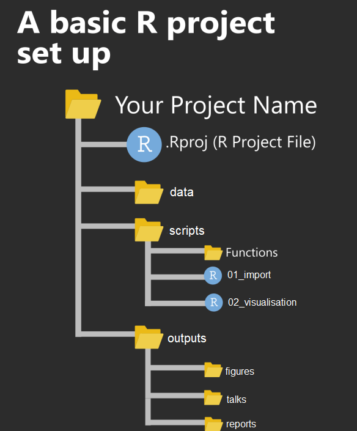
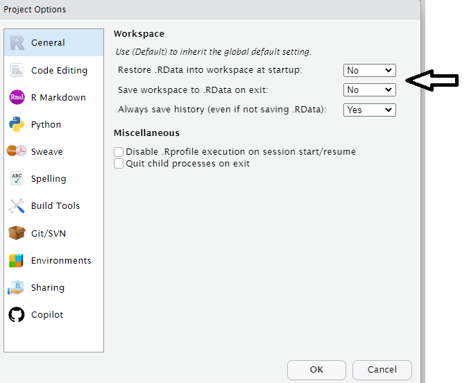

# Project-oriented workflows


```{r, include = FALSE}
source("R/booktem_setup.R")
source("R/my_setup.R")
library(tidyverse)
library(here)
penguins_raw <- read_csv(here("files", "penguins_raw.csv"))
```


In RStudio, a project is a way to organize your work within the IDE. It's a fundamental concept designed to enhance your workflow by providing a structured and efficient means of managing your R-related tasks and files. Here's why R projects are useful:

**1. Organized File Structure:** R projects encourage you to maintain a well-organized file structure for your work. Instead of having scattered R scripts, data files, and figures, you create a dedicated folder for each project. This folder typically contains all project-related materials, including data, code, figures, notes, and any other relevant files.

**2. Working Directory Management:** When you open an R project in RStudio, it automatically sets the working directory to the project's folder. This ensures that all file paths are relative to the project's location. This working directory intentionality eliminates the need for setting working directories manually or using absolute paths in your code.

**3. Portability and Collaboration:** R projects make your work more portable and collaborative. Since all paths are relative to the project folder, the project can be easily shared with others. It ensures that the code works consistently across different computers and for other users, promoting collaboration and reproducibility.

**4. RStudio Integration:** RStudio integrates project management seamlessly. You can designate a folder as an R project, and RStudio leaves a `.Rproj` file in that folder to store project-specific settings. When you double-click on this file, it opens a fresh instance of RStudio with the project's working directory and file browser pointed at the project folder.

**5. Efficient Workflow:** RStudio provides various menu options and keyboard shortcuts for managing projects. This includes the ability to open existing projects, switch between projects, and even launch multiple instances of RStudio for different projects.

In essence, R projects help you maintain a clean and organized workspace, improve collaboration, and ensure that your work remains reproducible and transferable across different environments and over time. It's a best practice for data scientists and analysts working with R, as it fosters the disciplined use of relative file paths and working directories, which is crucial for the reliability and scalability of your R projects.


## Setting up a new project

You should start a new R project when you begin working on a distinct task, research project, or analysis. This ensures that your work is well-organized, and it's especially beneficial when you need to collaborate, share, or revisit the project later.

To create and open an R project in RStudio:

1. Go to "File" in the RStudio menu.

2. Select "New Project..."

3. Choose a project type or create a new directory for the project.

4. Click "Create Project."

The new project will be created with a .Rproj file. You can open it by double-clicking on this file or by using the "File" menu in RStudio.

This will set up a dedicated workspace for your project, ensuring that the working directory and file paths are appropriately managed.

```{r, eval=TRUE, echo=FALSE, out.width="80%", fig.cap = "An example of a typical R project set-up"}

```

## Avoiding setwd() and Promoting Safe File Paths:

To maintain a clean and efficient workflow in R, it's advisable to avoid using `setwd()` at the beginning of each script. This practice promotes the use of safe file paths and is particularly important for projects with multiple collaborators or when working across different computers.

### Absolute vs. Relative Paths:

While absolute file paths provide an explicit way to locate resources, they have significant drawbacks, such as incompatibility and reduced reproducibility. Relative file paths, on the other hand, are relative to the current working directory, making them shorter, more portable, and more reproducible.

An **Absolute file path** is a path that contains the entire path to a file or directory starting from your Home directory and ending at the file or directory you wish to access e.g.

```
/home/your-username/project/data/penguins_raw.csv
```

- If you share files, another user won’t have the same directory structure as you, so they will need to recreate the file paths

- If you alter your directory structure, you’ll need to rewrite the paths

- An absolute file path will likely be longer than a relative path, more of the backslashes will need to be edited, so there is more scope for error.

A **Relative filepath** is the path that is relative to the working directory location on your computer.

When you use RStudio Projects, wherever the `.Rproj` file is located is set to the working directory. This means that if the `.Rproj` file is located in your project folder then the relative path to your data is:

```
data/penguins_raw.csv
```

This filepath is shorter and it means you could share your project with someone else and the script would run without any editing.

### Organizing Projects:

A key aspect of this workflow is organizing each logical project into a separate folder on your computer. This ensures that files and scripts are well-structured, making it easier to manage your work.

```
my_project.RProj/
    |- data/
    |   |- raw/
    |       |- penguins_raw.csv
    |   |- processed/
    |- scripts/
    |   |- analysis.R
    |- results/


```


### The `here` Package:

To further enhance this organization and ensure that file paths are independent of specific working directories, the here package comes into play. The `here()` function provided by this package builds file paths relative to the top-level directory of your project.

In the above project example you have raw data files in the data/raw directory, scripts in the scripts directory, and you want to save processed data in the data/processed directory.

To access this data using a relative filepath we need:

```{r, eval = F}

raw_data <- read.csv("data/raw/penguins_raw.csv")


```

To access this data with `here` we provide the directories and desired file, and `here()` builds the required filepath starting at the top level of our project each time

```{r, eval = F}

library(here)

raw_data <- read.csv(here("data", "raw", "penguins.csv"))

```


### Reading

https://github.com/jennybc/here_here

https://cran.r-project.org/web/packages/here/index.html


## Blank slates

When working on data analysis and coding projects in R, it's crucial to ensure that your analysis remains clean, reproducible, and free from hidden dependencies. 

Hidden dependencies are elements in your R session that might not be immediately apparent but can significantly impact the reliability and predictability of your work.

For example many data analysis scripts start with the command `rm(list = ls())`. While this command clears user-created objects from the workspace, it leaves hidden dependencies as it does not reset the R session, and can cause issues such as: 

- **Hidden Dependencies:** Users might unintentionally rely on packages or settings applied in the current session.

- **Incomplete Reset:** Package attachments made with `library()` persist, and customized options remain set.

- **Working Directory:** The working directory is not affected, potentially causing path-related problems in future scripts.

### Restart R sessions

Restarting R sessions and using scripts as your history is a best practice for maintaining a clean, reproducible, and efficient workflow. It addresses the limitations of `rm(list = ls())` by ensuring a complete reset and minimizing hidden dependencies, enhancing code organization, and ensuring your analysis remains robust and predictable across sessions and when shared with others.

```{r, eval=TRUE, echo=FALSE, out.width="80%",}

```

