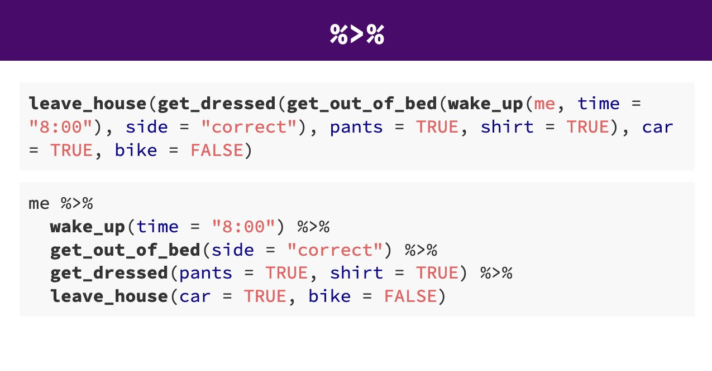

# Managing Data

```{r}
# Required packages

library(tidyverse)
library(gitcreds)

```


```{r, eval = F, echo = F}
### This is what i did to messy penguins
messy_penguins <- penguins  |> add_whitespace(cols = "Sex", messiness = 0.01) |> change_case(cols = "Species") |> duplicate_rows(0.05)

```

## Importing Data

When working with datasets in R, importing structured data efficiently is a crucial first step in analysis. The `readr` package, which is part of the `tidyverse`, provides powerful tools for reading and writing data. One of its key functions, `read_csv()`, is specifically designed for handling comma-separated values (CSV) files.

:::{.callout-info}

## Why Use read_csv() Instead of Base R Functions?

Base R provides the `read.csv()` function for reading CSV files, but readr offers several advantages:

- Speed: `read_csv()` is optimized for performance, making it significantly faster when working with large datasets.

- Automatic Data Type Detection: The function intelligently determines the appropriate data types for each column, reducing the need for manual conversions.

- Tibble Output: Instead of a traditional data frame, `read_csv()` returns a tibble, which has improved printing and subsetting features.

- More Control Over Missing Values: Users can define how missing values are interpreted, making data cleaning easier.

:::

To import a CSV file, simply use:

```{r, eval = FALSE}
# Replace 'path/to/your/file.csv' with the actual file path
data <- read_csv("path/to/your/file.csv")

```

This command reads the CSV file and stores it in the data object, with columns automatically assigned the most appropriate data types.


### Understanding Key Arguments in `read_csv()`

- `file`: The path to the CSV file to be read.

- `col_names`: A logical or character vector. If TRUE, the first row is used as column names. If FALSE, generic column names are assigned.

- `col_types`: Allows manual specification of column types using cols(), overriding automatic type detection.

- `skip`: The number of lines to skip before reading data, useful when dealing with files that have introductory text.

To access the full documentation for `read_csv()`, you can use:

```{r, eval = FALSE}
??read_csv
help("read_csv")
```

### Reading a CSV File Using a Relative Filepath

When we use R projects, instead of an absolute path, you can use a relative path to reference a file within your working directory:

> Assuming the file is in a 'data' folder inside your project directory

```{r, eval = FALSE}
data <- read_csv("data/sample_data.csv")
```

This command reads the CSV file and stores its contents in a variable named data. The `read_csv()` function automatically infers data types, reducing the need for manual data type conversions.

### The `here` Package:

To further enhance this organization and ensure that file paths are independent of specific working directories, the here package comes into play. The `here()` function provided by this package builds file paths relative to the top-level directory of your project.

In the above project example you have raw data files in the data/raw directory, scripts in the scripts directory, and you want to save processed data in the data/processed directory.

To access this data using a relative filepath we need:

```{r, eval = F}

raw_data <- read_csv("data/sample_data.csv")


```

To access this data with `here` we provide the directories and desired file, and `here()` builds the required filepath starting at the top level of our project each time

```{r, eval = F}

library(here)

raw_data <- read_csv(here("data", "sample_data.csv"))

```


:::{.task}
::::{.task-header}
Import some data
::::
::::{.task-container}

- Create a new R project

- Make sure it contains a data folder and a scripts folder

- Make a new script

- Import the `messy_penguins.csv` file

::::
:::

`r hide()`

```{r, eval = FALSE}

messy_penguins <- read_csv("data/messy_penguins.csv")

```

`r unhide()`


##Inspecting Data with `glimpse()`

After reading the file, it’s useful to inspect its structure using glimpse() from the dplyr package:

library(dplyr)
glimpse(data)

glimpse() provides a compact summary of the dataset, showing column names, data types, and example values.

Understanding Tibbles

A tibble is a modern version of a data frame that prints in a cleaner format. Unlike base R data frames, tibbles:

Do not automatically convert character vectors to factors.

Display only the first ten rows and as many columns as fit in the console.

Provide more readable printing, especially for large datasets.

### Reading Other Delimited File Types

`readr` also provides functions for importing other delimited file types:

- Tab-separated files (.tsv):

```{r, eval = FALSE}
data_tsv <- read_tsv("data/sample_data.tsv")
```

- Semicolon-separated files (.csv2):

```{r, eval = FALSE}
data_csv2 <- read_csv2("data/sample_data.csv2")
```

- Files with custom delimiters:

```{r, eval = FALSE}
data_custom <- read_delim("data/sample_data.txt", delim = "|")
```

>readr functions

| Function         | Description                                          |
|------------------|------------------------------------------------------|
| `read_csv()`     | CSV file format                                      |
| `read_tsv()`     | TSV (Tab-Separated Values) file format               |
| `read_delim()`   | User-specified delimited files                       |
| `read_fwf()`     | Fixed-width files                                    |
| `read_table()`   | Whitespace-separated files                           |
| `read_log()`     | Web log files                                        |
| `readxl::read_excel()`     | Read Excel files                                    |

By mastering these functions, you can efficiently handle various structured data formats in R.


## Describing the Data

Before working with your data, it's essential to understand its underlying structure and content. In this section, we'll use powerful functions like `glimpse()`, `str()`, `summary()`, `head`(), `tail()` and the add-on function `skimr::skim()` to thoroughly examine your dataset. These tools provide insights into data types, variable distributions, and sample records, helping you identify initial issues such as missing values or inconsistent data types. By gaining a clear understanding of your data's structure, you'll be better equipped to address any problems and proceed confidently with data cleaning and analysis.

When we run `glimpse()` we get several lines of output. The number of observations "rows", the number of variables "columns". Check this against the csv file you have - they should be the same. In the next lines we see variable names and the type of data. 


```{r, eval = T}

glimpse(messy_penguins)

```

We can see a dataset with 345 rows (including the headers) and 17 variables
It also provides information on the *type* of data in each column

* `<chr>` - means character or text data

* `<dbl>` - means numerical data


When we run `summary()` we get similar information, in addition for any numerical values we get summary statistics such as mean, median, min, max, quartile ranges and any missing (`NA`) values

```{r, eval = T}

summary(messy_penguins)

```

Finally the add-on package `skimr` provides the function `skimr::skim()` provides an easy to view set of summaries including column types, completion rate, number of unique variables in each column and similar statistical summaries along with a small histogram for each numeric variable. 

```{r}
library(skimr)

skim(messy_penguins)

```


We are going to learn how to organise data using the *tidy* format^[(http://vita.had.co.nz/papers/tidy-data.pdf)]. This is because we are using the `tidyverse` packages @R-tidyverse. This is an opinionated, but highly effective method for generating reproducible analyses with a wide-range of data manipulation tools. Tidy data is an easy format for computers to read. It is also the required data structure for our **statistical tests** that we will work with later.

Here 'tidy' refers to a specific structure that lets us manipulate and visualise data with ease. In a tidy dataset each *variable* is in one column and each row contains one *observation*. Each cell of the table/spreadsheet contains the *values*. One observation you might make about tidy data is it is quite long - it generates a lot of rows of data - you might remember then that *tidy* data can be referred to as *long*-format data (as opposed to *wide* data). 

```{r, eval=TRUE, echo=FALSE, out.width="80%", fig.alt= "tidy data overview"}
knitr::include_graphics("images/tidy-1.png")
```

See the Appendix on **Data reshaping** for what to do when data is not **tidy**.

### Descriptive Statistics

*Descriptive statistics* are useful in data exploration and understanding. They use statistical measures to describe the characteristics of features. For example, the *frequency* tells us how often a value occurs.

For continuous data the **mean** and **median** are often used to describe the properties of data. Both mean and median provide a description of the "central tendency" or what is considered a "typical" value. 

In R we can get summary statistics by using the `summary()` function. 

```{r}

summary(messy_penguins)

```


Finally the add-on package `skimr` provides the function `skimr::skim()` provides an easy to view set of summaries including column types, completion rate, number of unique variables in each column and similar statistical summaries along with a small histogram for each numeric variable.

```{r}
library(skimr)
skim(messy_penguins)
````


### dplyr

In this section we will be introduced to some of the most commonly used data wrangling functions, these come from the `dplyr` package (part of the `tidyverse`). These are functions you are likely to become *very* familiar with. 

::: {.callout-important}

Try running the following functions directly in your `r glossary("console")` *or* make a `scraps.R` scrappy file to mess around in. 

:::

```{r, eval = TRUE, echo = FALSE, warning = FALSE, message = FALSE}
library(kableExtra)

verb <- c( "select()","filter()", "arrange()", "summarise()", "group_by()", "mutate()")

action <- c("choose columns by name","select rows based on conditions",  "reorder the rows", "reduce raw data to user defined summaries", "group the rows by a specified column", "create a new variable")

box <- tibble(verb, action)
box


```

### Select

If we wanted to create a dataset that only includes certain variables, we can use the `dplyr::select()` function from the `dplyr` package. 

For example I might wish to create a simplified dataset that only contains `Species`, `Sex`, `Flipper Length (mm)` and `Body Mass (g)`. 

Run the below code to select only those columns

```{r, eval = FALSE}
select(
   # the data object
  .data = penguins_raw,
   # the variables you want to select
  `Species`, `Sex`, `Flipper Length (mm)`, `Body Mass (g)`)
```


Alternatively you could tell R the columns you **don't** want e.g. 


```{r, eval = F}
select(.data = penguins_raw,
       -`studyName`, -`Sample Number`)

```

Note that `select()` does **not** change the original `penguins` tibble. It spits out the new tibble directly into your console. 

If you don't **save** this new tibble, it won't be stored. If you want to keep it, then you must create a new object. 

When you run this new code, you will not see anything in your console, but you will see a new object appear in your Environment pane.

```{r, eval = F}
new_penguins <- select(.data = penguins_raw, 
       `Species`, `Sex`, `Flipper Length (mm)`, `Body Mass (g)`)
```

### Filter

Having previously used `dplyr::select()` to select certain variables, we will now use `dplyr::filter()` to select only certain rows or observations. For example only Adelie penguins. 

We can do this with the equivalence operator `==`

```{r, eval = F}
filter(.data = new_penguins, 
       `Species` == "Adelie Penguin (Pygoscelis adeliae)")

```

We can use several different operators to assess the way in which we should filter our data that work the same in tidyverse or base R.

```{r, eval = TRUE, echo = FALSE, warning = FALSE, message = FALSE}

Operator <- c("A < B", "A <= B", "A > B", "A >= B", "A == B", "A != B", "A %in% B")

Name <- c("less than", "less than or equal to", "greater than", "greater than or equal to", "equivalence", "not equal", "in")

box <- tibble(Operator, Name)

box |> 
   kbl(caption = "Boolean expressions", 
    booktabs = T) |> 
   kable_styling(full_width = FALSE, font_size=16)

```

If you wanted to select all the Penguin species except Adelies, you use 'not equals'.

```{r, eval = F}
filter(.data = new_penguins, 
       `Species` != "Adelie Penguin (Pygoscelis adeliae)")

```

This is the same as 

```{r, eval = F}
filter(.data = new_penguins, 
       `Species` %in% c("Chinstrap penguin (Pygoscelis antarctica)",
                      "Gentoo penguin (Pygoscelis papua)")
       )
```

You can include multiple expressions within `filter()` and it will pull out only those rows that evaluate to `TRUE` for all of your conditions. 

For example the below code will pull out only those observations of Adelie penguins where flipper length was measured as greater than 190mm. 

```{r, eval =F}

filter(.data = new_penguins, 
       `Species` == "Adelie Penguin (Pygoscelis adeliae)", 
       `Flipper Length (mm)` > 190)

```

### Arrange

The function `arrange()` sorts the rows in the table according to the columns supplied. For example


```{r, eval = F}
arrange(.data = new_penguins, 
        `Sex`)
```


The data is now arranged in alphabetical order by sex. So all of the observations of female penguins are listed before males. 

You can also reverse this with `desc()`

```{r, eval = F}

arrange(.data = new_penguins, 
        desc(`Sex`))

```

You can also sort by more than one column, what do you think the code below does?

```{r, eval = F}
arrange(.data = new_penguins,
        `Sex`,
        desc(`Species`),
        desc(`Flipper Length (mm)`))
```

### Mutate

Sometimes we need to create a new variable that doesn't exist in our dataset. For example we might want to figure out what the flipper length is when factoring in body mass. 

To create new variables we use the function `mutate()`. 

Note that as before, if you want to save your new column you must save it as an object. Here we are mutating a new column and attaching it to the `new_penguins` data oject.


```{r, eval = F}
new_penguins <- mutate(.data = new_penguins,
                     body_mass_kg = `Body Mass (g)`/1000)
```

## Pipes

```{r, eval=TRUE, echo=FALSE, out.width="80%", fig.alt= "Pipes make code more human readable"}

```

Pipes look like this: `|>` , a `r glossary("pipe")` allows you to send the output from one function straight into another function. Specifically, they send the result of the function before `|>` to be the **first** argument of the function after `|>`. As usual, it's easier to show, rather than tell so let's look at an example.

```{r, eval = F}
# this example uses brackets to nest and order functions
arrange(.data = filter(
  .data = select(
  .data = penguins_raw, 
  species, `Sex`, `Flipper Length (mm)`), 
  `Sex` == "MALE"), 
  desc(`Flipper Length (mm)`))

```

```{r, eval = F}
# this example uses sequential R objects 
object_1 <- select(.data = penguins_raw, 
                   `Species`, `Sex`, `Flipper Length (mm)`)
object_2 <- filter(.data = object_1, 
                   `Sex` == "MALE")
arrange(object_2, 
        desc(`Flipper Length (mm)`))

```

```{r, eval = F}
# this example is human readable without intermediate objects
penguins_raw |>  
  select(`Species`, `Sex`, `Flipper Length (mm)`) |>  
  filter(`Sex` == "MALE") |>  
  arrange(`Flipper Length (mm)`))
```

The reason that this function is called a pipe is because it 'pipes' the data through to the next function. When you wrote the code previously, the first argument of each function was the dataset you wanted to work on. When you use pipes it will automatically take the data from the previous line of code so you don't need to specify it again.


```{block, type = "info"}

From R version 4 onwards there is now a "native pipe" `|>`

This doesn't require the tidyverse `magrittr` package and the "old pipe" ` %>% ` or any other packages to load and use. 

You may be familiar with the magrittr pipe or see it in other tutorials, and website usages. The native pipe works equivalntly in most situations but if you want to read about some of the operational differences, [this site](https://www.infoworld.com/article/3621369/use-the-new-r-pipe-built-into-r-41.html) does a good job of explaining .


```


### Clean column names

```{r, eval = T}
# CHECK DATA----
# check the data
colnames(penguins_raw)
#__________________________----
```

When we run `colnames()` we get the identities of each column in our dataframe

* **Study name**: an identifier for the year in which sets of observations were made

* **Region**: the area in which the observation was recorded

* **Island**: the specific island where the observation was recorded

* **Stage**: Denotes reproductive stage of the penguin

* **Individual** ID: the unique ID of the individual

* **Clutch completion**: if the study nest observed with a full clutch e.g. 2 eggs

* **Date egg**: the date at which the study nest observed with 1 egg

* **Culmen length**: length of the dorsal ridge of the bird's bill (mm)

* **Culmen depth**: depth of the dorsal ridge of the bird's bill (mm)

* **Flipper Length**: length of bird's flipper (mm)

* **Body Mass**: Bird's mass in (g)

* **Sex**: Denotes the sex of the bird

* **Delta 15N** : the ratio of stable Nitrogen isotopes 15N:14N from blood sample

* **Delta 13C**: the ratio of stable Carbon isotopes 13C:12C from blood sample


```{r, eval = T, warning = F, message = F}
# CLEAN DATA ----

# clean all variable names to snake_case 
# using the clean_names function from the janitor package
# note we are using assign <- 
# to overwrite the old version of penguins 
# with a version that has updated names
# this changes the data in our R workspace 
# but NOT the original csv file

# clean the column names
# assign to new R object
penguins_clean <- janitor::clean_names(penguins_raw) 

# quickly check the new variable names
colnames(penguins_clean) 


```


`r hide ("Import and clean names")`

We can combine data import and name repair in a single step if we want to:

```{r, eval = FALSE}
penguins_clean <- read_csv ("data/penguins_raw.csv",
                      name_repair = janitor::make_clean_names)

```

`r unhide()`


#### Rename columns (manually)

The `clean_names` function quickly converts all variable names into `r glossary("snake case")`. The N and C blood isotope ratio names are still quite long though, so let's clean those with `dplyr::rename()` where "new_name" = "old_name".


```{r, eval = T, warning = F, message = F}

# shorten the variable names for isotope blood samples
# use rename from the dplyr package
penguins_clean <- rename(penguins_clean,
         "delta_15n"="delta_15_n_o_oo",  
         "delta_13c"="delta_13_c_o_oo")

```


#### Rename text values manually

Sometimes we may want to rename the values in our variables in order to make a shorthand that is easier to follow. This is changing the **values** in our columns, not the column names. 


```{r, eval = T, warning = F, message = F}
# use mutate and case_when 
# for a statement that conditionally changes 
# the names of the values in a variable
penguins <- penguins_clean |> 
  mutate(species = case_when(
  species == "Adelie Penguin (Pygoscelis adeliae)" ~ "Adelie",
  species == "Gentoo penguin (Pygoscelis papua)" ~ "Gentoo",
  species == "Chinstrap penguin (Pygoscelis antarctica)" ~ "Chinstrap",
  .default = as.character(species)
  )
  )

```


```{r}

# use mutate and if_else
# for a statement that conditionally changes 
# the names of the values in a variable
penguins <- penguins |> 
  mutate(sex = if_else(
    sex == "MALE", "Male", "Female"
  )
  )

```


::: {.callout-warning}

Notice from here on out I am assigning the output of my code to the R object penguins, this means any new code "overwrites" the old penguins dataframe. This is because I ran out of new names I could think of, its also because my Environment is filling up with lots of data frame variants. 

Be aware that when you run code in this way, it can cause errors if you try to run the same code twice e.g. in the example above once you have changed MALE to Male, running the code again could cause errors as MALE is no longer present! 

If you make any mistakes running code in this way, re-start your R session and run the code from the start to where you went wrong.

:::


#### Rename text values with stringr

Datasets often contain words, and we call these words "(character) strings".

Often these aren't quite how we want them to be, but we can manipulate these as much as we like. Functions in the package `stringr`, are fantastic. And the number of different types of manipulations are endless!

Below we repeat the outcomes above, but with string matching: 


```{r, eval = T, warning = F, message = F}
# use mutate and case_when 
# for a statement that conditionally changes 
# the names of the values in a variable
penguins <- penguins_clean |> 
  mutate(species = stringr::word(species, 1)
  ) |> 
  mutate(sex = stringr::str_to_title(sex))

```


Alternatively we could decide we want simpler species names but that we would like to keep the latin name information, but in a separate column. To do this we are using [regex](https://cran.r-project.org/web/packages/stringr/vignettes/regular-expressions.html). Regular expressions are a concise and flexible tool for describing patterns in strings

```{r, eval = F}
penguins_clean |> 
    separate(
        species,
        into = c("species", "full_latin_name"),
        sep = "(?=\\()"
    ) 
```

```{r, eval = T, echo = F}
penguins_clean |> 
    separate(
        species,
        into = c("species", "full_latin_name"),
        sep = "(?=\\()"
    ) |> 
  head()
```


##  Duplications

It is very easy when inputting data to make mistakes, copy something in twice for example, or if someone did a lot of copy-pasting to assemble a spreadsheet (yikes!). We can check this pretty quickly

```{r, eval = F}
# check for whole duplicate 
# rows in the data
penguins |> 
  duplicated() |>  
  sum() 

```

```
[1] 0
```
Great! 

If I did have duplications I could investigate further and extract these exact rows: 

```{r, eval = F}

# Inspect duplicated rows
penguins |> 
    filter(duplicated(penguins))

```
```
A tibble:0 × 17
0 rows | 1-8 of 17 columns
```

```{r, eval = F}

# Keep only unduplicated data
penguins |> 
    filter(!duplicated(penguins))

```

```{r, eval = T, echo = F}

# Keep only unduplicated data
penguins |> 
    filter(!duplicated(penguins)) |> 
  head()

```


### Checking for typos

We can also look for typos by asking R to produce all of the distinct values in a variable. This is more useful for categorical data, where we expect there to be only a few distinct categories


```{r, eval = T}
# Print only unique character strings in this variable
penguins |>  
  distinct(sex)

```

Here if someone had mistyped e.g. 'FMALE' it would be obvious. We could do the same thing (and probably should have before we changed the names) for species. 

We can also trim leading or trailing empty spaces with `stringr::str_trim`. These are often problematic and difficult to spot e.g.

```{r, eval  = T}
df2 <- tibble(label=c("penguin", " penguin", "penguin ")) 
df2 # make a test dataframe
```

We can easily imagine a scenario where data is manually input, and trailing or leading spaces are left in. These are difficult to spot by eye - but problematic because as far as R is concerned these are different values. We can use the function `distinct` to return the names of all the different levels it can find in this dataframe.

```{r, eval  = T}
df2 |> 
  distinct()
```

If we pipe the data throught the `str_trim` function to remove any gaps, then pipe this on to `distinct` again - by removing the whitespace, R now recognises just one level to this data. 

```{r, eval  = T}
df2 |> 
  mutate(label=str_trim(label, side="both")) |> 
  distinct()

```


## Dates

Working with dates can be tricky, treating date as strictly numeric is problematic, it won't account for number of days in months or number of months in a year. 

Additionally there's a lot of different ways to write the same date:

* 13-10-2019

* 10-13-2019

* 13-10-19

* 13th Oct 2019

* 2019-10-13

This variability makes it difficult to tell our software how to read the information, luckily we can use the functions in the `lubridate` package. 


```{block, type = "warning"}
If you get a warning that some dates could not be parsed, then you might find the date has been inconsistently entered into the dataset.

Pay attention to warning and error messages
```

Depending on how we interpret the date ordering in a file, we can use `ymd()`, `ydm()`, `mdy()`, `dmy()` 

* **Question** What is the appropriate function from the above to use on the `date_egg` variable?


`r longmcq(c("ymd()", "ydm()", "mdy()", answer="dmy()"))`


`r hide("Solution")`


```{r, eval = T, warning = F, message = F}

penguins <- penguins |>
  mutate(date_egg = lubridate::dmy(date_egg))

```

`r unhide()`


Here we use the `mutate` function from `dplyr` to create a *new variable* called `date_egg_proper` based on the output of converting the characters in `date_egg` to date format. The original variable is left intact, if we had specified the "new" variable was also called `date_egg` then it would have overwritten the original variable. 


Once we have established our date data, we are able to perform calculations or extract information. Such as the date range across which our data was collected.  

### Calculations with dates

```{r, eval = F}
penguins |> 
  summarise(min_date=min(date_egg),
            max_date=max(date_eggr))
```

We can also extract and make new columns from our date column - such as a simple column of the year when each observation was made:

```{r, eval = F}
penguins <- penguins |> 
  mutate(year = lubridate::year(date_egg))

```


## Missing Data

The `palmerpenguins` dataset contains data on penguins from the Palmer Archipelago in Antarctica. This dataset includes several measurements such as species, island, bill length, bill depth, flipper length, body mass, and sex. However, it contains missing values. 

We previously used functions like skimr::skim() and summary() to find that there are two missing values each for culmen length and depth. Although this small amount of missing data is unlikely to introduce significant bias, it’s still a good practice to investigate where these missing values are located in the dataset. Identifying patterns or specific groups (e.g., certain species or islands) associated with the missing values can help ensure that the missing data is not clustered in a way that could subtly affect our analysis.

```{r}
penguins |>
  # Filter rows where culmen length is NA
  filter(is.na(culmen_length_mm)) |> 
  # Group by species, sex and island
  group_by(species, sex, year, island) |>                 
  summarise(n_missing = n())    

penguins |>
  filter(is.na(culmen_depth_mm)) |>         
  group_by(species, sex, year, island) |>               
  summarise(n_missing = n())    
```


### Other methods for understanding missingness

- Use the `naniar` package to visualize and understand the patterns of missing data.

- Use the `mice` package to perform multiple imputation to handle missing values.

- Discuss how to choose an appropriate imputation algorithm.

- Check the quality of imputation using diagnostic plots and statistical checks.

```{r, include = FALSE}
library(naniar)
library(mice)
```

### Visualise missing data with `naniar`

The naniar package provides functions to visualize and explore missing data. Start by visualizing the missing values:

```{r}
# Visualise missing data
naniar::vis_miss(penguins)
```

The `vis_miss()` function creates a heatmap-like plot where missing values are shown in a different color, allowing you to quickly see where missing data occurs.

You can also use a `gg_miss_var` plot to see the proportion of missing values by variable

```{r}

# Visualize missing data by variable
gg_miss_var(penguins)

```

### Explore the Patterns of Missingness

Understanding the patterns of missingness can help you decide on an appropriate imputation method:

```{r}
# Explore missing data patterns
miss_var_summary(penguins)

```

We can combine this with `group_by()` to get insights into the patterns surrounding our missing data

```{r}
penguins |> 
  select(species, island, sex) |> 
  group_by(species, island) |> 
  miss_var_summary()

```

An upset plot can be used to visualise the patterns of missingness, or rather the combinations of missingness across cases. 

```{r}
gg_miss_upset(penguins)

```

`gg_miss_fct()`: This function allows you to explore missing data by levels of a factor. It is useful for checking if missingness is related to a categorical variable.

```{r}
# Explore missing data by species
gg_miss_fct(penguins, fct = island)

```

#### Testing for MCAR

The simplest formal test with `naniar` is `mcar_test()`, which implements Little’s MCAR test:

```{r}

messy_penguins |> 
  select(`Species`, 
         `Sex`,
         `Delta 15 N (o/oo)`, 
         `Delta 13 C (o/oo)`,
         `Island`, 
         `Culmen Length (mm)`, 
         `Flipper Length (mm)`, 
         `Body Mass (g)`) |>  mcar_test()

messy_penguins |> 
  select(`Species`, 
         `Sex`,
         `Island`, 
         `Culmen Length (mm)`, 
         `Flipper Length (mm)`, 
         `Body Mass (g)`) |>  mcar_test()


```

- Null hypothesis (H0): Data are MCAR.

- A p-value below 0.05 typically indicates data are not MCAR, suggesting MAR or MNAR.

> (Note: Diagnosing MAR vs. MNAR often requires subject-matter insight and further data exploration.)

### Handling missing data

#### Deleting Missing Rows

One of the simplest approaches to address missing data in a dataset is to delete observations (rows) that contain any missing values. This method, often referred to as "listwise deletion" or "complete case analysis," involves removing entire records from the analysis if they are missing any data point in one or more variables

- When to Consider Deleting Missing Rows:

Minimal Missing Data: If the missing data is slight and seemingly random, eliminating those incomplete entries is unlikely to significantly affect the dataset's overall quality.

MCAR Data: Deletion is most appropriate when the missing data is Missing Completely At Random (MCAR), meaning there's no systematic difference between the missing and observed values.

### Impute missing data

Before performing imputation, it’s important to choose the right algorithm based on the data type and the nature of the missingness. The mice package supports various imputation methods for different types of data:

### Types of Missingness:

- Missing Completely at Random (MCAR): The missing data has no relationship with any other variable. Any imputation method can be used, but simpler methods like mean/mode imputation might suffice.

- Missing at Random (MAR): The missingness is related to other observed variables. Imputation methods that take into account other variables, such as predictive mean matching or multiple regression, are appropriate.

- Missing Not at Random (MNAR): The missingness is related to the missing values themselves. In such cases, data augmentation, sensitivity analysis, or using domain knowledge for imputation might be necessary.

### Choosing the Imputation Method:

Here are some common imputation methods provided by mice and when they are most appropriate:

- Mean/Mode Imputation (mean, mode): Fills in missing values with the mean (numeric data) or mode (categorical data) of observed values. Simple but can distort the distribution and underestimate variability.

- Predictive Mean Matching (pmm): Matches the missing value with observed values that have a similar predicted value based on a regression model. It’s useful for numerical data and preserves the original distribution.

- Logistic Regression (logreg): Suitable for binary categorical data, like sex in the penguins dataset, and uses logistic regression to predict the missing values.

- Polytomous Regression (polyreg): Suitable for multinomial categorical data with more than two levels (e.g., species with Adelie, Gentoo, and Chinstrap). Uses polytomous regression to impute missing values.

### Impute Missing Values Using the mice Package

Given that the sex column is a binary categorical variable, we can use logreg or polyreg for imputation. For this example, we will use logreg.

Prepare the data by the selecting relevant columns we want to use as predictors to impute our missing values:

```{r}

# Run the mice function with maxit=0
# This allows us to extract the default predictor matrix and methods without performing actual imputation
imp <- mice(penguins, maxit=0)

# Extract the predictor matrix from the imputation object
predM <- imp$predictorMatrix

```

> Note sex will not be included for imputation unless it is coded as a factor

```{r}

penguins <- penguins |> 
  mutate(sex = factor(sex))

```

```{r}


# Extract the methods of imputation used for each variable
meth <- imp$method

# Set the imputation method for certain columns to an empty string "" to exclude them from imputation
# For these columns, missing values will be left as is and not imputed
meth["sex"] <- "logreg"

# Print the updated methods matrix to review the imputation methods assigned to each variable
meth


```


```{r}
# if necessary we can determine the variables that will be used for imputation
predM["sex", ] <- c(0,0,1,1,1,1,1,1,1,0,0,0,1,0,0,0,0,0,1,0)

```


```{r}
# With this command, we tell mice to impute the anesimp2 data, create 5
# datasets, use predM as the predictor matrix and don't print the imputation
# process. If you would like to see the process, set print as TRUE

imputed_data <- mice(penguins, maxit = 5, 
             predictorMatrix = predM, 
             method = meth, print =  FALSE)
```

### Check for convergence

In order to obtain correct results, the MICE algorithm needs to have converged. This can be checked visually by plotting summaries of the imputed values accross the iterations.

The mean and variance of the imputed values per iteration and variable are stored in the elements chainMean and chainVar of the mids object.

```{r}

plot(imputed_data, layout = c(4,4))

```


Now that we know that imputation has converged, we can compare the distribution of the imputed values against the distribution of the observed values. When our imputation models fit the data well, they should have similar distributions (conditional on the covariates used in the imputation model).

```{r}

# Create a complete dataset with imputed values for 'sex'
penguins_imputed <- complete(imputed_data)

# Explore missing data patterns
miss_var_summary(penguins_imputed)

```

### Check against original data


```{r}

test_data <- bind_rows("original" = penguins, "imputed" = penguins_imputed, .id = "groups")

test_data |> 
  drop_na(sex) |> 
ggplot(aes(x = sex, fill = groups)) +
  geom_bar(position = "dodge") +
  labs(title = "Comparison of Categorical Distribution: Original vs Imputed",
       x = "Category",
       y = "Count") +
  facet_wrap(~ species + island)

```

```{r}

# Density plots 

test_data |> 
  drop_na(sex) |> 
ggplot(aes(x = delta_15n, fill = groups)) +
    geom_density(alpha=0.5) 

```

## Working with character strings

### Standardising text cases

Text data often has inconsistent capitalization, making comparisons difficult. Converting all text to lowercase ensures uniformity.

```{r}
penguins_messy |>
  mutate(species = str_to_lower(species))

glimpse(penguins_clean$species)

```

Now, all species names are in lowercase, making them easier to filter and analyse.

### Removing extra whitespace

Sometimes text values have unwanted leading or trailing spaces, which can cause issues when grouping or filtering data.

```{r}

penguins_clean <- penguins_clean |>
  mutate(sex = str_trim(sex))

glimpse(penguins_clean)

```

### Detecting and Extracting Text Patterns

You may need to filter or extract values based on specific patterns, such as detecting certain species or extracting numerical values.

```{r}
penguins_clean |> 
  filter(str_detect(species, "chinstrap"))

```

This filters rows where species contains the word "chinstrap".

```{r}
penguins_clean <- penguins_clean |> 
  mutate(island_short = str_sub(island, 1, 3))

head(penguins_clean$island_short)


```

This extracts a short version of the island column, which might be useful for summarizing or visualization.

### Replace Incorrect or Inconsistent Entries

Datasets often contain typos, variations in spelling, or inconsistent formatting that need to be corrected for accurate analysis.


In penguins_raw, species values are sometimes upper and lower case

```{r}

penguins_clean %>%
  mutate(sex = str_replace(sex, "FEMALE", "female"),
         sex = str_replace(sex, "MALE", "male"))

```

### Removing Unwanted Characters
If entries contain unwanted punctuation, such as "Male!" or "Female.", we can clean them:


penguins_clean <- penguins_clean %>%
  mutate(sex = str_replace_all(sex, "[^a-zA-Z]", ""))  # Removes punctuation

unique(penguins_clean$sex)

This removes special characters, ensuring consistent data.

### Splitting Text into Multiple Columns
Why?
Some datasets store multiple pieces of information in a single column. We can split these into separate columns for better analysis.

Example: Splitting a Hypothetical species Column
If species contained values like "Adelie - Palmer", we could separate them:

r
Copy
Edit
penguins_clean <- penguins_clean %>%
  separate(species, into = c("species_name", "extra"), sep = " - ", fill = "right")

glimpse(penguins_clean)
This splits "Adelie - Palmer" into:

species_name = "Adelie"
extra = "Palmer"
If there is no extra information after the -, the column remains empty.


## Factors

In R, factors are a class of data that allow for **ordered categories** with a fixed set of acceptable values. 

Typically, you would convert a column from character or numeric class to a factor if you want to set an intrinsic order to the values (“levels”) so they can be displayed non-alphabetically in plots and tables, or for use in linear model analyses (more on this later). 

Working with factors is easy with the `forcats` package:

Using across - we can apply functions to columns based on selected criteria - here within mutate we are changing each column in the `.cols` argument and applying the function `forcats::as_factor()`

```{r}

penguins |> 
  mutate(
    across(.cols = c("species", "region", "island", "stage", "sex"),
           .fns = forcats::as_factor)
  ) |> 
  select(where(is.factor)) |> 
  glimpse()

```

::: {.callout-important}

Unless we assign the output of this code to an R object it will just print into the console, in the above I am demonstrating how to change variables to factors but we aren't "saving" this change.

:::

### Setting factor levels

If we want to specify the *correct* order for a factor we can use `forcats::fct_relevel`


```{r, eval = T, warning = F, message = F}
penguins <- penguins |> 
  mutate(mass_range = case_when(
    body_mass_g <= 3500 ~ "smol penguin",
    body_mass_g >3500 & body_mass_g < 4500 ~ "mid penguin",
    body_mass_g >= 4500 ~ "chonk penguin",
    .default = NA)
  )
```

If we make a barplot, the order of the values on the x axis will typically be in alphabetical order for any character data

```{r, eval = T, warning = F, message = F}
penguins |> 
  drop_na(mass_range) |> 
  ggplot(aes(x = mass_range))+
  geom_bar()

```


To convert a character or numeric column to class factor, you can use any function from the `forcats` package. They will convert to class factor and then also perform or allow certain ordering of the levels - for example using `forcats::fct_relevel()` lets you manually specify the level order. 

The function `as_factor()` simply converts the class without any further capabilities.

```{r, eval = T, warning=FALSE, message = F}
penguins <- penguins |> 
  mutate(mass_range = as_factor(mass_range))

```


```{r}
levels(penguins$mass_range)
```

Below we use `mutate()` and `as_factor()` to convert the column flipper_range from class character to class factor. 

```{r}
# Correct the code in your script with this version
penguins <- penguins |> 
  mutate(mass_range = fct_relevel(mass_range, 
                                  "smol penguin", 
                                  "mid penguin", 
                                  "chonk penguin")
         )

levels(penguins$mass_range)
```

Now when we call a plot, we can see that the x axis categories match the intrinsic order we have specified with our factor levels. 

```{r, eval = T, warning = F, message = F}
penguins |> 
  drop_na(mass_range) |>  
  ggplot(aes(x = mass_range))+
  geom_bar()

```


```{block, type = "info"}

Factors will also be important when we build linear models a bit later. The reference or intercept for a categorical predictor variable when it is read as a `<chr>` is set by R as the first one when ordered alphabetically. This may not always be the most appropriate choice, and by changing this to an ordered `<fct>` we can manually set the intercept.

```


## Visualising Data

### Comparisons

### Relationships

### Distributions

### Compositions

## Class Imbalance

## Outliers

## Transformation


