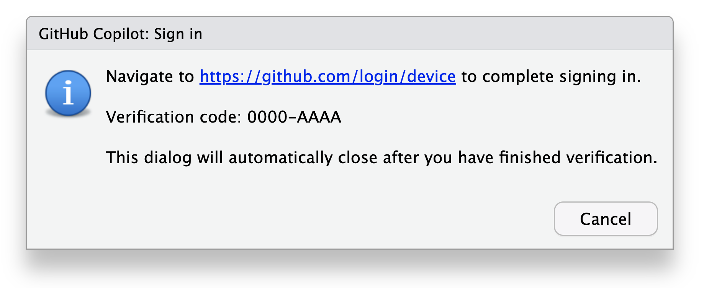
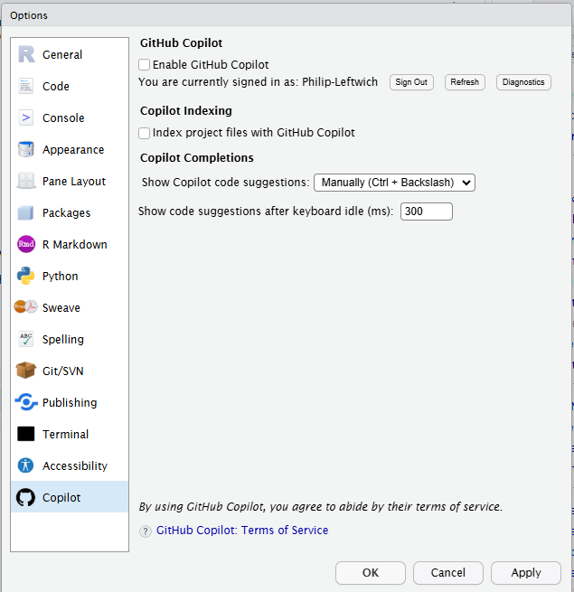
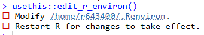
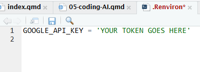

# Coding with AI support

```{r, include = FALSE}
source("R/booktem_setup.R")
source("R/my_setup.R")
library(tidyverse)
library(here)
penguins_raw <- read_csv(here("files", "penguins_raw.csv"))
```

```{r, eval = FALSE}
# Packages needed for this sheet
library(tidyverse)
library(ellmer)
library(usethis)

```


## Github Copilot

### What is GitHub Copilot?
 
GitHub Copilot is a popular AI development tool that can convert human language commands into executable code or speed up your coding with intelligent autocompletion.

### Setting up Copilot on Posit Cloud

GitHub Copilot needs to be enabled and authorised for each new project. 

1. You must have access to GitHub Copilot via your GitHub account, and you must authenticate with that account before you can use GitHub Copilot in your projects. [GitHub Copilot is free for students and teachers](https://education.github.com/discount_requests/application).

2. To enable GitHub Copilot in RStudio:

- Navigate to Tools > Global Options > Copilot.

- Check the box to “Enable GitHub Copilot”.

- Download and install the Copilot Agent components.

- Click the “Sign In” button.

- In the “GitHub Copilot: Sign in” dialog, copy the Verification Code.

- Navigate to or click on the link to https://github.com/login/device, paste the Verification Code and click “Continue”.

```{r, echo=FALSE, eval=TRUE}

```

- GitHub will request the necessary permissions for GitHub Copilot. To approve these permissions, click “Authorize GitHub Copilot Plugin”.

- After the permissions have been approved, your RStudio IDE will indicate the currently signed in user.

- Close the Global Options dialogue, open a source file (.R, .py, .qmd, etc) and begin coding with Copilot!


### Using Copilot

:::{.callout-warning}

While Copilot often generates useful and functional code, it is important to note that the suggestions are not always valid code examples or completely solve the intended problem. 

Copilot suggestions are non-deterministic and we cannot guarantee the quality, accuracy, or security of the outputs. It is important to review the suggestions and ensure that they are both accurate and appropriate for the intended use case. Copilot may generate code that contains insecure coding patterns, bugs, or outdated practices. 

It is important to record questions, suggestions and autocompletions and for these reasons including prompts in scripts and documenting use is critical.

:::

#### Set-up

We need to set up co-pilot correctly for each R project. To make sure we are in control, and actively aware of when we are using AI assistance set up your copilot as follows: 

- Tools > Global Options > Copilot > Show Code Suggestions > Manually


```{r, echo=FALSE, eval=TRUE}

```


- Tools > Global Options > Code > Completion - Set R and other languages to "Manually"

```{r, echo=FALSE, eval=TRUE}

```


### Uses

With copilot signed in and options set we can perform the following actions:

#### Code completion

:::{.task}
::::{.task-header}
Copilot code completion
::::
::::{.task-container}

Put the following prompt and partial code into an R script, then hit CTRL + Backslash`

To accept the code suggestions hit the TAB key

You can ask for further prompts by pushing the keys again

````md

```{r}`r ''`
# Function to calculate the factorial of a number
factorial <- function(n) {

```

````
::::
:::


:::{.callout-note}

A factorial is the product of an integer and all the integers beneath it
e.g. 4(!) = 4 x 3 x 2 x 1 = 24

:::

`r hide()`

Github should suggest the following code completion: 

```{r}
# Function to calculate the factorial of a number
factorial <- function(n) {
  if (n == 0) {
    return(1)
  } else {
    return(n * factorial(n - 1))
  }
}

```

`r unhide()`

:::{.task}
::::{.task-header}
Testing outputs
::::
::::{.task-container}

We need to check that our code performs correctly - 
When we produce a "pure" function the output is always predictable
Work out the answer to a few simple factorials (so you can check inputs and outputs)
The ask copilot to write you a "unit test"

A test encapsulates a series of expectations about a small, self-contained unit of functionality. Each test contains one or more expectations, such as `expect_equal()` 

````md

```{r}`r ''`
# Write a unit test for the factorial function

```

````
::::
:::

:::{.callout-tip}

If you put your cursor at the end of a line of text or code - copilot will try and suggest endings to the line (questions or code)

If you put your cursor on the next line it will try and complete whole tasks or answer questions

:::


`r hide()`

```{r, eval = FALSE}
# Write a unit test for the factorial function
test_that("factorial function", {
  expect_equal(factorial(0), 1)
  expect_equal(factorial(1), 1)
  expect_equal(factorial(2), 2)
  expect_equal(factorial(3), 6)
  expect_equal(factorial(4), 24)
})
# Error in test_that("factorial function", { : 
#  could not find function "test_that"
#a: "You need to load the 'testthat' package before running the test_that function. You can load the package using the following code:
#a: "library(testthat)"
# Run this code
library(testthat)
#q: Produce the correct order of code required to complete this unit test
#a: "You need to load the 'testthat' package before running the test_that function. You can load the package using the following code:
#a: "library(testthat)"
# Run this code
library(testthat)
# Write a unit test for the factorial function
test_that("factorial function", {
  expect_equal(factorial(0), 1)
  expect_equal(factorial(1), 1)
  expect_equal(factorial(2), 2)
  expect_equal(factorial(3), 6)
  expect_equal(factorial(4), 24)
})

```

`r unhide()`

:::{.callout-important}

This is our first example of writing a custom function and a unit test to check performance

:::

#### Answering questions


:::{.callout-tip}
To get the best output from Copilot, it's important to keep your instructions simple. Remember, Copilot is still a new feature in RStudio and it is continuously learning. Additionally, if you want to maintain Copilot's momentum, just press the CTRL + Backslash then TAB on its previous suggestions to bring up more commands.
:::


## Ellmer

The `ellmer` package in R provides a simple interface for communicating with OpenAI's language models. It allows users to send prompts to the OpenAI API and receive responses, making it useful for text generation, summarization, and various other natural language processing (NLP) tasks.

```{r, eval = FALSE}

library(ellmer)


# to use a model like GPT-4o or GPT-4o-mini from OpenAI:
chat <- chat_openai()

# ...or a locally hosted ollama model:
chat <- chat_ollama()

# ...or Claude's Sonnet model:
chat <- chat_claude()

# chat to Google's gemini
chat <- chat_gemini()


```

Then calling the output’s $chat() method returns a character response:

```{r, eval = FALSE}
chat$chat("When was R created? Be brief.")

#> R was created in 1993 by Ross Ihaka and Robert Gentleman at 
#> the University of Auckland, New Zealand.
```

```
Error in `gemini_key()`:
! Can't find env var `GOOGLE_API_KEY`

```

Oh no that didn't work, what happened?

### API Key

We can’t chat with Gemini yet because we’ve never specified an API key. This key is necessary to authenticate with Gemini (and get billed for using tokens.) So from the error message it looks like the `chat_gemini()` function assumes that an API key is set via the environment variable GOOGLE_API_KEY.

### Tokens?

To use any of the different LLM models we need to authorise or pay for tokens. 

An LLM is a model, and like all models needs some way to represent its inputs numerically. For LLMs, that means we need some way to convert words to numbers. This is the goal of the tokenizer. For example, using the GPT 4o tokenizer, the string “When was R created?” is converted to 5 tokens: 5958 (“When”), 673 (” was”), 460 (” R”), 5371 (” created”), 30 (“?”).

LLMs are priced per million tokens. State of the art models (like GPT-4o or Claude 3.5 sonnet) cost $2-3 per million input tokens, and $10-15 per million output tokens. Cheaper models can cost much less, e.g. GPT-4o mini costs $0.15 per million input tokens and $0.60 per million output tokens. Even $10 of API credit will give you a lot of room for experimentation, particularly with cheaper models, and prices are likely to decline as model performance improves.

In ellmer, you can see how many tokens a conversations has used by printing it, and you can see total usage for a session with `token_usage()`.

:::{.task}
::::{.task-header}
Get an API key
::::
::::{.task-container}

An API key is a unique identifier that authenticates a user or application to an API

We need authorisation in order to "talk" to the different LLM models

Gemini is the only model I have found that offers API keys for free (or at least doesn't seem to ask for a credit card?)

[Go here to Google developers studio](https://ai.google.dev/aistudio)

Generate a key and save it in your .Renviron

GOOGLE_API_KEY = 'Replace with your key'

````md

# Function to open your .Renviron file

usethis::edit_r_environ()

````
::::
:::


```{r, echo=FALSE, eval=TRUE}

```
Running this function will open a file called .Renviron

```{r, echo=FALSE, eval=TRUE}

```

Edit the file to include the api key for your chat model. Save the file and Restart R

### Initialise ellmer chat

```{r, eval = FALSE}
chat <- chat_gemini(system_prompt = "
  You are an expert R programmer who prefers the tidyverse
")

question <- "Write me a function to turn any numeric column into calculate Z scores"

chat$chat(question)

```


:::{.callout-tip}

I have noticed it has a tendency to be quite "chatty". Consider adding a system level prompt such as "Provide terse responses". This will save on the tokens used to generate answers
:::

```{r, eval = FALSE}
chat <- chat_gemini(system_prompt = "
  You are an expert R programmer who prefers the tidyverse. Just give me the code. I don't want any explanation or sample data.
")


chat$chat(question)
```

```
Using model = "gemini-1.5-flash".

zscore <- function(x) {
  if(!is.numeric(x)) stop("Input must be numeric")
  (x - mean(x, na.rm = TRUE)) / sd(x, na.rm = TRUE)
}

```

You can check on token exchange with the function `token_usage()`

### Prompts

- **System prompts**: These set the tone for the entire exchange, while these can be changed. If you are happy with the responses these only need to be set once per session

- **Standard prompts**: Relevant only for that chat or exchange.

### Recording outputs

Unlike Copilot, `ellmer` won't edit your scripts - prompts may be written and recorded in scripts, but it is important to record the prompts and responses. 

```{r, eval = FALSE}
chat
# This will return the user exchange and assistant suggestions
```

Two simple ways to record your interactions

- Highlight and save the chat in a plain text file

- save the chat as an R object written to disk

```{r, eval = FALSE}

saveRDS(chat, "chat_gemini_record")

# This can be reloaded with readRDS() at a later date

```


:::{.callout-warning}

Responses from LLMs are stochastic  - as such it is vital for reproducibility that we keep a record of all prompts and responses that helped build our analysis pipeline.

:::

## Reading

[Responsible use of copilot](https://docs.github.com/en/copilot/responsible-use-of-github-copilot-features/responsible-use-of-github-copilot-chat-in-your-ide)

[Ellmer](https://ellmer.tidyverse.org/index.html)
