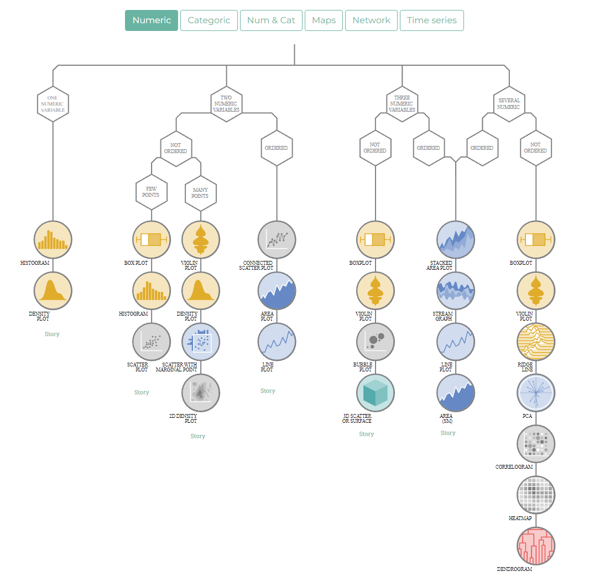
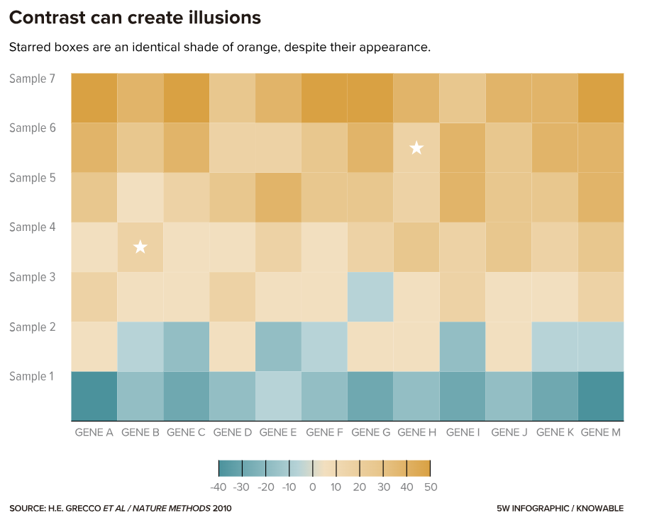
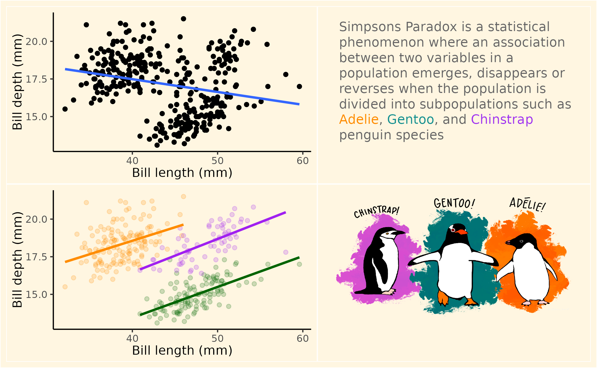

# Best Practice in Data visualisation


```{r, echo = F, warning = F, message = F}
library(tidyverse)
library(janitor)
library(here)
library(palmerpenguins)
source("R/booktem_setup.R")
source("R/my_setup.R")
source("sims.R")
```


```{r, eval=T, echo=F}
library(tidyverse)
library(palmerpenguins)
library(showtext)
library(patchwork)
library(ggtext)
library(ggbeeswarm)
library(gghighlight)

```


```{r, eval=F, echo=T}
library(tidyverse)
library(palmerpenguins)
library(showtext)
library(patchwork)
library(ggtext)
library(ggbeeswarm)
library(gghighlight)
library(sjPlot)
library(png)
library(ggpubr)
```


## Introduction

Data visualisation is a critical skill for scientists, allowing for the clear and effective communication of complex datasets. Whether creating figures for research papers, presentations, or reports, scientists must ensure their visualisations are accurate, clear, and accessible. Poor visualisations can mislead audiences, obscure key insights, or reduce the credibility of the findings. This tutorial will provide best practices for scientific data visualisation, covering accessibility, clarity, appropriate chart selection, and avoiding common statistical and graphical mistakes.

This chapter has taken inspiration from the following sources: 

- [Royal Statistical Society Data Visualisation Guide](https://royal-statistical-society.github.io/datavisguide/docs/styling.html)

- [Data to Viz](https://www.data-to-viz.com/)

- [Fundamentals of Data Visualisation](https://clauswilke.com/dataviz/)

- [Why scientists need to be better at data visualization](https://knowablemagazine.org/content/article/mind/2019/science-data-visualization)

Make sure to read @sec-ggplot for the basics and @sec-advanced-ggplot for even more data visualisation tips. 


## Choosing the right visualisation

Selecting the correct visualisation depends on the type of data being presented. [From Data to Viz](https://www.data-to-viz.com/) presents users with a series of decision trees, each leading to different recommended chart formats depending on the type of data selected (numeric, categoric, etc.).

```{r, eval=TRUE, echo=FALSE, out.width="80%", fig.alt= "tidy data overview"}

```


## ABC's

Creating effective data visualizations requires a balance of accuracy, beauty, and clarity. A well-designed chart should communicate insights clearly while also being visually appealing. The **ABC’s** of good data visualisation provide a simple framework to ensure your figures are both informative and engaging:

**A – Accurate:** Represent data truthfully. Avoid misleading scales, exaggerated trends, or unnecessary complexity that distorts the message. Scientific figures should be precise and reproducible.

**B – Beautiful:** A well-designed chart captures attention and enhances readability. Use thoughtful layout, balanced spacing, and clean, professional aesthetics to make data both engaging and easy to interpret.

**C – Clear:** Ensure your audience can understand the data in the right context. Provide clear titles, legends, and annotations, and use colorblind-friendly palettes to make your visuals inclusive.

By following these principles, you can create visuals that effectively tell a story, engage your audience, and support data-driven decision-making. 🚀

## Accuracy

Data visualisation is a powerful tool for scientists, enabling us to communicate complex information clearly and effectively. However, a poorly designed visualization can easily distort or misrepresent data, leading to incorrect interpretations and flawed conclusions. This section focuses on the principles of accuracy in data visualisation, emphasising the importance of avoiding common pitfalls, and ensuring that your figures are both informative and honest. Understanding these principles is essential for presenting your data in a way that is both scientifically rigorous and easily understood by your audience.

It's very easy to inadvertently (or deliberately) mislead your audience when creating data visualisations. Here are some common blunders to avoid, with a focus on accuracy:

### Dodgy Axes and Scales

#### Truncated Y-axis: 

Chopping off the bottom of the Y-axis (not starting it at zero) can make differences look far more dramatic than they actually are, leading to an inaccurate perception of the data.

`r hide("Code")`

```{r, eval = FALSE}

penguins |> 
  ggplot(aes(x = species)) +
    geom_bar() +
    theme_minimal() +
    coord_cartesian(ylim = c(60,150))


```
`r unhide()`

```{r, echo = FALSE}

penguins |> 
  ggplot(aes(x = species)) +
    geom_bar() +
    theme_minimal() +
    coord_cartesian(ylim = c(60,150))


```

**Q. Explain why truncating the y-axis in this plot is misleading. How does it affect the perceived difference between the categories? What is the impact of this on the conclusions you might draw from the data?**


`r hide("Solution")`

Truncated axes can exaggerate differences. You should have a good reason not to set the minimum axis values at 0. 

```{r, echo}
penguins |> 
  ggplot(aes(x = species)) +
    geom_bar() +
    theme_minimal() 

```

`r unhide()`

#### Inconsistent Scales: 

Comparing graphs that use different scales on their axes can be deeply misleading. Make sure you're comparing apples with apples, not apples with slightly smaller apples - or worse, oranges. The scaling changes the values and can thus make the visual inaccurate

`r hide("Code")`

```{r, eval = FALSE}

# Simulate Data
set.seed(123)
data1 <- data.frame(Category = c("A", "B", "C"), Value = c(10, 12, 15))
data2 <- data.frame(Category = c("A", "B", "C"), Value = c(100, 120, 150))

# Plot 1 (Smaller Scale)
plot1 <- ggplot(data1, aes(x = Category, y = Value)) +
  geom_bar(stat = "identity") +
  ggtitle("Dataset 1")

# Plot 2 (Larger Scale)
plot2 <- ggplot(data2, aes(x = Category, y = Value)) +
  geom_bar(stat = "identity") +
  ggtitle("Dataset 2")

# Arrange plots - LOOK at the Y axis
plot1 + plot2

```

`r unhide()`

```{r, echo = FALSE}

# Simulate Data
set.seed(123)
data1 <- data.frame(Category = c("A", "B", "C"), Value = c(10, 12, 15))
data2 <- data.frame(Category = c("A", "B", "C"), Value = c(100, 120, 150))

# Plot 1 (Smaller Scale)
plot1 <- ggplot(data1, aes(x = Category, y = Value)) +
  geom_bar(stat = "identity") +
  ggtitle("Dataset 1")

# Plot 2 (Larger Scale)
plot2 <- ggplot(data2, aes(x = Category, y = Value)) +
  geom_bar(stat = "identity") +
  ggtitle("Dataset 2")

# Arrange plots - LOOK at the Y axis
plot1 + plot2

```


#### Logarithmic Scales Misuse: 

Using log scales inappropriately (or without clearly labelling them as such) can completely distort the perception of trends. They're useful for exponential relationships, but using them incorrectly creates a false representation of the data.


`r hide("Code")`

```{r, eval = FALSE}

set.seed(123)
data <- data.frame(
  Time = 1:10,
  Value = c(1, 10, 100, 1000, 10000, 100000, 1000000, 10000000, 100000000, 1000000000) # Exponential growth
)

# Misleading Log Scale (Unlabelled)
ggplot(data, aes(x = Time, y = Value)) +
  geom_line() +
  scale_y_log10() 

```

`r unhide()`

```{r, echo = FALSE}

set.seed(123)
data <- data.frame(
  Time = 1:10,
  Value = c(1, 10, 100, 1000, 10000, 100000, 1000000, 10000000, 100000000, 1000000000) # Exponential growth
)

# Misleading Log Scale (Unlabelled)
ggplot(data, aes(x = Time, y = Value)) +
  geom_line() +
  scale_y_log10() 
```


When we do use a log scale - we need to make sure it is clearly labelled as such it is necessary to: 

- Make the scale attractive (use the scales package)

- Clearly label that a log scale was used

- Clearly include the *base* e.g. Log10, natural log etc.


`r hide("Code")`

```{r, eval = FALSE}

set.seed(123)
data <- data.frame(
  Time = 1:10,
  Value = c(1, 10, 100, 1000, 10000, 100000, 1000000, 10000000, 100000000, 1000000000) # Exponential growth
)


ggplot(data, aes(x = Time, y = Value)) +
  geom_line() +
  scale_y_log10(labels = scales::label_log()) +
  theme_minimal()+
  annotation_logticks()+
  labs(y = "Log10 scale")
```

`r unhide()`

```{r, echo = FALSE}

set.seed(123)
data <- data.frame(
  Time = 1:10,
  Value = c(1, 10, 100, 1000, 10000, 100000, 1000000, 10000000, 100000000, 1000000000) # Exponential growth
)


ggplot(data, aes(x = Time, y = Value)) +
  geom_line() +
  scale_y_log10(labels = scales::label_log()) +
  theme_minimal()+
  annotation_logticks()+
  labs(y = "Log10 scale")


```


### Chart Choice Calamities (Accuracy Edition)

Pie Chart Problems: While not always inaccurate, pie charts often make it difficult to accurately compare proportions, especially when segment sizes are similar. Bar charts or stacked bar charts are often a better bet for accuracy.

`r hide("Code")`

```{r, eval = FALSE}

set.seed(123)
data <- data.frame(
  Category = factor(c("A", "B", "C", "D", "E")),
  Value = c(20, 22, 18, 25, 15)
)

# Gaffe (Pie Chart)
ggplot(data, aes(x = "", y = Value, fill = Category)) +
  geom_bar(stat = "identity", width = 1) +
  coord_polar("y", start=0) +
  theme_void() +
  ggtitle("Pie Chart (Difficult to Compare)")

```

`r unhide()`

```{r, echo = FALSE}

set.seed(123)
data <- data.frame(
  Category = factor(c("A", "B", "C", "D", "E")),
  Value = c(20, 22, 18, 25, 15)
)

# Gaffe (Pie Chart)
ggplot(data, aes(x = "", y = Value, fill = Category)) +
  geom_bar(stat = "identity", width = 1) +
  coord_polar("y", start=0) +
  theme_void() +
  ggtitle("Pie Chart (Difficult to Compare)")


```

**Q. What do you think is the second largest group by proportion. What share of the pie does it have?**

`r hide("Alternative")`


Be honest, with this bar chart are the proportions and values easier to determine?

```{r}
# Fix (Bar Chart)
ggplot(data, aes(x = Category, y = Value)) +
  geom_bar(stat = "identity") +
  ggtitle("Bar Chart (Easier Comparison)")

```


`r unhide()`


### Statistical Slip-Ups

#### Regression Line Misuse: 

Plotting a regression line when you only have a correlation, without any theoretical basis for a causal relationship, is a big no-no. A correlation doesn't imply causation, and it certainly doesn't automatically justify a regression model. It *may* inaccurately suggests a causal relationship.

`r hide("Code")`

```{r, eval = FALSE}

colours <- c("darkorange",
             "darkgreen",
             "purple")

names(colours) <- unique(penguins$species)

ggplot(penguins, aes(x= bill_length_mm, 
                     y= bill_depth_mm,
                     colour=species)) +
    geom_point()+
  geom_smooth(method="lm",
              se=FALSE)+
  scale_colour_manual(values=colours)+
  theme_classic()+
    labs(x="Bill length (mm)",
         y="Bill depth (mm)")

```

`r unhide()`

```{r, echo = FALSE}

colours <- c("darkorange",
             "darkgreen",
             "purple")

names(colours) <- unique(penguins$species)

ggplot(penguins, aes(x= bill_length_mm, 
                     y= bill_depth_mm,
                     colour=species)) +
    geom_point()+
  geom_smooth(method="lm",
              se=FALSE)+
  scale_colour_manual(values=colours)+
  theme_classic()+
    labs(x="Bill length (mm)",
         y="Bill depth (mm)")


```

When we haven't established a *cause and effect* relationship, we should consider not including a regression line and present the simple scatterplot instead: 

`r hide("Code")`

```{r, eval = FALSE}
ggplot(penguins, aes(x= bill_length_mm, 
                     y= bill_depth_mm,
                     colour=species)) +
    geom_point()+
  scale_colour_manual(values=colours)+
  theme_classic()+
    labs(x="Bill length (mm)",
         y="Bill depth (mm)")

```

`r unhide()`

```{r}
ggplot(penguins, aes(x= bill_length_mm, 
                     y= bill_depth_mm,
                     colour=species)) +
    geom_point()+
  scale_colour_manual(values=colours)+
  theme_classic()+
    labs(x="Bill length (mm)",
         y="Bill depth (mm)")

```

##### Model Mismatch with geom_smooth: 

Using independent regressions (with things like `geom_smooth` in `ggplot2`) when you have a pre-existing model that doesn't match this (e.g., a global model, a mixed-effects model) is a serious error. You're creating a visualisation that contradicts your actual analysis. 

The `geom_smooth` function will default to fit a "loess" regression - but even when set to "lm" it is fitting individual regression models for each group in turn - this might not represent the model you have fitted for your data

```{r}
library(sjPlot)

tab_model(lm(bill_depth_mm ~ bill_length_mm + species, data = penguins))

```

`r hide("Code")`

```{r, eval = FALSE}

penguins |> 
  ggplot(aes(x= bill_length_mm, 
                     y= bill_depth_mm,
                     colour=species)) +
    geom_point(alpha = .4)+
    geom_smooth() +
  scale_colour_manual(values=colours)+
  theme_classic()+
    labs(x="Bill length (mm)",
         y="Bill depth (mm)")

```

`r unhide()`

```{r, echo = FALSE}
penguins |> 
  ggplot(aes(x= bill_length_mm, 
                     y= bill_depth_mm,
                     colour=species)) +
    geom_point(alpha = .4)+
    geom_smooth() +
  scale_colour_manual(values=colours)+
  theme_classic()+
    labs(x="Bill length (mm)",
         y="Bill depth (mm)")

```


Whenever possible we should fit, evaluate and then visualise the actual model we have generated to explain our data:

`r hide("Code")`

```{r, eval = FALSE}

lm(bill_depth_mm ~ bill_length_mm + species, data = penguins) |> 
  broom::augment() |> 
  ggplot(aes(x= bill_length_mm, 
                     y= bill_depth_mm,
                     colour=species)) +
    geom_point(alpha = .4)+
    geom_line(aes(y = .fitted))+
  scale_colour_manual(values=colours)+
  theme_classic()+
    labs(x="Bill length (mm)",
         y="Bill depth (mm)")

```

`r unhide()`

```{r, echo = FALSE}

lm(bill_depth_mm ~ bill_length_mm + species, data = penguins) |> 
  broom::augment() |> 
  ggplot(aes(x= bill_length_mm, 
                     y= bill_depth_mm,
                     colour=species)) +
    geom_point(alpha = .4)+
    geom_line(aes(y = .fitted))+
  scale_colour_manual(values=colours)+
  theme_classic()+
    labs(x="Bill length (mm)",
         y="Bill depth (mm)")

```

#### Ignoring Uncertainty: 

Failing to show uncertainty (e.g., error bars, confidence intervals) can give a misleading impression of precision. You're presenting point estimates as certainties, which is inaccurate. Wherever possible we should include a measure of uncertainty - and clearly indicate what it is for both:


##### Regression

`r hide("Code")`

```{r, eval = FALSE}
lm(bill_depth_mm ~ bill_length_mm + species, data = penguins) |> 
    broom::augment(interval = "confidence") |> 
  ggplot(aes(x= bill_length_mm, 
                     y= bill_depth_mm,
                     colour=species)) +
      geom_ribbon(aes(y = .fitted,
                    ymin = .upper,
                    ymax = .lower,
                    fill = species),
                  colour = NA,
                  alpha = .4)+
    geom_point(alpha = .4)+
    geom_line(aes(y = .fitted))+
  scale_colour_manual(values=colours)+
  scale_fill_manual(values = colours)+
  theme_classic()+
    labs(x="Bill length (mm)",
         y="Bill depth (mm)")

```

`r unhide()`

```{r, echo = FALSE, fig.cap = "Regression analysis of Bill length (mm) against Bill depth (mm), solid line indicates mean with shaded intervals for 95% confidence intervals"}
lm(bill_depth_mm ~ bill_length_mm + species, data = penguins) |> 
    broom::augment(interval = "confidence") |> 
  ggplot(aes(x= bill_length_mm, 
                     y= bill_depth_mm,
                     colour=species)) +
      geom_ribbon(aes(y = .fitted,
                    ymin = .upper,
                    ymax = .lower,
                    fill = species),
                  colour = NA,
                  alpha = .4)+
    geom_point(alpha = .4)+
    geom_line(aes(y = .fitted))+
  scale_colour_manual(values=colours)+
  scale_fill_manual(values = colours)+
  theme_classic()+
    labs(x="Bill length (mm)",
         y="Bill depth (mm)")

```

##### Difference plots

`r hide("Code")`

```{r, eval = FALSE}
sex_colours <- c("darkblue", "darkred")

body_mass_model <- lm(body_mass_g ~ sex * species, data = penguins) |> 
  emmeans::emmeans(specs = ~ sex + species) |> 
  as_tibble()

penguins |> 
  drop_na(sex) |> 
  ggplot(aes(x = species, 
             y = body_mass_g,
            colour=sex)) +
    geom_point(alpha = .2,
                position = position_jitterdodge(dodge.width = .2)) +
    geom_point(data = body_mass_model,
               aes(x = species,
                   y = emmean,
                   colour = sex),
                position = position_dodge(width = .2),
               size = 2) +
    geom_linerange(data = body_mass_model,
                   aes(x = species,
                       y=emmean,
                       ymin = lower.CL,
                       ymax = upper.CL),
                position = position_dodge(width = .2))+
  scale_colour_manual(values=sex_colours)+
  scale_fill_manual(values = sex_colours)+
  theme_classic()+
    labs(x="Sex",
         y="Body Mass (g)")

```

`r unhide()`

```{r, echo = FALSE, fig.cap = "Mean estimate differences in Body mass (g) by sex and species of penguin, small faded points indicate raw data solid points and vertical lines indicate mean and 95% confidence intervals"}

sex_colours <- c("darkblue", "darkred")

body_mass_model <- lm(body_mass_g ~ sex * species, data = penguins) |> 
  emmeans::emmeans(specs = ~ sex + species) |> 
  as_tibble()

penguins |> 
  drop_na(sex) |> 
  ggplot(aes(x = species, 
             y = body_mass_g,
            colour=sex)) +
    geom_point(alpha = .2,
                position = position_jitterdodge(dodge.width = .2)) +
    geom_point(data = body_mass_model,
               aes(x = species,
                   y = emmean,
                   colour = sex),
                position = position_dodge(width = .2),
               size = 2) +
    geom_linerange(data = body_mass_model,
                   aes(x = species,
                       y=emmean,
                       ymin = lower.CL,
                       ymax = upper.CL),
                position = position_dodge(width = .2))+
  scale_colour_manual(values=sex_colours)+
  scale_fill_manual(values = sex_colours)+
  theme_classic()+
    labs(x="Sex",
         y="Body Mass (g)")
```


### Include raw data in figures: 

Why should we make an effort to include raw data in our figures? 

- Transparency and reproducibility:

Raw data is a great starting point for enabling others to verify your findings and conduct independent analyses

The information helps to reduce suspicion and ensure scientific conclusions can be reproduced

- Contextualization of statistics:

Raw data allows a reader to understand the raw distribution

Readers can assess whether summary statistics are really representative of the underlying data (outliers)

- Identifying errors and biases:

Raw data makes it easier to spot errors

It enhances the overall credibility of the published findings

`r hide("Code")`
```{r, eval = FALSE}
# Simulated dataset
set.seed(123)
df <- data.frame(
  group = rep(c("A", "B"), each = 50),
  value = c(c(rnorm(49, mean = 10, sd = 2), 20), c(rnorm(25, mean = 12, sd = 2), rnorm(25, mean = 20, sd =2))
))

# Summary statistics for bar plot
summary_df <- df %>%
  group_by(group) %>%
  summarise(mean = mean(value), se = sd(value) / sqrt(n()))

# Bar plots with SE
g_bar <- ggplot(summary_df, aes(x = group, y = mean, fill = group)) +
  geom_bar(stat = "identity", color = "black") +
  geom_errorbar(aes(ymin = mean - se, ymax = mean + se), width = 0.2) +
  theme_minimal() +
  ggtitle("Bar plot with SE")

# Box plots
g_box <- ggplot(df, aes(x = group, y = value, fill = group)) +
  geom_boxplot() +
  theme_minimal() +
  ggtitle("Box plot")

# Violin plots
g_violin <- ggplot(df, aes(x = group, y = value, fill = group)) +
  geom_violin() +
  theme_minimal() +
  ggtitle("Violin plot")

# Raw data points with jitter
g_jitter <- ggplot(df, aes(x = group, y = value, color = group)) +
  geom_jitter(width = 0.2, alpha = 0.5) +
  theme_minimal() +
  ggtitle("Jittered raw data")

# Box plot with jittered points
g_box_jitter <- ggplot(df, aes(x = group, y = value, fill = group)) +
  geom_boxplot(outlier.shape = NA, alpha = 0.5) +
  geom_jitter(aes(color = group), width = 0.2, alpha = 0.5) +
  theme_minimal() +
  ggtitle("Box plot with raw data")

# Arrange plots in a grid using patchwork
(g_bar | g_box) / (g_violin | g_jitter) / g_box_jitter + plot_annotation('Data revealed with raw values can be hidden in summary plots') & theme(legend.position = "none")


```

`r unhide()`

```{r, echo = FALSE}

# Simulated dataset
set.seed(123)
df <- data.frame(
  group = rep(c("A", "B"), each = 50),
  value = c(c(rnorm(49, mean = 10, sd = 2), 20), c(rnorm(25, mean = 12, sd = 2), rnorm(25, mean = 20, sd =2))
))

# Summary statistics for bar plot
summary_df <- df %>%
  group_by(group) %>%
  summarise(mean = mean(value), se = sd(value) / sqrt(n()))

# Bar plots with SE
g_bar <- ggplot(summary_df, aes(x = group, y = mean, fill = group)) +
  geom_bar(stat = "identity", color = "black") +
  geom_errorbar(aes(ymin = mean - se, ymax = mean + se), width = 0.2) +
  theme_minimal() +
  ggtitle("Bar plot with SE")

# Box plots
g_box <- ggplot(df, aes(x = group, y = value, fill = group)) +
  geom_boxplot() +
  theme_minimal() +
  ggtitle("Box plot")

# Violin plots
g_violin <- ggplot(df, aes(x = group, y = value, fill = group)) +
  geom_violin() +
  theme_minimal() +
  ggtitle("Violin plot")

# Raw data points with jitter
g_jitter <- ggplot(df, aes(x = group, y = value, color = group)) +
  geom_jitter(width = 0.2, alpha = 0.5) +
  theme_minimal() +
  ggtitle("Jittered raw data")

# Box plot with jittered points
g_box_jitter <- ggplot(df, aes(x = group, y = value, fill = group)) +
  geom_boxplot(outlier.shape = NA, alpha = 0.5) +
  geom_jitter(aes(color = group), width = 0.2, alpha = 0.5) +
  theme_minimal() +
  ggtitle("Box plot with raw data")

# Arrange plots in a grid using patchwork
(g_bar | g_box) / (g_violin | g_jitter) / g_box_jitter + plot_annotation('Data revealed with raw values can be hidden in summary plots') & theme(legend.position = "none") 


```

#### Overlapping data points

`r hide("Code")`

```{r, eval = FALSE}
library(ggbeeswarm)
penguins |> 
    ggplot(aes(x = species,
               y = body_mass_g,
               fill = species))+
    geom_beeswarm(shape = 21, 
                  colour = "white")+
  theme_classic()+
    scale_fill_manual(values = colours)

```

`r unhide()`

```{r, echo = FALSE}

library(ggbeeswarm)
penguins |> 
    ggplot(aes(x = species,
               y = body_mass_g,
               fill = species))+
    geom_beeswarm(shape = 21, 
                  colour = "white")+
  theme_classic()+
    scale_fill_manual(values = colours)

```


## Beauty

Why Does Attractiveness Matter?

- Enhances Readability – A well-designed figure reduces cognitive load, making it easier for the audience to process the information quickly.

- Encourages Engagement – A visually pleasing chart is more likely to hold the viewer’s attention, especially in presentations or public communication.

- Aids Retention – People remember visuals better when they are aesthetically pleasing and well-structured.

- Signals Professionalism – A well-crafted visual enhances credibility and demonstrates attention to detail.

### Rotated figures

When using plots for simple differences - consider ordering the categorical axis in order from highest to lowest value (*except if they already have an intrinsic order*) - rotating the plots can also make them look more attractive and aid interpretation: 

`r hide("Code")`

```{r, eval = FALSE}
penguins |> 
    mutate(species = fct_infreq(species)) |> 
  ggplot(aes(x = species)) +
    geom_bar() +
    coord_flip() +
    theme_minimal() +
    ggtitle("Rotated Figure")

```

`r unhide()`

```{r, echo = FALSE}

penguins |> 
    mutate(species = fct_infreq(species)) |> 
  ggplot(aes(x = species)) +
    geom_bar() +
    coord_flip() +
    theme_minimal() +
    ggtitle("Rotated Figure")

```

### Avoid unnecessary colours and legends

In this example - neither the colour or the figure legend add any value to the plot - the information on species is already contained withing the x-axis. In addition the colours used here are not particularly attractive. Instead consider a simple uniform colour to make the figures look more attractive, and reserve different colour use for conveying information see @sec-acc-col

`r hide("Code")`

```{r, eval = FALSE}
penguins |> 
    mutate(species = fct_infreq(species)) |> 
  ggplot(aes(x = species,
             fill = species)) +
    geom_bar() +
    coord_flip() +
    theme_minimal()

```

`r unhide()`

```{r, eval = FALSE}

penguins |> 
    mutate(species = fct_infreq(species)) |> 
  ggplot(aes(x = species,
             fill = species)) +
    geom_bar() +
    coord_flip() +
    theme_minimal()
```


```{r, echo = FALSE, eval = FALSE}

# Misalignment

plot_1 <- ggplot(penguins, aes(x= bill_length_mm, 
                     y= bill_depth_mm,
                     colour=species)) +
    geom_point()+
  scale_colour_manual(values=colours)+
  theme_classic()+
  theme(legend.position = "none")+
    labs(x="Bill length (mm)",
         y="Bill depth (mm)")

plot_2 <- penguins |> 
    mutate(species = fct_infreq(species)) |> 
  ggplot(aes(x = species,
             fill = species)) +
  scale_fill_manual(values = colours) +
    geom_bar() +
    coord_flip() +
    theme_minimal()
    
  plot_1 + plot_2 + plot_layout(guides = "collect")
  
layout <- "AAAABBBB
           AAAABBBB
           AAAABBBB
           ####BBBB"

  plot_1 + plot_2 + plot_layout(guides = "collect", design = layout)

```


:::{.callout-warning}

```{r, eval=TRUE, echo=FALSE, out.width="80%", fig.alt= "Multi panel plot"}

```

:::


### Theme (unnecessary grids and frames)

There is already lots of information on how to customise themes in the ggplot appendices - here we visit some simple rules for maximising attractiveness: 

Try to avoid unnecessary gridlines - these clutter the plot

`r hide("Code")`

```{r, eval = FALSE}

ggplot(penguins, aes(x= bill_length_mm, 
                     y= bill_depth_mm,
                     colour=species)) +
    geom_point()+
  scale_colour_manual(values=colours)+
  theme_bw()+
    labs(x="Bill length (mm)",
         y="Bill depth (mm)") +
  theme(legend.background = element_rect(colour = "black"))
  

```

`r unhide()`

```{r}

ggplot(penguins, aes(x= bill_length_mm, 
                     y= bill_depth_mm,
                     colour=species)) +
    geom_point()+
  scale_colour_manual(values=colours)+
  theme_bw()+
    labs(x="Bill length (mm)",
         y="Bill depth (mm)") +
  theme(legend.background = element_rect(colour = "black"))
  

```

**BUT** if you remove too many gridlines - it can reduce accuracy and attractiveness. You can play with preset `themes` and customise these further to produce the figure that is right for your data. 

In this example - we have retained the axis lines but removed all grids - there is an argument that we have lost anchor points for our data - that it is now harder to estimate precise values for data points: 

`r hide("Code")`

```{r, eval = FALSE}
ggplot(penguins, aes(x= bill_length_mm, 
                     y= bill_depth_mm,
                     colour=species)) +
    geom_point()+
  scale_colour_manual(values=colours)+
  theme_classic()+
    labs(x="Bill length (mm)",
         y="Bill depth (mm)") 

```

`r unhide()`

```{r, echo = FALSE}
ggplot(penguins, aes(x= bill_length_mm, 
                     y= bill_depth_mm,
                     colour=species)) +
    geom_point()+
  scale_colour_manual(values=colours)+
  theme_classic()+
    labs(x="Bill length (mm)",
         y="Bill depth (mm)") 

```


Compare that with this subtle change - the gridlines are unobtrusive but anchor the datapoints:


`r hide("Code")`

```{r, eval = FALSE}
ggplot(penguins, aes(x= bill_length_mm, 
                     y= bill_depth_mm,
                     colour=species)) +
    geom_point()+
  scale_colour_manual(values=colours)+
  theme_minimal()+
    labs(x="Bill length (mm)",
         y="Bill depth (mm)") 

```

`r unhide()`

```{r, echo = FALSE}
ggplot(penguins, aes(x= bill_length_mm, 
                     y= bill_depth_mm,
                     colour=species)) +
    geom_point()+
  scale_colour_manual(values=colours)+
  theme_minimal()+
    labs(x="Bill length (mm)",
         y="Bill depth (mm)") 

```

### Fonts

#### Font size

Larger fonts are easier to read. It’s generally recommended that font size is at least 12pt for printed materials or websites. If you’re creating a presentation, fonts should be at least 36pt to make sure they’re visible to people nearer the back of the room.

In this example the text is too small - making it less attractive and hard to read: 

`r hide("Code")`

```{r, eval = FALSE}
ggplot(penguins, aes(x= bill_length_mm, 
                     y= bill_depth_mm,
                     colour=species)) +
  geom_point()+
  scale_colour_manual(values=colours)+
  theme_classic()+
    labs(x="Bill length (mm)",
         y="Bill depth (mm)") +
  theme(text = element_text(size = 6))

```

`r unhide()`

```{r, echo = FALSE}

ggplot(penguins, aes(x= bill_length_mm, 
                     y= bill_depth_mm,
                     colour=species)) +
  geom_point()+
  scale_colour_manual(values=colours)+
  theme_classic()+
    labs(x="Bill length (mm)",
         y="Bill depth (mm)") +
  theme(text = element_text(size = 6))
  

```

#### Font family


With extensions to ggplot we have full customisation of fonts, so what makes a good choice of font family? There are three main types of font:

- Serif: serifs are the small strokes on the ends of some longer strokes that occur in some fonts. Fonts that have these serifs are called serif fonts.

- Sans serif: Fonts without serifs are called sans serif fonts.

- Monospace: monospace fonts are those whose characters each take up an equal width.

There is no consensus as to which type of font (serif, sans serif, or monospace) is more accessible. The simpler characters of sans serif fonts may increase readability for visually impaired readers, while those with dyslexia may find the characters more difficult to tell apart. Serif fonts (such as Times New Roman) can be more difficult to read as the decorative lines distract from the shape of the letter. This is especially true in digital publications where on-screen pixelation can further distort the letters. For this reason sans serif fonts for any text in images that will appear online may be preferred. 


:::{.callout-warning}

Some fonts are not compatible with latex - which means they will cause errors if you try to knit to pdf. 

When using showtext and ggsave - using the opts argument to set a higher dpi (300)

:::

`r hide("Code")`

```{r, eval = FALSE}
library(showtext)
font_add_google("Fira Sans", "Fira")
showtext_auto() # if you set this fonts will be applied for the rest of the session
# showtext_opts(dpi = 300)

ggplot(penguins, aes(x= bill_length_mm, 
                     y= bill_depth_mm,
                     colour=species)) +
  geom_point()+
  scale_colour_manual(values=colours)+
  theme_classic()+
    labs(x="Bill length (mm)",
         y="Bill depth (mm)") +
  theme(text = element_text(size = 6))

showtext_auto(FALSE) # this stops show text fonts being applied

```

`r unhide()`

```{r, echo = FALSE}
library(showtext)
font_add_google("Fira Sans", "Fira")
showtext_auto()
# showtext_opts(dpi = 300)

ggplot(penguins, aes(x= bill_length_mm, 
                     y= bill_depth_mm,
                     colour=species)) +
  geom_point()+
  scale_colour_manual(values=colours)+
  theme_classic()+
    labs(x="Bill length (mm)",
         y="Bill depth (mm)") +
  theme(text = element_text(size = 6))

showtext_auto(FALSE)

```


## Clarity and Accessibility

A clear figure should be understandable without needing additional explanation.

### Clarity Guidelines

✔ Use descriptive axis labels and legends (e.g., “Growth Rate (cm/day)” instead of “Rate”)


```{r}

ggplot(penguins, aes(x = species, y = bill_length_mm)) +
  geom_boxplot() +
  xlab("Species") +
  ylab("Bill Length") + # Lacks units
  ggtitle("Missing Descriptive Labels")


```

✔Avoid unnecessary complexity (too many categories, excessive colors) 

`r hide("Code")`

```{r, eval = FALSE}

penguins |> drop_na(sex) |> 
ggplot(aes(x= bill_length_mm, 
                     y= bill_depth_mm,
                     colour=species,
                     shape = sex)) +
  geom_point()+
  scale_colour_manual(values=colours)+
  theme_classic()+
    labs(x="Bill length (mm)",
         y="Bill depth (mm)") +
  theme(text = element_text(size = 6))

```

`r unhide()`

```{r, echo = FALSE}
penguins |> drop_na(sex) |> 
ggplot(aes(x= bill_length_mm, 
                     y= bill_depth_mm,
                     colour=species,
                     shape = sex)) +
  geom_point()+
  scale_colour_manual(values=colours)+
  theme_classic()+
    labs(x="Bill length (mm)",
         y="Bill depth (mm)") +
  theme(text = element_text(size = 6))


```


Instead you may need to simplify plots - or separate some features across multiple panels: 


`r hide("Code")`

```{r, eval = FALSE}
penguins |> drop_na(sex) |> 
ggplot(aes(x= bill_length_mm, 
                     y= bill_depth_mm,
                     colour=species,
                     shape = sex)) +
  geom_point()+
  scale_colour_manual(values=colours)+
  theme_classic()+
    labs(x="Bill length (mm)",
         y="Bill depth (mm)") +
  theme(text = element_text(size = 6))+
  facet_wrap(~sex)

```

`r unhide()`

```{r, echo = FALSE}
penguins |> drop_na(sex) |> 
ggplot(aes(x= bill_length_mm, 
                     y= bill_depth_mm,
                     colour=species,
                     shape = sex)) +
  geom_point()+
  scale_colour_manual(values=colours)+
  theme_classic()+
    labs(x="Bill length (mm)",
         y="Bill depth (mm)") +
  theme(text = element_text(size = 6))+
  facet_wrap(~sex)

```
 

### Accessible Colour

✔ Use colorblind-friendly palettes (e.g., Viridis, Color Universal Design)

 Use colorblind-friendly palettes

See @sec-acc-col

> Consider Grayscale or dashed vs. solid lines work well for black-and-white printing.

✔ Ensure sufficient contrast between elements

`r hide("Code")`

```{r, eval = FALSE}
ggplot(penguins, aes(x = species, y = bill_length_mm)) +
  geom_boxplot(fill = "grey90", color = "grey80") + # Very light colors
  theme_minimal() +
  ggtitle("Low Contrast")

```

`r unhide()`

```{r, echo = FALSE}

ggplot(penguins, aes(x = species, y = bill_length_mm)) +
  geom_boxplot(fill = "grey90", color = "grey80") + # Very light colors
  theme_minimal() +
  ggtitle("Low Contrast")

```

`r hide("Code")`

```{r, eval = FALSE}

ggplot(penguins, aes(x = species, y = bill_length_mm)) +
  geom_boxplot(fill = "skyblue", color = "black") + # Clear contrast
  theme_minimal() +
  ggtitle("High Contrast")

```

`r unhide()`

```{r, echo = FALSE}
ggplot(penguins, aes(x = species, y = bill_length_mm)) +
  geom_boxplot(fill = "skyblue", color = "black") + # Clear contrast
  theme_minimal() +
  ggtitle("High Contrast")


```


### Annotations

✔ Where possible - label data directly

`r hide("Code")`

```{r, eval = FALSE}

penguin_count <- penguins |> group_by(species) |> 
  summarise(n = n())

penguins |> 
    mutate(species = fct_infreq(species)) |> 
  ggplot(aes(x = species)) +
    geom_bar(
         colour = "black",
         fill = "gray90") +
   geom_text(data = penguin_count,
             aes(x = species, 
                 y = n, 
                 label = n),
             hjust = 1.5)+
    coord_flip() +
    theme_minimal()+
    theme(legend.position = "none")

```

`r unhide()`

```{r}

penguin_count <- penguins |> group_by(species) |> 
  summarise(n = n())

penguins |> 
    mutate(species = fct_infreq(species)) |> 
  ggplot(aes(x = species)) +
    geom_bar(
         colour = "black",
         fill = "gray90") +
   geom_text(data = penguin_count,
             aes(x = species, 
                 y = n, 
                 label = n),
             hjust = 1.5)+
    coord_flip() +
    theme_minimal()+
    theme(legend.position = "none")

```

And try not to rely on colour as the only way to communicate information: 

```{r}
ggplot(penguins, aes(x = bill_length_mm, y = bill_depth_mm, color = species)) +
  geom_point() +
  ggtitle("Relying on Color")


```

In a scatter plot, directly labelling every data point isn’t usually an option as there are too many points to label without clutter. Instead, you may choose to indicate groups by shape - or if appropriate clustering: 

`r hide("Code")`

```{r, eval = FALSE, fig.asp = 0.8, fig.width = 7}
penguins |> 
  drop_na() |> 
ggplot(aes(x = bill_length_mm, 
           y = bill_depth_mm, 
           color = species,
           shape = species)) +
  geom_point(size = 3) +
  ggforce::geom_mark_ellipse(aes(group = species, 
                                 description = paste("Mean bill length:", round(mean(bill_length_mm), 1), "mm,\nMean bill depth:", round(mean(bill_depth_mm), 1), "mm")),
                          expand = unit(2, "mm"), # Adjust the padding around the ellipse
                          label.fontsize = 7, # Adjust font size for the label
                          con.colour = "black", # Connection line color
                          con.cap = unit(0.1, "mm")) + # Length of connection line ends
  scale_color_viridis_d(name = "Penguin Species") +  # Colorblind-friendly palette
  labs(title = "Penguin Bill Dimensions",
       subtitle = "Species Differences Highlighted with Ellipses",
       x = "Bill Length (mm)",
       y = "Bill Depth (mm)") +
  theme_minimal() +
  theme(legend.position = "bottom") + # Move the legend to the bottom for better layout
  guides(color = guide_legend(override.aes = list(shape = c(16, 17, 15))),
         shape = "none") # Make a unified legend.

```

`r unhide()`

```{r, echo = FALSE, fig.asp = 0.8, fig.width = 10}


penguins |> 
  drop_na() |> 
ggplot(aes(x = bill_length_mm, 
           y = bill_depth_mm, 
           color = species,
           shape = species)) +
  geom_point(size = 3) +
  ggforce::geom_mark_ellipse(aes(group = species, 
                                 description = paste("Mean bill length:", round(mean(bill_length_mm), 1), "mm,\nMean bill depth:", round(mean(bill_depth_mm), 1), "mm")),
                          expand = unit(2, "mm"), # Adjust the padding around the ellipse
                          label.fontsize = 7, # Adjust font size for the label
                          con.colour = "black", # Connection line color
                          con.cap = unit(0.1, "mm")) + # Length of connection line ends
  scale_color_viridis_d(name = "Penguin Species") +  # Colorblind-friendly palette
  labs(title = "Penguin Bill Dimensions",
       subtitle = "Species Differences Highlighted with Ellipses",
       x = "Bill Length (mm)",
       y = "Bill Depth (mm)") +
  theme_minimal() +
  theme(legend.position = "bottom") + # Move the legend to the bottom for better layout
  guides(color = guide_legend(override.aes = list(shape = c(16, 17, 15))),
         shape = "none") # Make a unified legend.
```

### Use visualisations appropriate to the audience

## Scientific Figures vs General Data Visualisations

Data visualizations serve different purposes in different contexts:

- Scientific Figures: Used in research papers, these focus on precision, reproducibility, and conveying detailed statistical information.

- General Data Visualizations: Found in public communication (e.g., news articles, reports), these are often simplified for accessibility.


| Feature | Scientific Figures | Storytelling Visuals |
|---|---|---|
| **Purpose** | Precision, reproducibility, detail | Clarity, impact, accessibility |
| **Audience** | Experts, researchers | General public, stakeholders |
| **Detail Level** | High, precise data representation | Simplified, focused on key takeaways |
| **Interactivity** | Typically static (e.g., in papers) | Can be interactive (e.g., dashboards) |
| **Titles** | Descriptive, factual (e.g., "Mean Gene Expression...") | Engaging, conveys main message (e.g., "Gene Expression Soars...") |
| **Captions/Legends** | Detailed, explaining methods and findings | Concise, highlighting the story |
| **Annotations** | Primarily for specific data points, statistical significance | Emphasise key data |
| **Color Palette** | Colorblind-friendly, consistent with data type (e.g., Viridis) | Color to can be used engage and draw attention to key features |
| **Uncertainty Representation** | Error bars, confidence intervals required | Often omitted for simplicity (use barcharts or dot charts) |
| **Statistical Analysis** | Regression lines, trend lines must be justified | Smoothed fits for general trends |
| **Log Scales** | Appropriate only with clear justification and labeling | Avoided unless necessary, with explanation |
| **Data Aggregation** | Show distributions, avoid over-averaging | Summarized means, easy-to-understand summaries |
| **Overall Goal** | Convey detailed information | Create immediate interest |
| **Regression Lines** | Only if causality is demonstrated | More relaxed - show correlation or trends |
| **Visualisation Type** | Complex: heatmaps or boxplots/violins, barcharts or dot charts with error bars | Often barcharts or dot charts without error bars |


### Scientific figure legends

A scientific figure legend must provide sufficient context to allow the figure to be understood independently of the main text. This includes:

- A Concise Title: A sentence or two conveying the main point of the figure. It shouldn't just describe what the figure is, but what it shows.

- Experimental Details: A brief description of the experimental design, methodology, and data collection procedures relevant to interpreting the figure. Be specific about sample sizes, replicates, and any manipulations or treatments applied.

- Definition of Variables and Symbols: Clear definitions of all variables, symbols, abbreviations, and color-coding used in the figure. This is crucial for understanding what each element represents.

- Statistical Information: Relevant statistical details, such as the type of test used (e.g., t-test, ANOVA), the p-value threshold for significance, and what error bars represent (e.g., standard deviation, standard error, confidence interval). If applicable, specify the n for each group.

- Caveats and Limitations: Acknowledge any limitations or assumptions that might affect the interpretation of the data. This demonstrates transparency and scientific rigor.

- Explicit statement of the main finding: Tell the reader what the figure shows - provide a very brief discussion of the conclusion you can draw based on the data visual

This comprehensive legend ensures that the figure effectively communicates its message and is readily interpretable by readers with diverse levels of familiarity with the specific research area. Also see @sec-public-plot.


### Storytelling with Data

The rules around data visuals for a more general audience—for public engagement talks, websites, conference posters, etc.—can be more relaxed, sacrificing some accuracy to produce a clearer message. However, this relaxation must not lead to outright misrepresentation or distortion of the underlying data.

- Prioritize Clarity: Simplify for a general audience; avoid complexity.

- Highlight Key Findings: Use annotations (sparingly!) to point out the 1-3 most important takeaways.

- Logical Ordering: Present data in a sensible order (chronological, by magnitude, etc.).

- One Visual, One Question: Each visual should answer a single, clear question.

- Appropriate Scales: Use appropriate scales and annotation, and avoid complicated data transformations

- Simplified Data: Make the message of the visual immediately clear. Avoid complex techniques

- Error Bars with Caution: Consider leaving these off completely

- Log Scales With Care: Be very careful about log scales

- Be Truthful: Do not mislead with cherry-picked data or biased representations. Aim for accessibility, not deception.

`r hide("Code")`

```{r, eval = FALSE}

penguin_count <- penguins |> 
  group_by(species) |> 
  summarise(n = n()) |> 
  ungroup() |> 
  mutate(perc = n/sum(n))

penguins |> 
    mutate(species = fct_infreq(species)) |> 
    mutate(species = fct_rev(species)) |> 
  ggplot(aes(x = species,
             fill = species)) +
  geom_bar(colour = "black") +
   gghighlight(species == "Adelie")+
   geom_text(data = penguin_count,
             aes(x = species, 
                 y = n, 
                 label = scales::percent(perc)),
             hjust = 1.5)+
    coord_flip() +
    theme_minimal()+
    theme(legend.position = "none",
           plot.title = element_textbox_simple(face = "bold"),
    plot.subtitle = element_textbox_simple(
      margin = margin(t = 10),
      lineheight = 1.5
    ))+
  scale_fill_manual(values=colours)+
  labs(title = "Penguin Numbers",
    subtitle = "<span style = 'color:#FF8C00'>Adelie</span> penguins are the most abundant species in the Palmer Archipelago",
    y = "Count")

```

`r unhide()`

```{r, echo = FALSE}

penguin_count <- penguins |> 
  group_by(species) |> 
  summarise(n = n()) |> 
  ungroup() |> 
  mutate(perc = n/sum(n))

penguins |> 
    mutate(species = fct_infreq(species)) |> 
    mutate(species = fct_rev(species)) |> 
  ggplot(aes(x = species,
             fill = species)) +
  geom_bar(colour = "black") +
   gghighlight(species == "Adelie")+
   geom_text(data = penguin_count,
             aes(x = species, 
                 y = n, 
                 label = scales::percent(perc)),
             hjust = 1.5)+
    coord_flip() +
    theme_minimal()+
    theme(legend.position = "none",
           plot.title = element_textbox_simple(face = "bold"),
    plot.subtitle = element_textbox_simple(
      margin = margin(t = 10),
      lineheight = 1.5
    ))+
  scale_fill_manual(values=colours)+
  labs(title = "Penguin Numbers",
    subtitle = "<span style = 'color:#FF8C00'>Adelie</span> penguins are the most abundant species in the Palmer Archipelago",
    y = "Count")
   


```


`r hide("Code")`

```{r}

library(patchwork)
library(png)
library(ggpubr)

penguin_pic <- png::readPNG("images/lter_penguins.png")

penguin_fig <- ggplot() +
  background_image(penguin_pic)


```


```{r}
text <- tibble(
  x = 0, y = 0, label = 'Simpsons Paradox is a statistical phenomenon where an association between two variables in a population emerges, disappears or reverses when the population is divided into subpopulations such as <span style = "color:#FF8C00">Adelie</span>, <span style ="color:#159090">Gentoo</span>, and <span style = "color:#A034F0">Chinstrap</span> penguin species'
)


pt <- ggplot(text, aes(x = x, y = y)) +
    ggtext::geom_textbox(
        aes(label = label),    # Map the 'label' column from the 'text' data to the text labels
        box.color = NA,
        fill = "#fff6e1",
         # Make the text box border color transparent
        width = unit(15, "lines"),  # Set the width of the text boxes to 15 lines
        color = "grey40",       # Set the text color to a light gray
        size = 4,             # Set the text size to 4 (adjust as needed)
        lineheight = 1.2)+        # Set the line height for text within the boxes +
    # Customize the plot coordinate system
    coord_cartesian(expand = FALSE, clip = "off") +
    
    # Apply a theme with a blank (void) background
    theme_classic()+
    theme(legend.position="none",
          plot.background = element_rect(fill = "#fff6e1"),
          text = element_blank(), 
          axis.ticks = element_blank(),
          panel.background = element_rect(fill = "#fff6e1"))

pt
```


```{r, eval = FALSE}
layout <- "
AAACCC
AAACCC
BBBDDD
BBBDDD
"

p1 <- ggplot(penguins, aes(x= bill_length_mm, 
                     y= bill_depth_mm)) +
    geom_point()+
  geom_smooth(method="lm",
              se=FALSE)+
  theme_classic()+
  theme(legend.position="none",
        plot.background = element_rect(fill = "#fff6e1"),
        panel.background = element_rect(fill = "#fff6e1"))+
    labs(x="Bill length (mm)",
         y="Bill depth (mm)")

p2 <- ggplot(penguins, aes(x= bill_length_mm, 
                     y= bill_depth_mm,
                     colour=species)) +
    geom_point(alpha = .2)+
  geom_smooth(method="lm",
              se=FALSE)+
  scale_colour_manual(values=colours)+
  theme_classic()+
  theme(legend.position="none",
        plot.background = element_rect(fill = "#fff6e1"),
        panel.background = element_rect(fill = "#fff6e1"))+
    labs(x="Bill length (mm)",
         y="Bill depth (mm)")

p1 + p2 + 
  pt +  penguin_fig + 
  plot_layout(design = layout) & 
    theme(legend.position="none",
        plot.background = element_rect(fill = "#fff6e1"),
        panel.background = element_rect(fill = "#fff6e1"))

ggsave("Example-multi-plot.png")
```

`r unhide()`

:::{.callout-warning}

The ggtext package here is using html to add colours to the text - this is incompatible with latex and pdfs - this would have to be saved as an image file first then displayed - rather than rendered directly in a qmd file if knitting to pdf.

:::


```{r, eval=TRUE, echo=FALSE, out.width="80%", fig.alt= "Multi panel plot"}

```


## Next steps

> Make sure to review the ggplot and ggplot extras appendices for even more ggplot tips! 

### Summary: Principles of Data Visualization

- Purpose-Driven Visuals:

Scientific figures emphasize accuracy and detail for experts.

General visuals focus on clarity and storytelling for broader audiences.

- Visual Selection: Choose visuals that match the data structure. Be appropriate and clear.

- Accessibility is Key:

Use colorblind-friendly palettes and high contrast.

Use color and shape where necessary to convey information

Descriptive labels, legible font sizes are a must.

- Avoid Common Mistakes:

Avoid truncated axes and unjustified log scales.

Always present data fairly, avoiding cherry-picking or data outliers.

- Incorporate Statistical Information:

Include error bars where needed.

Justify regression methods and be wary visuals that match models

- Ensure Transparency:

Annotate figures to highlight key insights.

