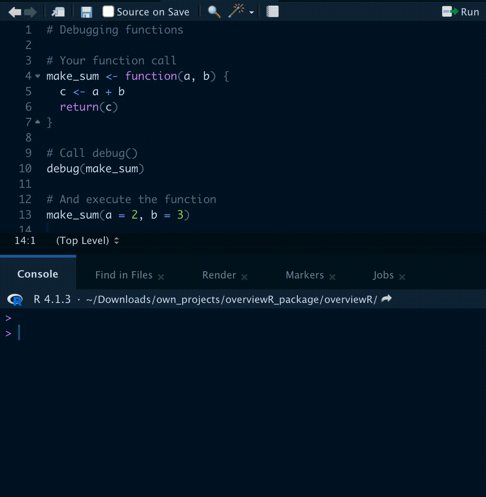
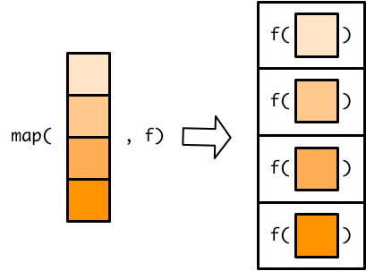
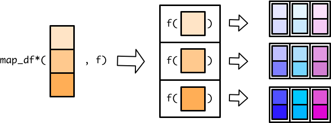
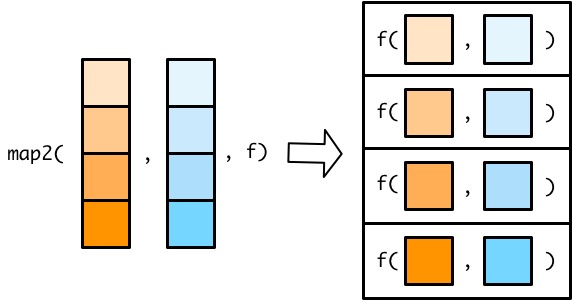

# Functions

```{r, echo = F, warning = F, message = F}
library(tidyverse)
library(janitor)
library(here)
library(palmerpenguins)
source("R/booktem_setup.R")
source("R/my_setup.R")
source("sims.R")
```

```{r}
library(tidyverse)
library(palmerpenguins)
library(patchwork)
```


## Introduction


## Structuring a function

R makes it easy to create user defined functions by using `function()`. Here is how it works:

```{r, eval = FALSE}

# this is an example function
my_function_name <- function(my_args) {
  # document your function here
  # what the function does
  # function inputs and outputs
  some_calculated_output <- (argument1 + argument2 )
  
  return(some_calculated_output)
}


```

* Give your function an object name and assign the function to it, e.g. `my_function_name <- function()`.

* Within the parentheses you specify inputs and arguments just like how pre-written functions work, e.g. `function(my_args)`.

* Next, put all the code you want your function to execute inside curly brackets like this: `function(my_args) {code to run}`

* Use `return()` to specify what you want to your function to output once it is done running the code.


### Activity: Understand the function

Here is a very simple function. Can you guess what it does?

```{r}
add_one <- function(x) {
  return(x + 1)
}
```

:::{.callout-note}

There is now a shortcut to writing functions in R `\(x)` that removes the need to call `function()` or use curly braces`{}`.

In this tutorial I will use the older method for now, but briefly demonstrate the simpler syntax

:::

```{r}

add_one <- \(x) x + 1

```

```{r}

add_one(10)

```

What value did you get when running the function above? `r fitb("11")`

Now try applying your function to this vector:

```{r}
number_series <- c(1,5,10)
```

You should see it worked on *each element* inside the vector. This emphasises that R is a vector based language (it will by default apply functions on all elements in an object). 

## Function environments

When a function is evaluated, it creates it's own environment. All of the arguments that are passed to the function,
along with any variables created in the function are stored in this new environment.

The function's environment's parent will be the global environment, so we can see all of the variables created in the
global environment. Variables that are created in the function's environment aren't visible from the global environment
though.

If we reassign a variable in a function it will take a copy of that variable rather than mutating the value in the global environment. If we want to update `x` in the global environment we need to use the `<<-` operator.

```{r}
# x has a value of 1 in the global environment
x <- 1 

fn <- function(y) {
 # the value of x is copied from the global environment
 # but any changes remain only within the function environment
  x <- x * 2
  z <- x + y
  return(z)
}

fn(2)
x
```


:::{.task}
::::{.task-header}
Create a function
::::
::::{.task-container}

- Create a function called `fahr_to_kelvin` that converts temperature values from degrees Fahrenheit to Kelvin.

- The conversion is `temp_in_kelvin <- (temp_fahr - 32) * (5 / 9)) + 273.15

::::
:::


`r hide("Solution")`

```{r}
fahr_to_kelvin <- function(fahr) {

  kelvin <- ((fahr - 32) * (5 / 9)) + 273.15
  return(kelvin)
}
```


The `return()` function can return only a single object. If we want to return multiple values in R, we can use a `list` (or other objects) and return it.

`r unhide()`


:::{.task}
::::{.task-header}
Celsisus to Kelvin function
::::
::::{.task-container}

To convert temperature to Celsius from kelvin, you subtract 273.15 from the temperature value in kelvin. 
Write a function that performs this conversion and returns "both" kelvin and celsius.

::::
:::

`r hide("Solution")`

```{r}

fahr_to_kelvin_celsius <- function(fahr) {

  celsius <- ((fahr - 32) * (5 / 9))
  kelvin <- celsius +  + 273.15
  
  temps <- list(celsius, kelvin)
  names(temps) <- c("celsius", "kelvin")
  
  return(temps)
}

```

`r unhide()`

:::{.callout-note}

A general rule of thumb. If you end up repeating a line of code more than three times in a script - you should write a function to do the work instead. And write clear comments on its use!

Why?

It reduces the numbers of lines of code in your script, it reduces the amount of repetition in the code, if you need to make changes you can change the function without having to hunt through all of your code. 

A really good way to organise your functions is to organise them into a separate script to the rest of your analysis. Write functions in a separate script and use source("scripts/functions.R")


:::

### Argument defaults

This is an example of a very simple function that just prints the string "Hello World" whenever you type the function `say_hello()`

```{r}
say_hello <- function(){
  paste("Hello World") 
}

say_hello()

```

### Activity: Understanding arguments

:::{.task}
::::{.task-header}
Understanding arguments
::::
::::{.task-container}

What happens when you try to put something in the brackets when **using** this function?
  
e.g. say_hello("Phil")

::::
:::


`r hide("Solution")`

Error in say_hello( or something similar, this function has not been set with any arguments, therefore it doesn't know what to do with any values provided to it. 

`r unhide()`

Now lets try a similar function, but we include an argument:


`r hide("Solution")`

```{r}

say_morning <- function(x){
  paste("Good morning", x)
}

#  what about this one?
say_morning("Phil")

```

`r unhide()`

:::{.task}
::::{.task-header}
Not supplying arguments
::::
::::{.task-container}

What happens when you DO NOT put something in the brackets when using this function?

::::
:::


`r hide("Solution")`

```{r, eval = FALSE}

Error in paste("Good morning", x) : 
  argument "x" is missing, with no default

```

`r unhide()`


So that was an example where we included an argument for our function. But now it requires a value be provided in order to work. 

#### Argument defaults

However, you are probably used to the idea that many functions have "default" values for arguments, and we can easily set these.

```{r}
say_morning_default <- function(name = "you"){
  paste("Good morning", name)
}

say_morning_default()
```

> There is now a default value supplied to the argument, but this should still be able to be changed when running the function. Try it! 


## Wrapper functions

Wrapper functions in R are a powerful tool for simplifying and customizing the use of existing functions. These functions act as intermediaries between the user and the underlying function, allowing you to add additional functionality, handle errors, or make the function more user-friendly. They are especially useful when you want to streamline repetitive tasks, create more intuitive interfaces, or modify the behavior of built-in functions without altering their source code. In this brief introduction, we'll explore the concept of wrapper functions, their benefits, and how to create and use them effectively in R.

### Default values

ou can create a wrapper function that calls an existing function with default argument values to simplify its usage. For instance, if you frequently use the `mean` function with a specific argument, you can create a wrapper like this:

```{r}
my_mean <- function(x) {
  mean(x, na.rm = TRUE)
}

```

Now, you can use `my_mean(x)` to calculate the mean while always ignoring `NA` values.

What happens when you try to use your new function `my_mean` and set na.rm  = F?

`r hide("Show")`

```
Error in my_mean(c(5, 6, 7, 8), na.rm = F) : unused argument (na.rm = F)
```

`r unhide()`

If we want to be able to allow users to specify their own values for `na.rm = T` then we need to modify the wrapper function

```{r}

my_mean <- function(x, na.rm = TRUE) {
  mean(x, na.rm = na.rm)
}


```

With this modification, users can provide their own value for the na.rm argument when calling my_mean. For example:

```{r}
my_mean(c(1, 2, NA, 4))# By default, NA values are removed
my_mean(c(1, 2, NA, 4), na.rm = FALSE)  # NA values are not removed


```

This modification makes the na.rm argument in the my_mean function flexible and allows users to override the default behavior when needed.


## Documenting functions

It is important to document your functions to:

- Remind your future self what the function does

- Show your future self and your colleagues how to use the function

- Help anyone else looking at your code understand what you think the function does

A common way to add documentation in software is to add comments to your function that specify

- What does this function do?

- What are the arguments (inputs) to the function, and what are these supposed to be (e.g., what class are they? Character, numeric, logical?)

- What does the function return, and what kind of object is it?


Like this: 

```{r, eval = F}

# Function: fahr_to_kelvin_celsius
# Description: Converts a temperature in degrees Fahrenheit to degrees Celsius and Kelvin.
#
# Input:
#   fahr: Numeric value representing temperature in degrees Fahrenheit.
#
# Output:
#   A list containing two elements:
#   - celsius: Numeric value representing temperature in degrees Celsius.
#   - kelvin: Numeric value representing temperature in Kelvin.
#
# Example Output:
#   If you call fahr_to_kelvin_celsius(32), the result would be:
#   celsius: 0
#   kelvin: 273.15
  

fahr_to_kelvin_celsius <- function(fahr) {

 # Calculate the temperature in degrees Celsius  
  celsius <- ((fahr - 32) * (5 / 9))
  
  # Calculate the temperature in Kelvin
  kelvin <- celsius +  + 273.15
  
  # Create a list to store the results 
  temps <- list(celsius, kelvin)
  names(temps) <- c("celsius", "kelvin")
 
  # Return the list of temperatures 
  return(temps)
}

```

:::{.callout-note}

Formal documentation for R functions that you see when you access the help in R is written in separate .Rd using a markup language similar to LaTeX. You see the result of this documentation when you look at the help file for a given function, e.g. ?read.csv. The `roxygen2` package allows R coders to write documentation alongside the function code and then process it into the appropriate .Rd files. You should consider switching this more formal method of writing documentation when you start working on more complicated R projects. Or if you aspire to write packages in R!
[R packages 2nd Edition](https://r-pkgs.org/)
:::

### Practice

:::{.task}
::::{.task-header}
Custom model diagnostics
::::
::::{.task-container}

Here is a custom script to print model diagnostics when running a linear model. Can you comment out this code to document it properly?

::::
:::


```{r, eval = F}


my_lm <- function(formula, data) {
 
  model <- lm(formula, data = data)
  

  summary_model <- summary(model)
  
  
  cat("Coefficients:\n")
  print(summary_model$coefficients)
  
  
  par(mfrow = c(2, 2))  # Arrange plots in a 2x2 grid
  plot(model, which = 1)  # Residuals vs. Fitted
  plot(model, which = 2)  # Normal Q-Q plot
  plot(model, which = 3)  # Scale-Location plot
  plot(model, which = 4)  # Residuals vs. Leverage
  
  # Return the fitted model
  return(model)
}

```

`r hide("Solution")`

```{r, eval = F}

# Function: my_lm
# Description: Fit a linear regression model and provide summary statistics and diagnostic plots.
#
# Input:
#   formula: A formula specifying the regression model.
#   data: The data frame containing the variables used in the model.
#
# Output:
#   A linear regression model object fitted to the data.
#
# Example Usage:
#   To fit a linear regression model to the 'body_mass_g' variable as a function of 'flipper_length_mm in the 'penguins' dataset,
#   you can call:
#   my_lm(body_mass_g ~ flipper_length_mm, data = penguins_raw)

my_lm <- function(formula, data) {
  # Fit a linear regression model
  model <- lm(formula, data = data)

  # Get summary statistics of the model
  summary_model <- summary(model)

  # Print model coefficients
  cat("Coefficients:\n")
  print(summary_model$coefficients)

  # Arrange plots in a 2x2 grid
  par(mfrow = c(2, 2))

  # Plot diagnostics:
  # 1. Residuals vs. Fitted
  plot(model, which = 1)

  # 2. Normal Q-Q plot
  plot(model, which = 2)

  # 3. Scale-Location plot
  plot(model, which = 3)

  # 4. Residuals vs. Leverage
  plot(model, which = 4)

  # Return the fitted model
  return(model)
}
```

`r unhide()`


## Checking functions

### print

One simple and easy way to keep on top of your functions, and understand what they are doing is to use lots of print statements.


```{r, eval = FALSE}

# This edited function will now remind the user what the input value was

fahr_to_kelvin_celsius <- function(fahr) {
    # Calculate the temperature in degrees Celsius
    celsius <- (fahr - 32) * (5 / 9)
    
    # Calculate the temperature in Kelvin
    kelvin <- celsius + 273.15
    
    # Create a list to store the results
    temps <- list(celsius = celsius, kelvin = kelvin)
    
    # Return the list of temperatures along with a message
    print(paste("The temperature in Fahrenheit was", fahr))
    return(temps)
}


```


### testthat

Pure Functions:
A pure function is a concept in programming that describes a function with the following characteristics:

It always produces the same output for the same input.
It has no side effects, meaning it doesn't modify external state or variables.
It relies only on its input parameters to generate output.
In R, pure functions are essential for creating clean and predictable code. They are often used in functional programming to perform operations on data without causing unexpected side effects.

When our function is pure, we can run expectation tests using the `testthat` package:

```{r, include = FALSE}
library(testthat)

```

```{r, eval = FALSE}

test_that("it works as expected", {
    expect_equal(fahr_to_kelvin(92), 306.483, tolerance=1e-2)  
   
})


```


### debugging

For more complex functions, we may need to go digging! Here there are three basic commands:

- `debug()`

- `browser()`

- `undebug()`

With `debug(function_name)` the next time you run `function_name()` an interactive session will open in Rstudio. 
While you are in debug mode you can call the individual objects in your function, and run the commands line by line:

```{r, eval=TRUE, echo=FALSE, out.width="100%"}

```

Once we are done with debugging it is important to turn the debug mode off - close the interactive page and run `undebug(function_name)` so that the debugging panel doesn't reopen the next time you launch your function. 

```{r, eval = F}

make_sum <- function(a,b){
  c <- a+b
  return(c)
}

debug(make_sum)

make_sum(a = 5, b =2)

undebug(make_sum)

```

While in debugging mode, you can use various commands to inspect and control the debugging process. Here are some common debugging commands:

- n or next: Step to the next line of the function.

- c or continue: Continue execution until the function returns.

- Q or quit: Quit debugging and return to the R console.

- where: Show the call stack to see where you are in the function.

- print(var_name): Print the value of a variable.


:::{.task}
::::{.task-header}

::::
::::{.task-container}

This test fails, can you work out why?

::::
:::


```{r, eval =F}
test_that("it works as expected", {
    expect_equal(fahr_to_kelvin_celsius(92), list(33, 306), tolerance = 1)  
    
})

```


`r hide("Solution")`

```{r, eval = F}

# the output is a named list, so these must be supplied with the test
named_list <- list(celsius = 33.3, kelvin = 306.4)


test_that("it works as expected", {
    expect_equal(fahr_to_kelvin_celsius(92), list(33, 306), tolerance = 1e-2)  
    
})


```

Test passed 😀

`r unhide()`


# Flow control

Imagine you want a variable to be equal to a certain value if a condition is met. This is a typical problem that requires the `if` and `else` construct. For instance:

```{r}

a <- 4
b <- 5

```


```{r}
if (a > b) {
  f <- 20
    } else {
  f <- 10
}

f

```

Another way to achieve this is by using the `ifelse()` function:

```{r}
f <- ifelse(a > b, 20, 10)
f
```

`if` and `else` might seem interchangeable with `ifelse()`, but they’re not. `ifelse()` is vectorized. Let’s try the following:

```{r}
ifelse(c(1,2,4) > c(3, 1, 0), "yes", "no")

```
Trying to attempt the same with `if` and `else` will result in an error as only the first element can be evaluated

```{r, eval = FALSE}

if (c(1, 2, 4) > c(3, 1, 0)) print("yes") else print("no")

```

```
Error in if (c(1, 2, 4) > c(3, 1, 0)) print("yes") else print("no") : 
  the condition has length > 1

```

The work around for this would to be use a loop, so that each element along the vector can be evaluated in turn. We will revisit loops shortly. 

```{r}

vector1 <- c(1, 2, 4)
vector2 <- c(3, 1, 0)

result <- character(length(vector1))  # Create an empty character vector to store the results

for (i in 1:length(vector1)) {
  if (vector1[i] > vector2[i]) {
    result[i] <- "yes"
  } else {
    result[i] <- "no"
  }
}

print(result)


```

### `case_when`

`case_when` is a powerful `tidyverse` function in R that serves as an extension of `if_else`, providing a flexible way to create conditional transformations on multiple values within a dataset. While `if_else` is primarily used for a single condition, `case_when` is designed to handle multiple conditions and allows you to assign specific values or perform operations based on these conditions.

Here's a simple introduction to case_when as an extension of `if_else`:

Imagine you have a dataset with a column called "temperature," and you want to create a new column called "weather" based on different temperature ranges. With if_else, you might write something like this:

```{r}


temperature <-  c(10, 25, 5, 30, 15)

ifelse(temperature < 10, "Cold",
        ifelse(temperature >= 10 & temperature < 25, "Moderate", "Hot"))


```

```{r}

case_when(
    temperature < 10 ~ "Cold",
    temperature >= 10 & temperature < 25 ~ "Moderate",
    temperature >= 25 ~ "Hot"
  )


```

## Conditional functions

Let's make a function that reports p-values in APA format (with "p = [rounded value]" when p >= .001 and "p < .001" when p < .001).

You can add a default value to any argument. If that argument is skipped, then the function uses the default argument.

First we could make a function that rounds any value to three digits.

```{r}

report_p <- function(p, digits = 3) {
      roundp <- round(p, digits)
    reported <-  paste("p =", roundp)
    
    return(reported)
}

```

But we would like this to have a conditional response as well: so we need an `if` `else` statement.

```{r}

 report_p <- function(p, digits = 3) {
     reported <- if(p < 0.001){
             "p < 0.001"} else{
             paste("p =", round(p, digits))}
             
     
     return(reported)
 }

```

However we soon hit our first problem, this function works well when provided a single numeric value, but when applied to a vector or a dataframe we encounter an error:

```{r, eval = FALSE}
x <- c(0,0.05,0.3,0.4)

report_p(x)

```

```
Error in if (p < 0.001) { : the condition has length > 1
```

In R, conditional statements are not vector operations. They deal only with a single value. If you pass in, for example, a vector, the `if` statement will only check the very first element and issue a warning. The solution to this is the `ifelse()` or the tidyverse equivalent `if_else()` function

::: {.panel-tabset}

## ifelse

```{r, eval = F}
# Function: report_p
# Description: This function formats p-values for reporting, rounding them to a specified number of digits
#' and handling very small p-values by reporting them as "p < 0.001". 
#
# Input:
#   p - numeric value representing the p-value to be formatted
#   digits - an integer specifying the number of decimal places to round the p-value to
#   default is 3
#
# Output:
#   A character string with the formatted p-value, either in the form "p < 0.001" for
#         values less than 0.001 or "p = X.XXX" where X.XXX is the rounded p-value.
#
# Example Output:
# report_p(0.0005)     Returns "p < 0.001"
# report_p(0.045)      Returns "p = 0.045"
# report_p(0.04567, 2)  Returns "p = 0.05"


 report_p <- function(p, digits = 3) {
     reported <- ifelse(p < 0.001,
             "p < 0.001",
             paste("p =", round(p, digits)))
     
     return(reported)
 }
 
```

## if_else

```{r}

# Function: report_p
# Description: This function formats p-values for reporting, rounding them to a specified number of digits
#' and handling very small p-values by reporting them as "p < 0.001". 
#
# Input:
#   p - numeric value representing the p-value to be formatted
#   digits - an integer specifying the number of decimal places to round the p-value to
#   default is 3
#
# Output:
#   A character string with the formatted p-value, either in the form "p < 0.001" for
#         values less than 0.001 or "p = X.XXX" where X.XXX is the rounded p-value.
#
# Dependencies:
#   dplyr for if_else() function
#
# Example Output:
# report_p(0.0005)     Returns "p < 0.001"
# report_p(0.045)      Returns "p = 0.045"
# report_p(0.04567, 2)  Returns "p = 0.05"


 report_p <- function(p, digits = 3) {
     reported <- if_else(p < 0.001,
             "p < 0.001",
             paste("p =", round(p, digits)))
     
     return(reported)
 }

```


https://stackoverflow.com/questions/50646133/dplyr-if-else-vs-base-r-ifelse

:::


## Warnings and errors

:::{.task}
::::{.task-header}
Omitted arguments
::::
::::{.task-container}

What happens when omit an argument for p, set the value to 1.5 or a character "a"?

::::
:::


Sometimes the function will not run, in the first example because we did not provide an argument default. 

For `p = 1.5` it probably *shouldn't* run (p = 1.5 makes no sense), but it does! 

For `p = "a"` there is a warning but perhaps not a very intuitive one. 

We can make our own custom/specific warnings, try this and run it with the arguments above again! 


`r hide("Solution")`

```{r}

 report_p <- function(p, digits = 3) {
   
  if (!is.numeric(p)) stop("p must be a number")
  if (p <= 0) warning("p-values cannot less 0")
  if (p >= 1) warning("p-values cannot be greater than 1")
   
     reported <- ifelse(p < 0.001,
             "p < 0.001",
             paste("p =", round(p, digits)))
     return(reported)
 }
 

```

`r unhide()`

## Activities


:::{.task}
::::{.task-header}
Write a Simple Function
::::
::::{.task-container}

We'll create a function that calculates the GC content of a DNA sequence, and the result melting temperature of the sequence and returns both in a list. 

GC content is the percentage of the DNA molecule's nitrogenous bases that are either guanine (G) or cytosine (C). 

This is a common metric used in molecular biology and genetics to analyze DNA sequences. Each GC base addes 4 degrees to melting temp while each AT base adds 2 degrees. 

::::
:::


> Hint `stringr` and associated functions will be very helpful here


`r hide("stringr functions")`

`str_count` can let you selectively add letters in a vector

`str_length` can let you count the characters in a vector

`r unhide()`


`r hide("Solution")`

```{r}
gc_content <- function(dna_sequence) {
  # Convert the input sequence to uppercase to handle mixed-case input
  dna_sequence <- str_to_upper(dna_sequence)
  

  
  # Calculate the number of GC bases (C and G) in the sequence
  gc_count <- sum(str_count(dna_sequence %in% c("G", "C")))
  
  # Calculate the total number of bases in the sequence
  total_bases <- str_length(dna_sequence)
  
  # Calculate the GC content as a percentage
  gc_percentage <- (gc_count / total_bases) * 100
  
  gc_percentage <- round(gc_percentage, 2)
  
   # Calculate AT numbers
  at_count <- total_bases - gc_count
  
  # Calculate melting temp of sequence
  melt_temp <- (gc_count*4) + (at_count*2)
  
  
  dna_content <- list(gc_percentage, melt_temp)
  names(dna_content) <- c("GC Percentage", "Melting temp (celsius)")
  
  
  return(dna_content)
}

```

`r unhide()`


:::{.task}
::::{.task-header}
Document the Function
::::
::::{.task-container}

Add documentation to the factorial function with comments. Include a description, inputs, outputs and examples.

::::
:::


`r hide("Solution")`

```{r}
# Function: gc_content
# Description: calculates the GC (Guanine-Cytosine) content and the melting temperature of a given DNA sequence. 
#
# Input:
#   dna_sequence: A character string representing the DNA sequence for which you want to calculate GC content and melting temperature.   
#   The function is case-insensitive, meaning it can handle mixed-case input. The sequence should consist of valid DNA bases (A, T, C, G).
#
# Output:
#   A named list containing two elements:
#   - "GC Percentage" (numeric): The calculated GC content as a percentage, rounded to two decimal places.
#   - "Melting temp (celsius)" (numeric): The estimated melting temperature of the input DNA sequence in degrees Celsi
#
# Example Output:
#   If you call gc_content("ATGCGTAGCT")
#   $`GC Percentage`
#   [1] 50
#  $`Melting temp (celsius)`
#  [1] 30

gc_content <- function(dna_sequence) {
  # Convert the input sequence to uppercase to handle mixed-case input
  dna_sequence <- str_to_upper(dna_sequence)
  

  
  # Calculate the number of GC bases (C and G) in the sequence
  gc_count <- sum(str_count(dna_sequence %in% c("G", "C")))
  
  # Calculate the total number of bases in the sequence
  total_bases <- str_length(dna_sequence)
  
  # Calculate the GC content as a percentage
  gc_percentage <- (gc_count / total_bases) * 100
  
  gc_percentage <- round(gc_percentage, 2)
  
   # Calculate AT numbers
  at_count <- total_bases - gc_count
  
  # Calculate melting temp of sequence
  melt_temp <- (gc_count*4) + (at_count*2)
  
  
  dna_content <- list(gc_percentage, melt_temp)
  names(dna_content) <- c("GC Percentage", "Melting temp (celsius)")
  
  
  return(dna_content)
}

```

`r unhide()`


:::{.task}
::::{.task-header}
Test the Function
::::
::::{.task-container}

Create a test script that uses test_that to check if the function returns the correct GC percentage and melting temps

::::
:::


`r hide("Solution")`

```{r}

test_that("gc_content function tests", {
    # Test valid input and GC content calculation
    dna_seq1 <- "ATGCGTAGCT"
    result1 <- gc_content(dna_seq1)
    expect_equal(result1$`GC Percentage`, 50)
    expect_equal(result1$`Melting temp (celsius)`, 30)})

```

`r unhide()`


:::{.task}
::::{.task-header}
Handle Errors
::::
::::{.task-container}


You can optionally modify the gc_content function to handle errors such as when the input contains non-DNA characters, or warnings if the the length exceeds 30nt?

::::
:::


`r hide("regex help")`

```{r, eval = FALSE}

# this is the regular expression to detect ATCG

str_detect(dna_sequence, "^[ATCG]+$")) 

```

`r unhide()`


`r hide("Solution")`

```{r}
gc_content <- function(dna_sequence) {
  # Convert the input sequence to uppercase to handle mixed-case input
  dna_sequence <- str_to_upper(dna_sequence)
  
  # Check if the input sequence contains only valid DNA characters (A, T, C, G)
if (!str_detect(dna_sequence, "^[ATCG]+$")) stop("Invalid DNA sequence. Only A, T, C, and G are allowed.")

    if (str_length(dna_sequence) > 30 ) warning("Sequence is > 30 nt temperature predictions may be inaccurate")

  
  # Calculate the number of GC bases (C and G) in the sequence
  gc_count <- sum(str_count(dna_sequence %in% c("G", "C")))
  
  # Calculate the total number of bases in the sequence
  total_bases <- str_length(dna_sequence)
  
  # Calculate the GC content as a percentage
  gc_percentage <- (gc_count / total_bases) * 100
  
  gc_percentage <- round(gc_percentage, 2)
  
   # Calculate AT numbers
  at_count <- total_bases - gc_count
  
  # Calculate melting temp of sequence
  melt_temp <- (gc_count*4) + (at_count*2)
  
  
  dna_content <- list(gc_percentage, melt_temp)
  names(dna_content) <- c("GC Percentage", "Melting temp (celsius)")
  
  
  return(dna_content)
}

```

`r unhide()`


# Simple iteration

We’ve seen how to write a function and how they can be used to create concise re-usable operations that can be applied multiple times in a script without having to copy and paste, but where functions really come into their own is when combined with iteration. Iteration is the process of running the same operation on a group of objects, further minimising code replication. 

Functional programming in R requires a good understanding of the types of data structure available in R. So make sure you remember the distinctions between vectors, lists, matrices and dataframes.

In the section below we will start with simple functions that allow you to replicate arguments

## `rep()`

The function `rep()` lets you repeat the first argument a set number of times.

```{r}
rep(1:5, 5)

rep(c("Adelie", "Gentoo", "Chinstrap"), 2)

```

The default for the amount of repetition is `times = ` it will print the entire vector start to finish THEN repeat.

If the second argument is a vector with the same number of elements as the *first* vector, then it will repeat to the specified values for each

```{r}
rep(c("Adelie", "Gentoo", "Chinstrap"), c(2, 1, 3))

```

Or if you use the argument `each` then it will rep all of the first element *first* followed by the second etc.


```{r}
rep(c("Adelie", "Gentoo", "Chinstrap"), each = 3)
```
What do you think will happen if you set both times to 3 and each to 2?

```{r, eval = F}

rep(c("Adelie", "Gentoo", "Chinstrap"), times = 2, each = 3)

```


## `seq()`

The function `seq()` is useful for generating a sequence of numbers with some pattern.

Use `seq()` to create a vector of the integers 0 to 10.


```{r}

seq(1,5)

```

This is initially very similar to just making a vector with

```{r}

c(1:5)

```

But with `seq` we have extra functions. You can set the by argument to count by numbers other than 1 (the default). Use `seq()` to create a vector of the numbers 0 to 100 by 10s.

```{r}
seq(0, 100, by = 10)

```


We also have the argument `length.out`, which is useful when you want to know how to many steps to divide something into

```{r}
seq(0, 100, length.out = 12)

```

## `replicate()`

Replicate is our first example of a function whose purpose is to iterate *other* functions

For example the `rnorm` function generates numbers from a normal distribution.

Nesting this inside the `replicate()` function will repeat this command a specified number of times

```{r}
replicate(3, # times to replicate function
          expr = rnorm(n = 5, 
                       mean = 1,
                       sd = 1))

```

https://www.r-bloggers.com/2023/07/the-replicate-function-in-r/

> Note the default behaviour for replicate is simplify = TRUE, where it will return the most compact data structure it can. When you set simplfy = FALSE it will return a list. 

# Loops

Loops are one of the staples of all programming languages, not just R, and can be a powerful tool; though we will see later there are a suite of alternative to loops in R. 

For loops make it possible to repeat a set of instructions i times. For example, try the following:

```{r}
for (i in 1:5){
  print("hello")
}
```

Or

```{r}
for (i in 1:3) {
  print(i+1)
}
```

This is a dynamic piece of code where an index 'i' is iteratively replaced by each value in the vector 1:5. 

Let's break it down. Since the first value in our sequence (1:3) is 1, the loop begins by substituting 'i' with 1 and executing everything within the curly braces {1+1}. Loops conventionally use 'i' as the counter, which is short for iteration. However, you are free to use any variable name you prefer:

so the first loop is essentially: 

```
i <- 1 + 1
print(i)

```

Once this first iteration is complete, it loops back to the beginning and replaces i with the next value in our 1:3 sequence (2 in this case):

```
i <- 2 + 1
print(i)

```

This process is then repeated until the loop reaches the final value in the sequence 

```
for (i in 1:3) { # the SEQUENCE is defined (numbers 1 to 5) and loop is opened with "{"
  print(i + 1)    # The OPERATIONS (add 1 to each sequence number and print)
}                            # The loop is closed with "}"

```

## Functions in for loops

Whilst above we have been using simple addition in the body of the loop, you can also combine loops with functions.

```{r}

# Define a function to calculate the square of a number
square <- function(x) {
  return(x * x)
}

# Use a for loop to calculate and print the squares of numbers from 1 to 5
for (num in 1:5) { # Here I have replace i with num
  result <- square(num)
  cat("The square of", num, "is", result, "\n")
}


```

## For loops in dataframes

Let's create a somewhat more intricate function. Initially, we generate a new tibble by creating four vectors, each consisting of 10 randomly generated numbers. These numbers are designed to be approximately centered around a mean of 0 with a standard deviation of 1. Afterward, we combine these vectors to form the final tibble.

```{r}
set.seed(1234)

# a simple tibble
df <- tibble(
  a =  rnorm(10),
  b =  rnorm(10),
  c =  rnorm(10),
  d = rnorm(10),
  e = rnorm(10),
  f = rnorm(10),
  g = rnorm(10),
  h = rnorm(10),
)

df

```

Each vector is randomly generated so the actual averages will be slightly different, we can test that here:

```{r}

mean(df$a)

mean(df$b)

mean(df$c)

mean(df$d)

```

So the above code works, but it is repetitive, applying the same function again and again.

Below we have a simple for loop:

```{r}
#1. Having a predefined empty vector to receive the values is good practice, we will see why a bit later

output <- vector("double", ncol(df)) # this will have four empty elements the same as the number of columns for the dataframe. The vector is set to receive numeric data

```

Now we run our loop: 

```{r}

for (i in 1:ncol(df)) {            # 2. sequence - determines what to loop over 
  
  output[[i]] <- mean(df[[i]])      # 3. body - each time the loop runs it allocates a value to output, 
}
output

```

Each time the mean is calculate for one column in df this is then stored as an element in the previously empty output vector.

`for()` loops are very useful for quickly iterating over a list, but because R prefers to store everything as a new object with each loop iteration, loops can become quite slow if they are complex, or running many processes and many iterations.


### Do as little as possible inside a loop

R is an interpreted language every thing you write inside a loop runs multiple times. The best thing you can do is to be parsimonious while writing code inside a loop. There are a number of steps that you can do to speed up a loop a bit more.

- Calculate results before the loop

- Initialize objects before the loop

- Iterate on as few numbers as possible

- Write as few functions inside a loop as possible

The main tip is to *Get out of loop* as quickly as possible.

See also https://bookdown.org/csgillespie/efficientR/programming.html#top-5-tips-for-efficient-programming


## Exercise

This section for the workshop provides a real world example using iterations to create graphs of population trends from the [Living Planet Index](https://www.livingplanetindex.org/) for a number of vertebrate species from 1970 to 2014. 

The data can be collected here:

```{r, eval = TRUE, echo = FALSE}
downloadthis::download_link(
  link = "https://raw.githubusercontent.com/UEABIO/data-sci-v1/main/book/files/LPI_data_loops.csv",
  button_label = "Download LPI data as csv",
  button_type = "success",
  has_icon = TRUE,
  icon = "fa fa-save",
  self_contained = FALSE
)
```

1. Can you make four plots using lists and for loops? For this exercise can you make a list of four
species based on the column `Common.Name`, House sparrow, Great tit, Corn bunting and Meadow pipit then loop down this to make four plots? 


`r hide("Initial list")`

```{r, eval = FALSE}

# Method 1
species_to_filter <- c("House sparrow", "Great tit", "Corn bunting", "Meadow pipit")

filtered_data <- filter(LPI_UK, Common.Name %in% species_to_filter)

sp_list <- split(filtered_data, filtered_data$Common.Name)

```


`r unhide()`


`r hide("Solution")`

```{r, eval =FALSE }

# Method 1
species_to_filter <- c("House sparrow", "Great tit", "Corn bunting", "Meadow pipit")

filtered_data <- filter(LPI_UK, Common.Name %in% species_to_filter)

sp_list <- split(filtered_data, filtered_data$Common.Name)

# Method 2


house_sparrow <- filter(LPI_UK, Common.Name == "House sparrow")
great_tit <- filter(LPI_UK, Common.Name == "Great tit")
corn_bunting <- filter(LPI_UK, Common.Name == "Corn bunting")
meadow_pipit <- filter(LPI_UK, Common.Name == "Meadow pipit")

sp_list <- list(house_sparrow, great_tit, corn_bunting, meadow_pipit)

my_list <- vector("list", length = 4)

for (i in 1:length(sp_list)) {                                    
  # For every item along the length of Sp_list we want R to perform the following functions
  data <- as.data.frame(sp_list[[i]])                               
  # Create a dataframe for each species
  sp.name <- unique(data$Common.Name)                             
  # Create an object that holds the species name, so that we can title each graph
  plot <- ggplot(data, aes (x = year, y = abundance)) +               
    # Make the plots and add our customised theme
    geom_point(size = 2, colour = "#00868B") +                              
    geom_smooth(method = lm, colour = "#00868B", fill = "#00868B") +        
    theme_classic() +
    labs(y = "Abundance\n", x = "", title = sp.name)
 
   # makes a list of all the plots generates
  my_plots[[i]] <- plot 
}
```

`r unhide()`


# Purrr

The `purrr::map()` family of functions are the tidyverse equivalent of `apply`

The base equivalent to `map()` is `lapply()`. The only difference is that `lapply()` does not support the helpers that you’ll learn about below, so if you’re only using `map()` from purrr, you can skip the additional dependency and use `lapply()` directly.


The basic syntax is map(`.x` = SEQUENCE, `.f` = FUNCTION, OTHER ARGUMENTS). In a bit more detail:

* `.x` = are the inputs upon which the .f function will be iteratively applied - e.g. a vector of jurisdiction names, columns in a data frame, or a list of data frames

* `.f` = is the function to apply to each element of the .x input - it could be a function like print() that already exists, or a custom function that you define. The function is often written after a tilde ~ (details below).
A few more notes on syntax:

* If the function needs no further arguments specified, it can be written with no parentheses and no tilde (e.g. `.f = mean`).

* You can use `.x` (or simply `.`) within the `.f = function` as a placeholder for the `.x` value of that iteration

```{r , echo=FALSE}



```

**The output of using` map()` is a list** - a list is an object class like a vector but whose elements can be of different classes. So, a list produced by `map()` could contain many data frames, or many vectors, many single values, or even many lists! There are alternative versions of `map()` explained below that produce other types of outputs (e.g. `map_dfr()` to produce a data frame, `map_chr()` to produce character vectors, and `map_dbl()` to produce numeric vectors).

Basic `map()` will *always* return a `list`, other variants return different data types.Unlike `apply`, `map` will ONLY return one type of data, removing the potential for changing data types that occasionally happens when using `apply`. 

## Example

```{r}
set.seed(1234)

# a simple tibble
df <- tibble(
  a =  rnorm(10),
  b =  rnorm(10),
  c =  rnorm(10),
  d = rnorm(10),
  e = rnorm(10),
  f = rnorm(10),
  g = rnorm(10),
  h = rnorm(10),
)

df

df_list <- as.list(df)

```

```{r, eval = F}

map(.x = df_list, .f = mean)

map(df_list, mean)

```


## more maps

`map()` always returns a list, which makes it the most general of the map family because you can put anything in a list. But it is inconvenient to return a list when a simpler data structure would do, so there are four more specific variants: `map_lgl()`, `map_int()`, `map_dbl()`, and `map_chr()`. Each returns an atomic vector of the specified type:

|Function| Data type returned|
|------|------|
|`map_lgl()`| returns a logical|
|`map_int()`| returns an integer vector|
|`map_dbl()`| returns a double vector|
|`map_chr()`| returns a character vector|
|`map_df()`| returns a data frame/tibble|


```{r , echo=FALSE}



```

:::{.callout-tip}

These specialized map functions are "type-safe" and will fail with incorrect return type.

This is safer than using functions like sapply() which tries to simplify results and could return a list, vector or matrix depending on input.

:::


```{r, eval = F}

# map lgl always returns a logical vector
map_lgl(df_list, is.double)
#   a    b    c    d    e    f    g    h 
# TRUE TRUE TRUE TRUE TRUE TRUE TRUE TRUE


# map_dbl always returns a double vector
map_dbl(df_list, mean)
#          a           b           c           d           e           f           g           h 
# -0.38315741 -0.11817071 -0.38794682 -0.76619306 -0.60979706 -0.27886474  0.61659223 -0.04230209 

# map_int always returns an integer vector
map_int(df_list, ~.x |>  mean() |> round())
# a  b  c  d  e  f  g  h 
# 0  0  0 -1 -1  0  1  0 

# map_int always returns an integer vector - note this comes with a deprecated coercion warning - use as.character()
 map_chr(df_list, mean)
#          a           b           c           d           e           f           g           h 
#"-0.383157" "-0.118171" "-0.387947" "-0.766193" "-0.609797" "-0.278865"  "0.616592" "-0.042302" 
 
# map_df always returns a dataframe 
 map_df(df_list, mean)
#       a      b      c      d      e      f     g       h
#   <dbl>  <dbl>  <dbl>  <dbl>  <dbl>  <dbl> <dbl>   <dbl>
#   1 -0.383 -0.118 -0.388 -0.766 -0.610 -0.279 0.617 -0.0423
```

purrr uses the convention that suffixes, like `_dbl()`, refer to the output. All `map_*()` functions can take any type of vector as input.


## Anonymous functions

There are multiple ways of structuring a `map()` call

```{r, eval = F}

map(df_list, mean)

df_list |>  
  map(mean)

df_list |> 
    map(~mean(.))

```

### What's up with `~`? 

Instead of using `map()` with an exisiting function, we can use inline anonymous functions as demonstrated with `apply()`

```{r}

map_dbl(df_list, function(x) sum(x)/length(x))

```

But this is quite *verbose* we can use `~` to support a shortcut

```{r}

map_dbl(df_list, ~ sum(.x)/length(.x))

```

It look a little quirky but you to refer to `.` for argument functions.

```{block, type = "info"}

Reserve this syntax for short and simple functions. A good rule of thumb is that if your function spans lines or uses {}, it’s time to give it a name.

```


## map with nested dataframes

Nested data frames in tibbles, a data structure in R, allow you to store complex and structured data within a single column of a tibble. This feature is particularly useful when dealing with hierarchical or nested data, such as lists, data frames, or even other tibbles.

:::{.callout-warning}

To use the penguins data you need to load it. 
Either run your cleaning script or run readRDS on the file you made

:::


Nested data frames in `tibbles` can be particularly useful when working with map functions, like `purrr::map()`to apply a function to elements within each nested structure. 

First we use the `nest()` function and select how we want to nest our data


```{r, echo = FALSE}

nested_penguins <- penguins |> 
  nest(data = -species)


```


```{r, eval = FALSE}

nested_penguins <- penguins |> 
  nest(data = -species)

nested_penguins

```

```
A tibble:3 × 2
species
<chr>
data
<list>
Adelie	<tibble>			
Gentoo	<tibble>			
Chinstrap	<tibble>			
3 rows

```

We can run iterative functions on these lists - such as generating new dataframes and adding them to new columns. Here we wish to keep only those penguins who are larger than the average for their species body weight.

> Note at this stage we are replicating iteration that can be achieved by using `group_by()` actions.

```{r}
nested_heavy_penguins <- penguins |> 
    nest(data = -species) |> 
  mutate(new_data = map(data, ~ .x 
                        |> filter(body_mass_g > mean(body_mass_g, na.rm = T)))
         )

```

```
# A tibble: 3 × 3
  species   data                new_data          
  <chr>     <list>              <list>            
1 Adelie    <tibble [152 × 19]> <tibble [70 × 19]>
2 Gentoo    <tibble [124 × 19]> <tibble [58 × 19]>
3 Chinstrap <tibble [68 × 19]>  <tibble [31 × 19]>

```

We can now produce individual plots for each nested dataframe:

```{r}

plots_df <- nested_heavy_penguins |> 
    mutate(scatterplots = map(new_data, ~ 
            ggplot(data = .x, aes(x = body_mass_g, y = flipper_length_mm)) +
                geom_point()
        ))


```

Plots can now be called in a number of ways:

```{r, eval = FALSE}
plots_df[[1,4]]

plots_df$scatterplots[[1]]

```

```{r, echo = F}

plots_df$scatterplots[[1]]

```

### walk

If we wish to see all of the plots at once we can use `purrr::walk` - this is another iteration function, where the primary output is "silent" - we do not wish to see outputs printed in the console. This is useful for functions like plot making or writing outputs to file. 

```{r, eval = FALSE}

walk(plots_df$scatterplots, ~print(.x))

```


:::{.callout-note}

gg objects are not the only type of objects that can be created using map() and mutate(). Another application of these two functions is fitting models to our data and storing the results in a new column. For example, we could use map() and mutate() to fit a linear regression model to the x and y columns and store the model output in a new column

:::

To view all the plots together, we can use the `patchwork::wrap_plots()` function

```{r}
library(patchwork)
plots_df$scatterplots |> wrap_plots()

```

## map2

`map2` is a versatile function in the `purrr` package for R that allows you to iterate over **two** input vectors or lists in parallel, applying a specified function to pairs of corresponding elements. It's particularly useful when you need to perform operations that depend on elements from two separate input sources simultaneously, offering a powerful way to combine and process data in a pairwise manner.

```{r , echo=FALSE}



```

Here is a quick example building on our plot making function - where we are able to alter the colour of the plots according to a 

```{r}

pal <- c(
  "Adelie" = "#FF8C00", 
  "Chinstrap" = "#A034F0", 
  "Gentoo" = "#159090")


plots_df <- nested_heavy_penguins |> 
    mutate(scatterplots = map2(.x = new_data, .y = pal, ~ 
            ggplot(data = .x, aes(x = body_mass_g, y = flipper_length_mm, colour = .y)) +
            geom_point() +
            scale_colour_identity()+
            ggtitle(names(.y))
        )
    )


plots_df$scatterplots |> 
    wrap_plots()


```


## pmap

While `map` works with a single vector, and `map2` works with two vectors, `pmap` is a generalised version that works on any number of vectors. `pmap` also has all of the variants that we have seen before.

- Parallel Mapping: pmap stands for "parallel map." It applies a function to the corresponding elements of multiple input lists (or data frames).

- Flexibility: You can provide any number of lists or vectors to pmap.

- Named Arguments: If you pass a data frame to pmap, it treats each column as a separate list.

Here's the basic syntax for pmap:

```

pmap(.l, .f, ...)

# .l is a list of vectors or a data frame.
# .f is the function you want to apply.
# ... are any additional arguments to the function .f.

```

Example

```{r}

# Vectors representing dimensions of three different boxes

lengths <- c(2, 3, 5)
widths  <- c(4, 2, 6)
heights <- c(3, 5, 2)

# Define a function to compute volume
compute_volume <- function(length, width, height) {
  length * width * height
}

# Use pmap to apply compute_volume to each combination
volumes <- pmap(list(lengths, widths, heights), compute_volume)

# Print the result
print(volumes)

```

Remember though R is designed to work with vectors, dataframes and vectorised functions. Allowing us to apply operations over dataframes in a way that may be faster and more concise than using explicit iteration:


```{r}

# Create a data frame with dimensions
boxes <- data.frame(
  length = c(2, 3, 5),
  width  = c(4, 2, 6),
  height = c(3, 5, 2)
)

# Define a function that takes a list (representing a row)
compute_volume_df <- function(df) {
  df$length * df$width * df$height
}

compute_volume_df(boxes)


```

**YOUR TURN:**  

Use the `pmap` function to make three separate plots for the  `nested penguins` data - add a title to each plot and put different geom shapes in for each plot: 

`r hide("Solution")`

```{r, eval = F}

# Define the color palette
pal <- c(
  "Adelie" = "#FF8C00", 
  "Chinstrap" = "#A034F0", 
  "Gentoo" = "#159090"
)

# Define different shapes for the plots
shapes <- c(16, 17, 18)  # Shapes for geom_point()

# Get titles
title <-  names(pal)


# Create plots using pmap
plots_df <- nested_heavy_penguins |> 
  mutate(plot = pmap(list(new_data, title, pal, shapes), ~ {
    ggplot(data = ..1, aes(x = body_mass_g, y = flipper_length_mm, colour = ..3)) +
      geom_point(shape = ..4) +
      scale_colour_identity() +
      ggtitle(..2)
  }))


plots_df$plot |> 
    wrap_plots()


```

`r unhide()`


### Running different summary functions on each nested dataframe

When working with nested data frames, `purrr` provides the capability to apply distinct functions to each nested data frame, making it a versatile tool for performing customized and specialized operations on grouped data. This flexibility is distinct from simple operations with `group_by()`, as it allows you to tailor your computations to the unique characteristics of each subgroup within your nested data structure.

```{r, eval = F}

summary_functions <- list(
    Adelie <- function(data) {
        summarise(data, 
                  mean_bill_length = mean(culmen_length_mm, na.rm = T),
                  mean_flipper_length = mean(flipper_length_mm, na.rm = T))
    },
    Chinstrap <- function(data) {
        summarise(data,
                  max_bill_length = max(culmen_length_mm, na.rm = T),
                  max_flipper_length = max(flipper_length_mm, na.rm = T))
    },
    Gentoo <- function(data) {
        summarise(data,
                  min_bill_length = min(culmen_length_mm, na.rm = T),
                  min_flipper_length = min(flipper_length_mm, na.rm = T))
    }
)

# Apply the summary functions to each species using map2
result <- nested_penguins |> 
    mutate(summaries = map2(data, summary_functions, ~ .y(.x)))

result$summaries

```


## Reading

If you would like to practice more `map()` then check out [this blogpost](https://www.rebeccabarter.com/blog/2019-08-19_purrr/#simplest-usage-repeated-looping-with-map)

Below are some links you may find useful

* [RStudio education cheat sheet for purr](https://www.rstudio.com/resources/cheatsheets/)

* [R4DS - intro to programming](https://r4ds.had.co.nz/program-intro.html)

# Introduction to Statistical Power

#### Why Power Analysis?

Before conducting any research study, it's crucial to perform a power analysis. Why?

* **Resource Efficiency:** Power analysis helps determine the minimum sample size required to detect a meaningful effect. By estimating this upfront, you avoid wasting resources on studies that are underpowered (i.e., unlikely to find an effect, even if it exists).
* **Ethical Considerations:** Underpowered studies expose participants to potential risks without a reasonable chance of contributing to knowledge. Power analysis helps ensure that your research is ethically sound by maximizing the potential to yield meaningful results.
* **Reproducibility:** Well-powered studies contribute to more reliable and reproducible scientific findings.
* **Grant Funding:** Many funding agencies require a power analysis to justify the proposed sample size.


#### Traditional Power Analysis

Packages like `pwr` in R provide tools for conducting power analysis based on analytical formulas. For simple designs (e.g., t-tests, ANOVA), these methods can be quite useful. However, they rely on several assumptions:

* **Normality:** Data are normally distributed.
* **Homogeneity of Variance:** Groups have equal variances.
* **Independence:** Observations are independent.
* **Standardized Effect Sizes:** These packages often require specifying a standardized effect size (e.g., Cohen's d) which can be difficult to estimate accurately *a priori* or translate into real-world significance.


#### The Problem with Standardized Effect Sizes

Standardized effect sizes are unitless measures of the magnitude of an effect. While they allow comparisons across different studies, they can be challenging to interpret in practical terms. For instance, a Cohen's d of 0.5 might be considered a "medium" effect, but what does that mean in terms of the actual outcome you are measuring?

Furthermore, traditional power analyses don't work well for complex models (e.g., mixed-effects models, GLMs with interactions) due to the mathematical intractability of computing power analytically.

#### Monte Carlo Simulations: A Flexible Framework

Monte Carlo simulations offer a powerful and flexible alternative. Instead of relying on formulas and assumptions, simulations allow you to:

* **Model Complex Designs:** Simulate data according to your specific study design, including complex models and non-standard distributions.
* **Use Real-World Metrics:** Define effect sizes in terms of meaningful changes in your outcome variable (e.g., a 10% increase in sales).
* **Relax Assumptions:** Assess the impact of violating assumptions by simulating data under different conditions.


### Setting up the Environment

Let's load the tidyverse:

```{r}
library(tidyverse)
```


### Simple Linear Model (t-test)

#### Creating the Simulation Function

Let's start with a simple linear model (equivalent to a t-test):

$$
Y_i = \beta_0 + \beta_1 G_i + \epsilon_i
$$


```{r}
simulate_lm <- function(n, effect_size, sd = 1, alpha = 0.05) {
  # Generate data
  group <- rep(c(0,1), each=n)  
  # Group variable (0 = control, 1 = treatment)
  
  y <- c(rnorm(n, mean=0, sd=sd),
         rnorm(n, mean =0+effect_size, sd =sd)
  )
  # Generate normal data
  
  data <- data.frame(group = group, y = y)

  # Fit linear model
  model <- lm(y ~ group, data = data)
  
  # Extract p-value for the x predictor
   p_value <- summary(model)$coefficients[2,4]  # Extract p-value for group effect

  # Return whether the p-value is significant
  return(p_value < alpha)
}
```


#### Running the Monte Carlo Simulation

Now, let's run the simulation multiple times to estimate power:

```{r}
monte_carlo_power <- function(n_sims, n, effect_size, sd = 1, alpha = 0.05) {
  results <- replicate(n_sims, simulate_lm(n, effect_size, sd, alpha))
  power <- mean(results)
  return(power)
}

# Run simulation
power_estimate <- monte_carlo_power(n_sims = 1000, n = 50, effect_size = 0.5)
print(paste("Estimated power:", power_estimate))
```

### Visualizing Power Curves

We can use Monte Carlo simulations to generate power curves - these show us how power changes for sample size under a fixed effect:

```{r, warning = FALSE}
sample_sizes <- seq(10, 100, by = 10)
power_results <- map_dbl(sample_sizes, ~ monte_carlo_power(n_sims = 1000, 
                                                           n = ., 
                                                           effect_size = 0.5))

tibble(n = sample_sizes, power = power_results) |> 
ggplot(aes(x = n, y = power)) +
  geom_line() +
  geom_point() +
  labs(x = "Sample Size", y = "Power", title = "Power Curve")
```

### Regression

$$
Y_i = \beta_0 + \beta_1 X_i + \epsilon_i
$$


```{r}
simulate_regression <- function(n, effect_size, sd = 1, alpha = 0.05) {
  # Generate continuous predictor X
  x <- rnorm(n, mean = 0, sd = 1)  # Standard normal predictor
  
  # Generate outcome variable Y based on the regression model
  y <- effect_size * x + rnorm(n, mean = 0, sd = sd)  # Linear relationship with noise
  
  # Create dataframe
  data <- data.frame(x = x, y = y)

  # Fit linear model
  model <- lm(y ~ x, data = data)
  
  # Extract p-value for predictor x
  p_value <- summary(model)$coefficients[2,4]  # Extract p-value for x
  
  # Return whether the p-value is significant
  return(p_value < alpha)
}


```

### Simple ANOVA

A one-way ANOVA tests whether there is a significant difference between the means of three or more groups. 

$$
Y_i = \beta_0 + \beta_1 G_{1i} + \beta_2 G_{2i} + \epsilon_i
$$


```{r}
simulate_anova <- function(n, effect_size_1, effect_size_2 = effect_size_1*2, sd = 1, alpha = 0.05) {
  # Generate group factor (three groups: 1, 2, 3)
  group <- factor(rep(1:3, each=n))
  
  # Generate outcome variable Y for each group
  y <- c(rnorm(n, mean = 0, sd = sd),          # Group 1 (Baseline)
         rnorm(n, mean = effect_size, sd = sd), # Group 2 (Effect size shift)
         rnorm(n, mean = effect_size_2, sd = sd))  # Group 3 (Larger shift set by default can be altered)
  
  # Create dataframe
  data <- data.frame(group = group, y = y)

  # Fit ANOVA model
  model <- lm(y ~ group, data = data)
  
  # Extract p-value from ANOVA table
  p_value <- anova(model)$`Pr(>F)`[1]  # First row is the group effect

  # Return whether the p-value is significant
  return(p_value < alpha)
}

```


#### Running the Monte Carlo Simulation

Now, let's run the simulation multiple times to estimate power:

```{r}
monte_carlo_power <- function(n_sims, n, effect_size, sd = 1, alpha = 0.05) {
  results <- replicate(n_sims, simulate_lm(n, effect_size, sd, alpha))
  power <- mean(results)
  return(power)
}

# Run simulation
power_estimate <- monte_carlo_power(n_sims = 1000, n = 50, effect_size = 0.5)
print(paste("Estimated power:", power_estimate))
```

### ANCOVA

An ANCOVA model combines categorical and continuous predictors:

$$
Y_i = \beta_0 + \beta_1 G_{1i} + \beta_2 G_{2i} + \beta_3 X_i + \epsilon_i
$$


#### Creating the Simulation Function

Now, let's create a function for ANCOVA:

```{r}
simulate_ancova <- function(n, effect_size, cov_effect, sd = 1, alpha = 0.05) {
  # Generate categorical group (three groups: 1, 2, 3)
  group <- factor(rep(1:3, each = n))

  # Generate a continuous covariate (e.g., pre-test scores)
  x1 <- rnorm(n, mean = 0, sd = 1)  # Standard normal covariate
  x2 <- rnorm(n, mean = 0, sd = 1)  # Standard normal covariate
  x3 <- rnorm(n, mean = 0, sd = 1)  
  
  x <- c(x1,x2,x3)
  
  # Generate outcome Y with group effects and covariate effect
  y <- c(rnorm(n, mean = 0 + cov_effect * x1, sd = sd),          # Group 1
         rnorm(n, mean = effect_size + cov_effect * x2, sd = sd),  # 
         rnorm(n, mean = 2 * effect_size + cov_effect * x3, sd = sd))  # Group 3
  
  # Create dataframe
  data <- data.frame(group = group, x = x, y = y)

  # Fit ANCOVA model (y ~ group + covariate)
  model <- lm(y ~ group + x, data = data)
  
  # Extract p-value for the group effect (ANOVA-type test)
  p_value <- anova(model)$`Pr(>F)`[1]  # First row is the group effect

  # Return whether the p-value is significant
  return(p_value < alpha)
}

```


Crucially the above version has effects of multiple predictors, but does not attempt to account for an interaction effect:

$$
Y_i = \beta_0 + \beta_1 G_{1i} + \beta_2 G_{2i} + \beta_3 X_i + \beta_4 (G_{1i} \times X_i) + \beta_5 (G_{2i} \times X_i) + \epsilon_i
$$
```{r}

simulate_ancova_interaction <- function(n, effect_size, cov_effect, interaction_effect, sd = 1, alpha = 0.05) {
  
  # Generate categorical group (three groups: 1, 2, 3)
  group <- factor(rep(1:3, each = n))

  # Generate a continuous covariate (e.g., pre-test scores)
  x1 <- rnorm(n, mean = 0, sd = 1)  # Standard normal covariate
  x2 <- rnorm(n, mean = 0, sd = 1)  # Standard normal covariate
  x3 <- rnorm(n, mean = 0, sd = 1)  
  
  x <- c(x1,x2,x3)

  # Generate outcome Y with main effects and interaction
  y1 <- rnorm(n, mean = 0 + (cov_effect * x1) + (interaction_effect * x1 * 0), sd = sd)  # Group 1 (reference)
  y2 <- rnorm(n, mean = effect_size + (cov_effect * x2) + (interaction_effect * x2 * 1), sd = sd)  # Group 2
  y3 <- rnorm(n, mean = 2 * effect_size + (cov_effect * x3) + (interaction_effect * x3 * 1.5), sd = sd)  # Group 3

  # Combine into one outcome variable
  y <- c(y1, y2, y3)

  # Create dataframe
  data <- data.frame(group = group, x = x, y = y)

  # Fit ANCOVA model with interaction
  model <- lm(y ~ group * x, data = data)

  # Extract p-value for interaction effect
  p_value <- drop1(model, test="F")[2,6]  # Extract p-value for group:x interaction

  # Return whether the interaction is significant
  return(p_value < alpha)
}


```


#### Running the Monte Carlo Simulation

```{r}
monte_carlo_power <- function(n_sims, n, effect_size, cov_effect, alpha = 0.05) {
  results <- replicate(n_sims, simulate_ancova(n, effect_size, cov_effect, alpha))
  power <- mean(results)
  return(power)
}

# Run simulation
power_estimate <- monte_carlo_power(n_sims = 1000, n = 50, effect_size = 0.5, cov_effect = 0.1)
print(paste("Estimated power:", power_estimate))
```


### Poisson GLM

#### Creating the Simulation Function

Now, let's create a function for a Poisson GLM:

```{r}
# Simulate Poisson Regression
simulate_poisson <- function(n, effect_size, alpha = 0.05) {
  # Generate predictor (continuous variable)
  x <- rnorm(n, mean = 0, sd = 1)

  # Generate outcome (count data) using a Poisson distribution
  lambda <- exp(0 + effect_size * x)  # Log link function
  y <- rpois(n, lambda = lambda)  # Poisson response variable

  # Fit Poisson regression model
  model <- glm(y ~ x, family = poisson(link = "log"))

  # Extract p-value for the predictor
  p_value <- summary(model)$coefficients[2,4]  

  # Return whether the effect is significant
  return(p_value < alpha)
}
```


#### Running the Monte Carlo Simulation

```{r}
# Monte Carlo Power Estimation
monte_carlo_power_poisson <- function(n_sims, n, effect_size, alpha = 0.05) {
  results <- replicate(n_sims, simulate_poisson(n, effect_size, alpha))
  power <- mean(results)  # Proportion of significant results
  return(power)
}

# Run power simulation
power_estimate <- monte_carlo_power_poisson(n_sims = 1000, n = 50, effect_size = 0.3)
print(paste("Estimated power:", power_estimate))
```


### Binomial GLM

#### Creating the Simulation Function

Finally, let's create a function for a binomial GLM:

```{r}
simulate_binomial_glm <- function(n, effect_size, alpha = 0.05) {
  # Generate data
  x <- rnorm(n)
  probability <- plogis(0.5 + effect_size * x)  # Example: logistic relationship
  success <- rbinom(n, size = 1, prob = probability)
  
  data <- data.frame(success = success, x = x)

  # Fit Binomial GLM
  model <- glm(success ~ x, family = binomial(link = "logit"), data = data)
  
 # Extract p-value for the predictor
  p_value <- summary(model)$coefficients[2,4]

  return(p_value < alpha)
}
```


#### Running the Monte Carlo Simulation

```{r}
monte_carlo_power <- function(n_sims, n, effect_size, alpha = 0.05) {
  results <- replicate(n_sims, simulate_binomial_glm(n, effect_size, alpha))
  power <- mean(results)
  return(power)
}

# Run simulation
power_estimate <- monte_carlo_power(n_sims = 1000, n = 50, effect_size = 0.5)
print(paste("Estimated power:", power_estimate))
```


### Conclusion

Monte Carlo simulations provide a flexible and powerful approach to power analysis, especially for complex study designs where analytical solutions may not be available

Learning them is a great way to really start to understand model structures and how they connect to hypothesis testing

:::{.task}
::::{.task-header}
Write your own monte carlo simulation
::::
::::{.task-container}

- Practice developing a hypothesis

- Think about the (generalised) linear model structure required

- How would you simulate this?

- You could try turning one of the GLMs here into a test of difference between two groups. 

::::
:::

