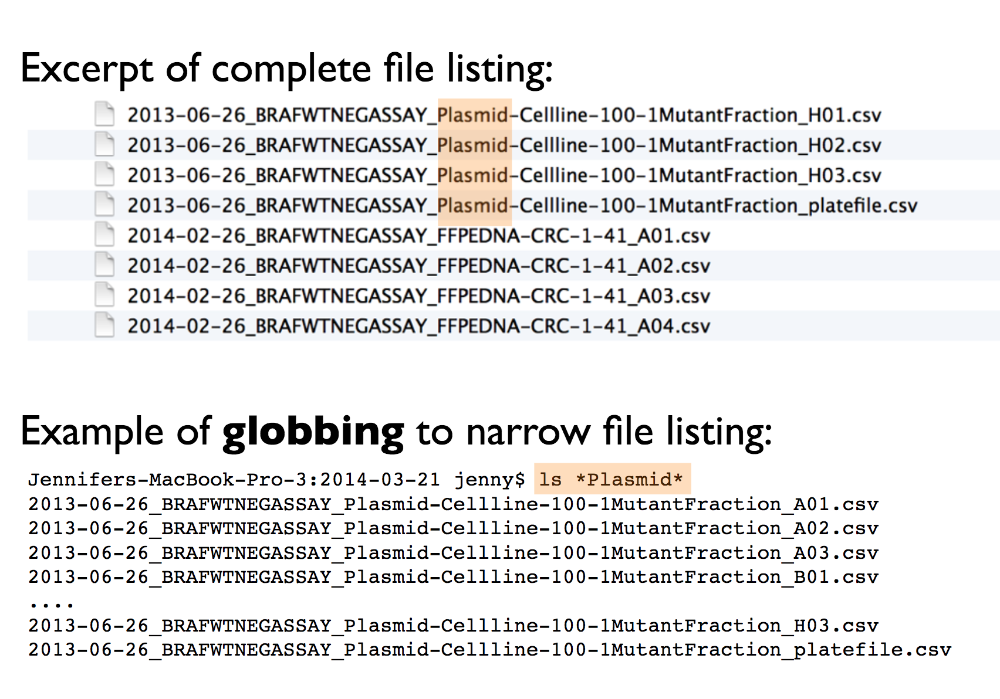
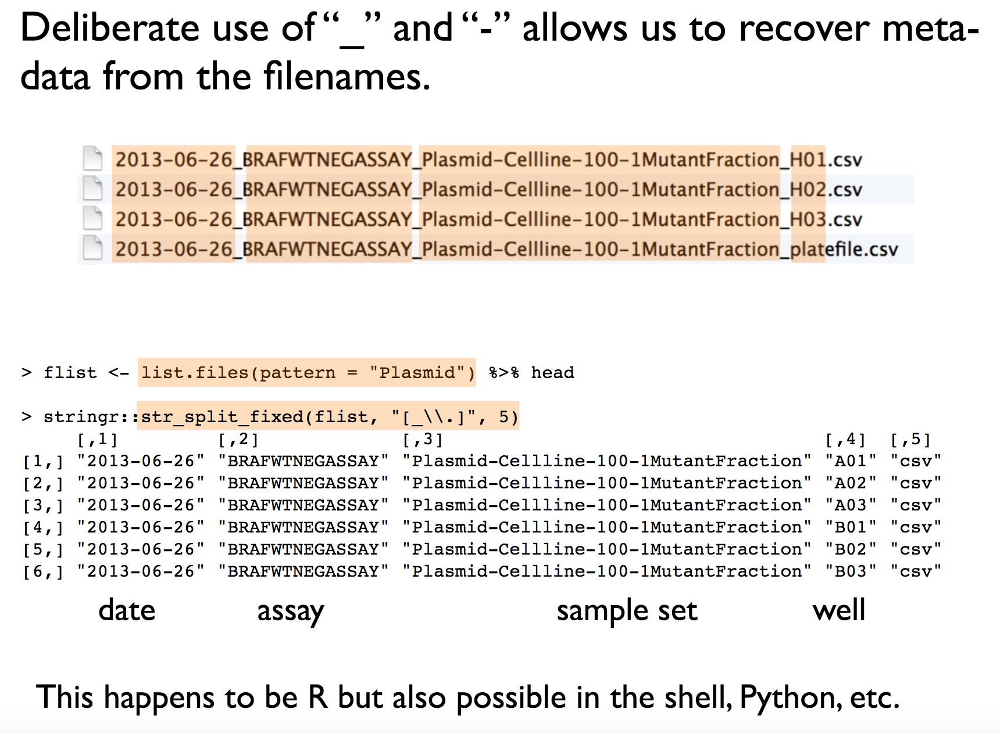
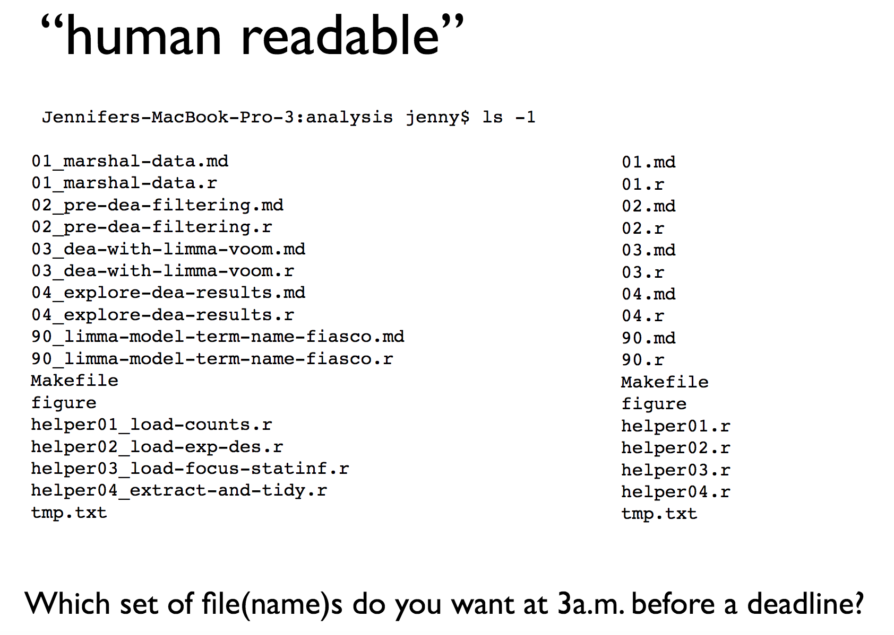
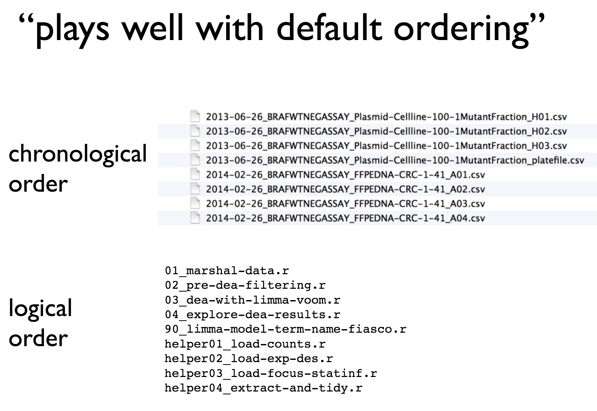

# Naming files

```{r, include = FALSE}
source("R/booktem_setup.R")
source("R/my_setup.R")
library(tidyverse)
library(here)
penguins_raw <- read_csv(here("files", "penguins_raw.csv"))
```

So as we are reading things into and out of our environment we come to filenames. 

So, what makes a good file name? Well, there are a few key principles to keep in mind:

**1. Machine Readable:** Your file names should be machine-readable, meaning they work well with regular expressions and globbing. This allows you to search for files using keywords, with the help of regex and the stringr package. To achieve this, avoid spaces, punctuation, accented characters, and case sensitivity. This makes searching for files and filtering lists based on names easier in the future.

```{r, eval=TRUE, echo=FALSE, out.width="80%",}

```


**2. Easy to Compute On:** File names should be structured consistently, with each part of the name serving a distinct purpose and separated by delimiters. This structure makes it easy to extract information from file names, such as splitting them into meaningful components.

```{r, eval=TRUE, echo=FALSE, out.width="80%",}

```

**3. Human Readable:** A good file name should be human-readable. It should provide a clear indication of what the file contains, just by looking at its name. It's important that even someone unfamiliar with your work can easily understand the file's content.


```{r, eval=TRUE, echo=FALSE, out.width="80%",}

```

**4. Compatible with Default Ordering:** Your computer will automatically sort your files, whether you like it or not. To ensure files are sorted sensibly, consider the following:

- Put something numeric at the beginning of the file name. If the order of sourcing files matters, state when the file was created. If not, indicate the logical order of the files.

- Use the YYYY-MM-DD format for dates (it's an ISO 8601 standard). This format helps maintain chronological order, even for Americans.

- Left-pad numbers with zeroes to avoid incorrect sorting (e.g., 01 not 1).

```{r, eval=TRUE, echo=FALSE, out.width="80%",}

```
Taking these simple but effective steps can significantly enhance your workflow and help your colleagues as well. Remember, good file names are a small change that can make a big difference in your productivity.

These examples from a great set of slides by R expert [Jenny Bryan](https://t.co/99waX8liuQ) and see [Data Organisation in Spreadsheets](https://www.tandfonline.com/doi/full/10.1080/00031305.2017.1375989) for more advice. 


**2. Easy to Compute On:** File names should be structured consistently, with each part of the name serving a distinct purpose and separated by delimiters. This structure makes it easy to extract information from file names, such as splitting them into meaningful components.

```{r, eval=TRUE, echo=FALSE, out.width="80%",}

```

**3. Human Readable:** A good file name should be human-readable. It should provide a clear indication of what the file contains, just by looking at its name. It's important that even someone unfamiliar with your work can easily understand the file's content.


```{r, eval=TRUE, echo=FALSE, out.width="80%",}

```

**4. Compatible with Default Ordering:** Your computer will automatically sort your files, whether you like it or not. To ensure files are sorted sensibly, consider the following:

- Put something numeric at the beginning of the file name. If the order of sourcing files matters, state when the file was created. If not, indicate the logical order of the files.

- Use the YYYY-MM-DD format for dates (it's an ISO 8601 standard). This format helps maintain chronological order, even for Americans.

- Left-pad numbers with zeroes to avoid incorrect sorting (e.g., 01 not 1).

```{r, eval=TRUE, echo=FALSE, out.width="80%",}

```
Taking these simple but effective steps can significantly enhance your workflow and help your colleagues as well. Remember, good file names are a small change that can make a big difference in your productivity.

These examples from a great set of slides by R expert [Jenny Bryan](https://t.co/99waX8liuQ)


