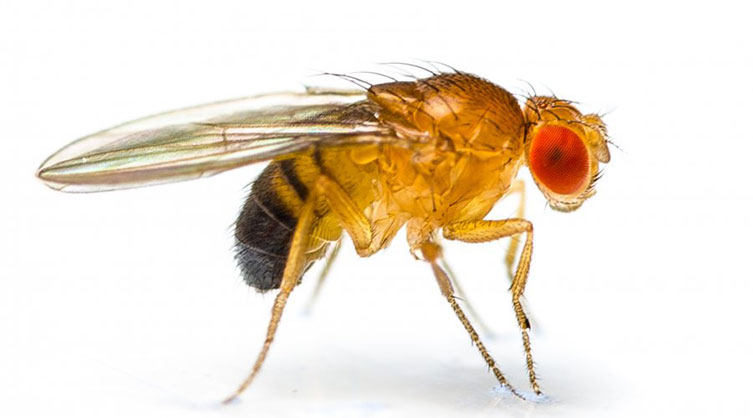

# Causal Inference with DAGs {#sec-dags}

```{r, echo = F, warning = F, message = F}
library(tidyverse)
library(ggdag)
library(dagitty)
library(here)
source("R/booktem_setup.R")
source("R/my_setup.R")
```


```{r, eval=T, echo=F}
library(tidyverse)
library(ggdag)
library(dagitty)
library(broom)
library(performance)
```

When we build regression models, we often want to know if our treatment or exposure **causes** changes in our outcome. However, simply including variables in a model doesn't guarantee we're estimating causal effects correctly. We need to think carefully about the causal structure of our data.

**Directed Acyclic Graphs (DAGs)** are visual tools that help us:

* Make our causal assumptions explicit
* Identify which variables to include in our models
* Avoid common statistical pitfalls
* Communicate our reasoning to others

In this chapter, we'll learn to use DAGs to make better modelling decisions.

## The fundamental problem

Consider this scenario: we want to know if a new fertiliser increases plant growth. We measure:

- **Treatment**: Fertiliser application (yes/no)
- **Outcome**: Plant height (cm)
- **Confound**: Sunlight exposure (low/high)

If plants near greenhouse windows get more sunlight AND we applied fertiliser mostly to those plants (easier to reach), we have a problem. When fertilised plants are taller, is it because of:

1. The fertiliser working?
2. The extra sunlight?
3. Both?

Simply including both variables in a regression doesn't tell us the answer - we need to understand the **causal structure**.

## What is a DAG?

A **Directed Acyclic Graph (DAG)** is a diagram showing causal relationships between variables using:

* **Nodes** (rectangles or circles) representing variables
* **Directed edges** (arrows) showing causal direction
* **No cycles** (you can't follow arrows and return to where you started)

```{r, echo=F, fig.width=6, fig.height=3}
dagify(
  height ~ fertiliser + sunlight,
  fertiliser ~ sunlight,
  exposure = "fertiliser",
  outcome = "height"
) |> 
  ggdag(text = FALSE, use_labels = "name") + 
  theme_dag()
```

The DAG above shows:

* Sunlight causes both fertiliser application and plant height
* Fertiliser causes plant height
* There's a "backdoor path" from fertiliser to height through sunlight

## Three key concepts

### 1. Confounders {#sec-confounders}

A **confounder** is a variable that affects both the exposure and the outcome, creating a spurious (non-causal) association.

**Structure**: 
```
    Confounder
       ↙    ↘
Treatment → Outcome
```

**Example**: In our plant study, sunlight is a confounder because:

* It affects who gets fertiliser (plants near windows)
* It directly affects plant height

**What to do**: **Adjust for confounders** in your model to block the backdoor path.

```{r, eval=FALSE}
# Correct model - adjusts for confounder
lm(height ~ fertiliser + sunlight, data = plant_data)
```

::: {.callout-warning}
## Common mistake

Failing to adjust for confounders means your treatment effect estimate includes both:

* The true causal effect
* The spurious association through the confounder

This leads to **confounding bias**.
:::

### 2. Colliders {#sec-colliders}

A **collider** is a variable that is caused by two other variables. Arrows point **into** it.

**Structure**:
```
Treatment → Collider ← Outcome
```

**Example**: In a bird nesting study:

* Supplemental feeding causes predator visits (active birds attract attention)
* Large clutch size causes predator visits (bigger nests are more visible)
* Predator visits is a **collider**

**What to do**: **Do NOT adjust for colliders**. They naturally block paths - adjusting for them creates spurious associations.

```{r, eval=FALSE}
# WRONG - adjusts for collider, creates bias
lm(fledglings ~ feeding + predator_visits, data = bird_data)

# CORRECT - leaves collider alone
lm(fledglings ~ feeding, data = bird_data)
```

::: {.callout-warning}
## Common mistake

Adjusting for a collider creates **collider bias** (also called selection bias or endogenous selection bias). This can make beneficial treatments appear harmful, or hide real effects entirely.
:::

### 3. Mediators {#sec-mediators}

A **mediator** sits on the causal pathway between treatment and outcome.

**Structure**:
```
Treatment → Mediator → Outcome
```

**Example**: In an exercise study:

* Exercise causes weight loss
* Weight loss reduces heart disease
* Weight loss is a **mediator**

**What to do**: **It depends on your research question**

* For **total effect** (all pathways): Don't adjust for mediator
* For **direct effect** (excluding mediation): Do adjust for mediator

```{r, eval=FALSE}
# Total effect - how does exercise affect heart disease?
lm(heart_disease ~ exercise, data = exercise_data)

# Direct effect - how does exercise affect heart disease 
# BESIDES through weight loss?
lm(heart_disease ~ exercise + weight_loss, data = exercise_data)
```

::: {.callout-note}
## Research question matters

Both models above are "correct" - they just answer different questions. Always be clear about whether you want the total effect or direct effect.
:::

## Quick reference table

| Variable Type | Structure | Do we adjust? | Why? |
|--------------|-----------|---------------|------|
| **Confounder** | → Treatment, → Outcome | ✅ YES | Blocks backdoor path |
| **Collider** | Treatment →, Outcome → | ❌ NO | Would create spurious association |
| **Mediator** | Treatment → Mediator → Outcome | 🟡 DEPENDS | Blocks causal pathway (adjust only for direct effect) |
| **Predictor of outcome only** | → Outcome | 🟢 OPTIONAL | Improves precision, not required for identification |

## Building DAGs in R

We use the `ggdag` package to create and analyse DAGs in R.

### Basic DAG construction

```{r}
library(ggdag)
library(dagitty)

# Create a simple DAG
my_dag <- dagify(
  outcome ~ treatment + confounder,  # Outcome caused by treatment and confounder
  treatment ~ confounder,            # Treatment caused by confounder
  
  exposure = "treatment",            # Label our exposure
  outcome = "outcome"                # Label our outcome
)

# Visualise it
ggdag(my_dag, text = FALSE, use_labels = "name") + 
  theme_dag()
```

### Using ggdag tools

#### Check for colliders

```{r}
# Identify colliders in your DAG
ggdag_collider(my_dag)
```

#### Find adjustment sets

The most important function: **What should I adjust for?**

:::{.panel-tabset}

## Visualised

```{r}
# Get minimal sufficient adjustment sets
ggdag_adjustment_set(my_dag)
```

## Written

```{r}

adjustmentSets(my_dag)

```

:::

This tells you which variables to include in your model to identify the causal effect.

#### Examine paths

```{r}
# See all paths from exposure to outcome
ggdag_paths(my_dag)
```

Paths can be:

* **Open** (biasing your estimate) - shown in one colour
* **Closed** (already blocked) - shown in another colour

#### Test specific adjustments

```{r, eval=FALSE}
# What happens if I adjust for this variable?
ggdag_paths(my_dag, adjust_for = "confounder")
```

## Worked example: Fruit fly longevity {#sec-fly-example}

```{r, eval=TRUE, echo=FALSE, out.width="60%", fig.alt="Fruit flies"}

```

This dataset examines how mating environment affects lifespan in fruit flies (*Drosophila melanogaster*).

We are introduced to the fruitfly dataset [Partridge and Farquhar (1981)](https://nature.com/articles/294580a0). From our understanding of sexual selection and reproductive biology in fruit flies, we know there is a well established ‘cost’ to reproduction in terms of reduced longevity for female fruitflies. The data from this experiment is designed to test whether increased sexual activity affects the lifespan of male fruitflies.

The flies used were an outbred stock, sexual activity was manipulated by supplying males with either new virgin females each day, previously mated females (Inseminated, so remating rates are lower), or provide no females at all (Control). For virgin and inseminated treatments, males were provided either a single female, or a group of females (8). All groups were otherwise treated identically.


**Research question**: Does competitive mating reduce longevity compared to isolation?

### The data

```{r, echo = FALSE}
fly_data <- read_csv(here::here("files", "fruitfly.csv"))
```

```{r, eval = TRUE, echo = FALSE}
downloadthis::download_link(
  link = "https://raw.githubusercontent.com/Philip-Leftwich/Oct-Intro-Analytics/refs/heads/dev/files/fruitfly.csv",
  button_label = "Download fruitfly data as csv",
  button_type = "success",
  has_icon = TRUE,
  icon = "fa fa-save",
  self_contained = FALSE
)
```

```{r}
head(fly_data)
```

The data columns are:

- **type**: Mating environment (Isolated vs Competitive)
- **longevity**: Lifespan in days
- **thorax**: Thorax length in mm (body size proxy)
- **sleep**: Average daily sleep in hours
- **partners**: Number of mating partners

### Building the DAG

Let's think about the causal relationships:

1. **Does mating type affect sleep?**

   - Yes: Competitive mating disrupts sleep patterns
   - Arrow: `type → sleep`

2. **Does sleep affect longevity?**

   - Yes: Sleep is restorative
   - Arrow: `sleep → longevity`

3. **Does mating type directly affect longevity?**

   - Yes: Mating is energetically costly
   - Arrow: `type → longevity`

4. **What about number of partners?**

   - More partners → less sleep (Arrow: `partners → sleep`)
   - More mating → energetic cost (Arrow: `partners → longevity`)

5. **Does body size matter?**

   - Larger flies may be healthier (Arrow: `thorax → longevity`)
   - But thorax doesn't affect mating assignment (random)

:::{.panel-tabset}

## Code

```{r}
fly_dag <- dagify(
  longevity ~ type + sleep + thorax + partners,
  sleep ~ type + partners,
  
  exposure = "type",
  outcome = "longevity",
  
  labels = c(
    type = "Mating Type",
    longevity = "Longevity",
    sleep = "Sleep",
    thorax = "Body Size",
    partners = "Partners"
  )
)
```

## Visualisation

```{r}
ggdag(fly_dag, text = FALSE, use_labels = "label") + 
  theme_dag()
```

:::

### Identifying key structures

#### Is sleep a collider?

```{r}
ggdag_collider(fly_dag)
```

**Yes!** Sleep has two arrows pointing into it:
```
type → sleep ← partners
```

This means the path `type → sleep ← partners → longevity` is **blocked by the collider**.

#### Is sleep also a mediator?

**Yes!** Sleep is on the causal pathway:
```
type → sleep → longevity
```

So sleep is **both** a collider AND a mediator. This is not uncommon in real data.

### What should we adjust for?

```{r}
ggdag_adjustment_set(fly_dag)
```

The adjustment set is **empty** `{ }` or contains only `{ thorax }`.

**Why no adjustment needed?**

1. The path through sleep is blocked by the collider structure

2. We don't want to block the mediator pathway (that's part of the effect!)

3. Thorax is optional - it improves precision but isn't required

### Fitting the models

:::{.panel-tabset}

## Total effect (Recommended)

```{r}
model_total <- lm(longevity ~ type, data = fly_data)

broom::tidy(model_total, conf.int = TRUE)
```

This estimates the **total effect** of mating type on longevity, including all pathways.

## With precision variable

```{r}
model_precise <- lm(longevity ~ type + thorax, data = fly_data)

broom::tidy(model_precise, conf.int = TRUE)
```

Same causal effect, but potentially more precise estimates by accounting for body size variation.

## Wrong model (for comparison)

```{r}
model_wrong <- lm(longevity ~ type + sleep, data = fly_data)

broom::tidy(model_wrong, conf.int = TRUE)
```

This model has two problems:

1. **Adjusts for collider**: Opens the path `type → sleep ← partners → longevity`
2. **Blocks mediator**: Excludes the pathway `type → sleep → longevity`

The effect estimate is biased.

:::

### Comparing models

```{r}

sjPlot::tab_model(model_total, model_precise, model_wrong,
          dv.labels = c("Total Effect", 
                                 "With Thorax", 
                                 "Wrong (Collider/Mediator)"))
```

Notice how the `type` coefficient changes dramatically in the wrong model due to collider bias and blocked mediation.

### Model diagnostics

```{r}
performance::check_model(model_total, detrend = FALSE)
```

The total effect model shows reasonable fit to assumptions.


## Common pitfalls

### 1. "Control for everything" approach

::: {.callout-warning}
**Don't do this:**
```{r, eval=FALSE}
# Kitchen sink model
lm(outcome ~ treatment + var1 + var2 + var3 + var4 + var5, data = data)
```

**Why it's wrong**: You'll almost certainly adjust for colliders, block mediators, or both.
:::

**Do this instead**: Draw your DAG first, then use `ggdag_adjustment_set()` to identify what to include.

### 2. Confusing correlation with causation

Just because a variable is associated with both treatment and outcome doesn't make it a confounder.

**Example**: In our fly data, sleep is associated with both `type` and `longevity`, but it's NOT a confounder - it's a mediator (and collider).

**Check**: Does the variable **cause** both treatment and outcome? If not, it's not a confounder.

### 3. Ignoring temporal order

Arrows should respect time - causes come before effects.

**Example**: If drought severity is measured during the fire year, it cannot **cause** the thinning decision that happened years earlier. 

### 4. Adjusting for descendants of treatment

::: {.callout-warning}
Variables caused by treatment (mediators, colliders) should rarely be adjusted for unless you specifically want the direct effect.
:::

### 5. Forgetting baseline variables

When you have repeated measures, baseline values are special:

```{r, eval=FALSE}
# Always include baseline when outcome is measured post-treatment
lm(diversity_change ~ treatment + baseline_diversity, data = data)
```

These improve precision and may be confounders if they affected treatment allocation (even in randomised trials, they still improve precision).

## DAG workflow summary

Follow this process when planning your analysis:

1. **List your variables**
   - What is your exposure/treatment?
   - What is your outcome?
   - What other variables did you measure?

2. **Draw the DAG** (on paper first!)
   - Use biological/domain knowledge
   - Think about temporal order
   - Consider unmeasured variables

3. **Build in R**
   ```{r, eval=FALSE}
   my_dag <- dagify(
     outcome ~ exposure + ...,
     exposure ~ ...,
     exposure = "exposure",
     outcome = "outcome"
   )
   ```

4. **Check structures**
   ```{r, eval=FALSE}
   ggdag_collider(my_dag)      # Find colliders
   ggdag_paths(my_dag)          # See all paths
   ```

5. **Find adjustment sets**
   ```{r, eval=FALSE}
   ggdag_adjustment_set(my_dag)
   ```

6. **Fit your model**
   ```{r, eval=FALSE}
   lm(outcome ~ exposure + adjustments, data = data)
   ```

7. **Sensitivity analysis**
   - What if a relationship goes the other way?
   - What if there's an unmeasured confounder?
   - How robust are your conclusions?

## Further reading

::: {.callout-tip}
## Excellent resources

- **Book**: "Causal Inference: The Mixtape" by Scott Cunningham (free online)
- **Book**: "The Effect" by Nick Huntington-Klein (free online)
- **Tutorial**: The ggdag vignette: `vignette("intro-to-dags", package = "ggdag")`
- **Video**: "Causal Inference Bootcamp" - Brady Neal (YouTube series)
- **Website**: DAGitty (draw DAGs online): http://www.dagitty.net/
:::

## Exercises

::: {.task}
:::: {.task-header}
Exercise 1: Identify the structure
::::
:::: {.task-container}

For each scenario, identify whether the middle variable is a confounder, collider, or mediator:

**a)** Temperature → Plant growth rate → Final plant height

**b)** Soil quality → Fertiliser application → Crop yield
      Soil quality → Crop yield

**c)** Studying → Exam score
      Natural ability → Exam score
      Studying ← Natural ability

**d)** Exercise → Fitness level → Health outcomes

`r hide("Solutions")`

**a)** Mediator - growth rate is on the causal path

**b)** Confounder - soil quality affects both treatment and outcome

**c)** This is tricky! If natural ability affects who studies, it's a confounder. But if we're looking at who gets into university (caused by both studying and ability), then university admission would be a collider.

**d)** Mediator - fitness is on the causal path

`r unhide()`

::::
:::

::: {.task}
:::: {.task-header}
Exercise 2: Build your own DAG
::::
:::: {.task-container}

Consider this scenario: You want to know if intensive farming reduces biodiversity. You have data on:

- Farming intensity (low/high)
- Biodiversity score
- Pesticide use
- Field size
- Soil quality

Think about the causal relationships and build a DAG. Consider:

1. Does farming intensity cause pesticide use?
2. Does field size affect farming intensity decisions?
3. Does soil quality affect both biodiversity and farming choices?
4. Is pesticide use on the causal pathway, or does it affect other variables?

`r hide("Solution")`

One reasonable DAG might be:

```{r}
farm_dag <- dagify(
  biodiversity ~ farming_intensity + pesticide_use + soil_quality,
  farming_intensity ~ field_size + soil_quality,
  pesticide_use ~ farming_intensity,
  
  exposure = "farming_intensity",
  outcome = "biodiversity"
)

ggdag(farm_dag) + theme_dag()
ggdag_adjustment_set(farm_dag)
```

Key insights:
- Pesticide use is a **mediator** (on the causal pathway)
- Soil quality is a **confounder** (affects both farming choices and biodiversity)
- Field size affects farming intensity but not biodiversity directly

To estimate total effect: adjust for soil quality only
To estimate direct effect: adjust for soil quality and pesticide use

`r unhide()`

::::
:::

::: {.task}
:::: {.task-header}
Exercise 3: What went wrong?
::::
:::: {.task-container}

A student wants to know if a new teaching method improves exam scores. They collect data on:

- Teaching method (new/traditional)
- Exam score
- Student motivation
- Hours studied
- Prior achievement

They reason: "Motivated students score better, so I should control for motivation. Students in the new method study more, so I should control for hours studied."

They fit this model:
```{r, eval=FALSE}
lm(exam_score ~ teaching_method + motivation + hours_studied + 
   prior_achievement, data = exam_data)
```

**Questions:**

1. What causal role does "hours studied" play?
2. What happens when they adjust for it?
3. What should they do instead?

`r hide("Solution")`

**1. Hours studied is a mediator**
- Teaching method → hours studied → exam score
- It's on the causal pathway (the new method might work BY getting students to study more)

**2. By adjusting for hours studied, they block the mediation pathway**
- They're now only estimating the direct effect
- They've thrown away part of the effect they wanted to measure!

**3. What to do instead:**

For **total effect** (does the new method work?):
```{r, eval=FALSE}
lm(exam_score ~ teaching_method + prior_achievement, data = exam_data)
```

Note: Motivation might also be a mediator if the new method increases motivation. Only adjust for it if you want to exclude that pathway.

`r unhide()`

::::
:::

## Summary

::: {.callout-important}
## Key takeaways

**DAGs help you:**

1. Make causal assumptions explicit
2. Identify what to adjust for (and what not to!)
3. Avoid common statistical traps

**Three critical structures:**

- **Confounders**: Adjust for them (block backdoor paths)
- **Colliders**: Don't adjust for them (would create bias)
- **Mediators**: Depends on your research question

**The golden rule:**

Draw your DAG BEFORE fitting your model. Let the causal structure guide your statistical choices, not the other way around.
:::

## Session Info

```{r}
sessionInfo()
```
