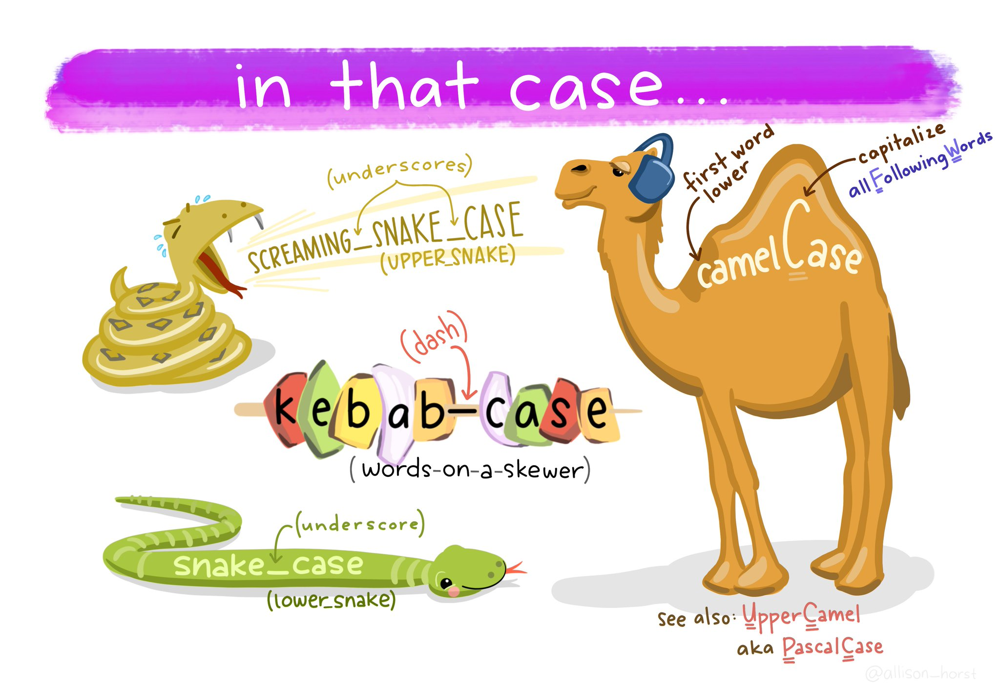

# Column classes & names {#sec-column-name}

```{r, echo = F, warning = F, message = F}
library(tidyverse)
library(janitor)
library(here)
source("R/booktem_setup.R")
source("R/my_setup.R")
penguins_raw <- read_csv(here("files", "penguins_raw.csv"))
```

## Learning Outcomes

This chapter explains how to check the class of each column and edit column names so that they are consistent and ready to use for analyses.

By the end of this section, you will be able to:

- Identify the data class (type) of each column in a dataset.

- Use functions to inspect and confirm column names and formats.

- Apply `janitor::clean_names()` to make variable names consistent and machine-readable.

- Rename columns manually using `dplyr::rename()` when needed.

:::{.callout-important collapse = "true"}

## Penguin raw dataset

```{r, eval = FALSE}
penguins_clean_names <- read_csv(url("https://UEABIO/5023B/raw/refs/heads/2026/files/penguins_raw.csv"))


```

:::


## Column classes


::: {.panel-tabset}

## `glimpse()`

Using `glimpse()` displays the class beside each column name (e.g. `chr`)

```{r}
library(dplyr)
glimpse(penguins_raw)

```

## `str()`

Using `str()` displays the class after the column name and before the number of rows (e.g. `chr`)

```{r}

str(penguins_raw)

```


## `skim()`

The `skimr::skim()` function groups columns by their type/class.

```{r}
library(skimr)

skim(penguins_raw)

```

:::

If you are using a `tibble`, the class is also displayed below each column name when you view your data.

```{r, eval = FALSE}

penguins_raw

```

:::{.callout-note}

## Data classes

From these data overviews we've learned:

- Columns like `Species`, `Island`are strings of text (`character`)

- Columns like `Culmen Depth (mm)` and `Flipper Length (mm)` are numbers with decimal points (`double`)

:::


## Column names


```{r, eval = T}
# CHECK DATA----
# check the data
colnames(penguins_raw)
#__________________________----
```

When we run `colnames()` we get the identities of each column in our dataframe

* **Study name**: an identifier for the year in which sets of observations were made

* **Region**: the area in which the observation was recorded

* **Island**: the specific island where the observation was recorded

* **Stage**: Denotes reproductive stage of the penguin

* **Individual** ID: the unique ID of the individual

* **Clutch completion**: if the study nest observed with a full clutch e.g. 2 eggs

* **Date egg**: the date at which the study nest observed with 1 egg

* **Culmen length**: length of the dorsal ridge of the bird's bill (mm)

* **Culmen depth**: depth of the dorsal ridge of the bird's bill (mm)

* **Flipper Length**: length of bird's flipper (mm)

* **Body Mass**: Bird's mass in (g)

* **Sex**: Denotes the sex of the bird

* **Delta 15N** : the ratio of stable Nitrogen isotopes 15N:14N from blood sample

* **Delta 13C**: the ratio of stable Carbon isotopes 13C:12C from blood sample

### Problems:

- Spaces and brackets make names awkward to reference.

- R is case-sensitive — Mass ≠ mass.

- You need backticks (```) around names with spaces or symbols.

:::{.task}
::::{.task-header}
Your turn
::::
::::{.task-container}

Identify two columns in `penguins_raw` that could cause errors if used without backticks: `r fitb(c("Culmen Length (mm)", "Culmen Depth (mm)", "Flipper Length (mm)", "Body Mass (g)", "Delta 15 N (o/oo)", "Delta 13 C (o/oo)"), ignore_case = TRUE)`

::::
:::

#### Clean column names

Often we might want to change the names of our variables. They might be non-intuitive, or too long. Our data has a couple of issues:

* Some of the names contain spaces

* Some of the names have capitalised letters

* Some of the names contain brackets

R is case-sensitive and also doesn't like spaces or brackets in variable names, because of this we have been forced to use backticks \`Sample Number\` to prevent errors when using these column names.


:::{.callout-important collapse = "true"}
## Name consistency

Column names should use consistent naming conventions. R is case sensitive, so two names with the same letters but different capitalisations are considered different names (e.g. event vs. Event). Using a naming convention which is both human- and machine-readable (e.g. camel case, snake case), and being consistent in your usage of it, makes it less likely that you will make these sorts of errors.

- **Snake case** uses lowercase letters only, with words separated by an underscore _ (e.g. `scientific_name`, `data_resource_name`, `event_date`).

:::

One of the most useful column name cleaning functions is `janitor::clean_names()` from the janitor package @R-janitor. This function will make all of your column names consistent, based on your preferred naming convention (defaults to snake case).

```{r, eval = T, warning = F, message = F}
# CLEAN DATA ----

# clean all variable names to snake_case 
# using the clean_names function from the janitor package
# note we are using assign <- 
# to overwrite the old version of penguins 
# with a version that has updated names
# this changes the data in our R workspace 
# but NOT the original csv file

# clean the column names
# assign to new R object
penguins_clean_names <- janitor::clean_names(penguins_raw) 

# quickly check the new variable names
colnames(penguins_clean_names) 


```


`r hide ("Import and clean names")`

We can combine data import and name repair in a single step if we want to:

```{r, eval = FALSE}
penguins_clean_names <- read_csv ("data/penguins_raw.csv",
                      name_repair = janitor::make_clean_names)

```

`r unhide()`


#### Rename columns (manually)

The `clean_names` function quickly converts all variable names into `r glossary("snake case")`. The N and C blood isotope ratio names are still quite long though, so let's clean those with `dplyr::rename()` where "new_name" = "old_name".


```{r, eval = T, warning = F, message = F}

# shorten the variable names for isotope blood samples
# use rename from the dplyr package
penguins_clean_names <- rename(penguins_clean_names,
         "delta_15n"="delta_15_n_o_oo",  
         "delta_13c"="delta_13_c_o_oo")

```

```{r snake, echo=FALSE, fig.cap="Snake case"}



```


## Save Cleaned Data

Saving as `.RDS` ensures you can load the cleaned version quickly next time.

```{r, eval = FALSE}

saveRDS(penguins_clean_names, "data/penguin_clean_names.RDS")

```


