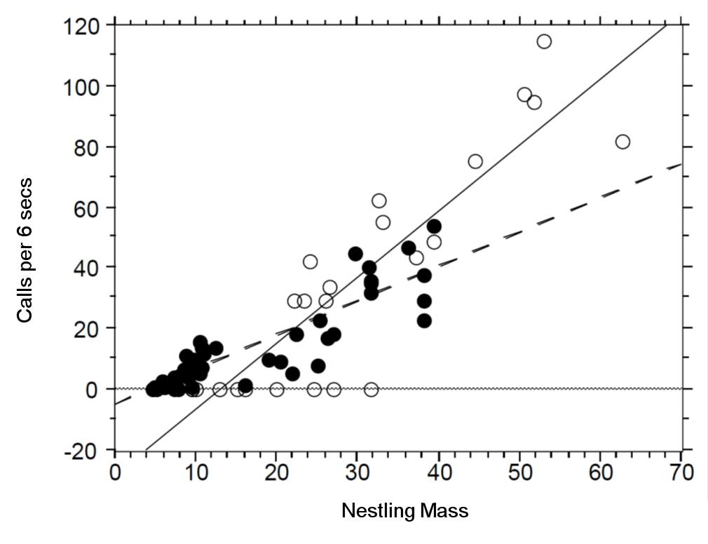
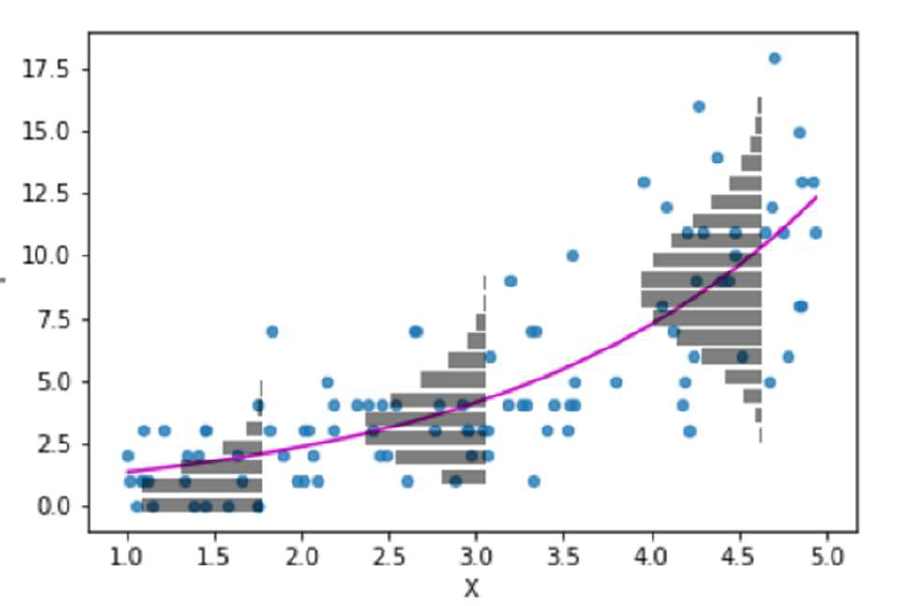

# Poisson regression (for count data or rate data)


```{r, echo = F, warning = F, message = F}
library(tidyverse)
library(janitor)
library(here)
source("R/booktem_setup.R")
source("R/my_setup.R")
```


```{r, eval=T, echo=F}
library(tidyverse)
library(performance)
library(emmeans)
library(broom)
library(MASS)
library(patchwork)
```


## Learning objectives:

- Understand why linear models fail for count data

- Recognise variance-mean relationships as the organising principle

- Diagnose model misspecification vs distributional misfit

- Choose between quasi-Poisson and negative binomial based on mechanism

- Communicate results appropriately

## Why count data needs different models

Count or rate data are ubiquitous in the life sciences (e.g number of parasites per microlitre of blood, number of species counted in a particular area). These type of data are **discrete** and **non-negative**.

- Count data characteristics: discrete, bounded at zero, often right-skewed

- Linear model assumptions: continuous response, constant variance, unbounded predictions

In such cases assuming our response variable to be normally distributed is not typically sensible. 


## Example: Cuckoos

```{r, echo=FALSE, fig.width = 10, fig.height = 5}

```

In a study by [Kilner *et al.* (1999)](http://www.nature.com/nature/journal/v397/n6721/abs/397667a0.html), the authors studied the begging rate of nestlings in relation to total mass of the brood of **reed warbler chicks** and **cuckoo chicks**.

The question of interest is:

> How does nestling mass affect begging rates between the different species?


```{r, echo = F}
cuckoo <- read_csv(here::here("files", "cuckoo.csv"))
```
```{r, eval = TRUE, echo = FALSE}
downloadthis::download_link(
  
  link = "https://github.com/UEABIO/5023B/blob/dev/files/cuckoo.csv",
  button_label = "Download Cuckoo data as csv",
  button_type = "success",
  has_icon = TRUE,
  icon = "fa fa-save",
  self_contained = FALSE
)
```

```{r}
head(cuckoo)
```

The data columns are:

* **Mass**: nestling mass of chick in grams
* **Beg**: begging calls per 6 secs
* **Species**: Warbler or Cuckoo

```{r, eval = T, fig.height=6, fig.width=7, warning = FALSE}
ggplot(cuckoo, aes(x = Mass, y = Beg, colour = Species)) + 
  geom_point(size = 3, alpha = 0.6) +
  scale_colour_manual(values = c("darkorange", "steelblue")) +
  labs(x = "Nestling mass (g)", 
       y = "Begging calls per 6 seconds") +
  theme_minimal()
```

There seem to be a relationship between mass and begging calls and it could be different between species. It is tempting to fit a linear model to this data. 

In fact, this is what the authors of the original paper did; **reed warbler chicks** (solid circles, dashed fitted line) and  **cuckoo chick** (open circles, solid fitted line):

```{r, echo=FALSE, eval = T, fig.width = 10, fig.height = 5}

```


## When Linear models fail

Let us display the model diagnostics plots for a linear model.

:::{.task}
::::{.task-header}
Fit a linear model
::::
::::{.task-container}

Fit a linear model with interaction:
```{r}
cuckoo_lm <- lm(Beg ~ Mass * Species, data = cuckoo)

summary(cuckoo_lm)
```

Examine diagnostics:
```{r}
check_model(cuckoo_lm, detrend = FALSE)
```

**Discussion questions:**
- What does the residuals vs fitted plot show?
- Can this model predict negative begging calls?
- Is the assumption of constant variance met?

::::
:::

`r hide("Solution")`

The residuals vs fitted plot shows clear heteroscedasticity—variance increases with fitted values. The Q-Q plot shows deviation from normality. Most critically, the model predicts **negative begging calls** for small nestlings:

```{r}
# Generate predictions
predictions_lm <- emmeans(cuckoo_lm, 
                          specs = ~ Mass + Species,
                          at = list(Mass = seq(0, 40, by = 5))) |>
  as_tibble()

# Check for negative predictions
predictions_lm |> 
  filter(emmean < 0)
```

Linear models are inappropriate when:
1. Response is bounded (cannot be negative)
2. Variance changes systematically with mean
3. Relationship is inherently non-linear

`r unhide()`

```{r, eval = T}
performance::check_model(cuckoo_lm, 
                         detrend = FALSE)
```


## Poisson GLM—modelling counts explicitly

### The Poisson distribution and log-link


The Poisson distribution lets us model count data explicitly.


Instead of assuming constant variance, Poisson models explicitly link variance to the mean:

**Poisson distribution properties:**
- Discrete, non-negative integers
- Single parameter λ (rate)
- Mean = λ
- Variance = λ (key assumption)

* **Discrete** variable, defined on the range $0, 1, \dots, \infty$.
* A single ***rate*** parameter $\lambda$, where $\lambda > 0$.
* **Mean** = $\lambda$  
* **Variance** = $\lambda$


```{r, eval = T, echo=F}
#cols <- c("#F4ABAB", "#91CDF2", "#5AA566", "#A57C42")
cols <- c("#377eb8", "#4daf4a", "#984ea3") # colorbrewer
par(mfrow = c(3, 1))
x <- 0:20
rates <- c(1, 5, 10)
barplot(dpois(x, rates[1]), col = cols[1], ylab = "Probability", xlab = "X", main = paste0("lambda = ", rates[1]), names.arg = x)
for(i in 2:length(rates)) barplot(dpois(x, rates[i]), col = cols[i], ylab = "Probability", xlab = "X", main = paste0("lambda = ", rates[i]), names.arg = x)
par(mfrow = c(1, 1))
```

**The log link:**

$$
\begin{aligned}
Y_i & \sim \text{Poisson}(\lambda_i) \\
\log(\lambda_i) & = \beta_0 + \beta_1 X_i
\end{aligned}
$$

This constrains predictions to be positive and models the exponential mean-response relationship naturally present in many biological count processes.

**What the log link does:**
- Ensures predicted counts are always positive (since e^x > 0 for all x)
- Creates multiplicative effects on the original scale
- Models proportional rather than additive changes


```{r, eval=TRUE, echo=FALSE, out.width="80%", fig.alt= "Poisson distribution on an exponential line"}


```


## Fitting a Poisson GLM 

We start with an **additive model** (parallel slopes):
```{r}
cuckoo_glm_add <- glm(Beg ~ Mass + Species, 
                      data = cuckoo, 
                      family = poisson(link = "log"))

summary(cuckoo_glm_add)
```

Generate predictions on the response scale:
```{r}
predictions_poisson <- emmeans(cuckoo_glm_add,
                               specs = ~ Mass + Species,
                               at = list(Mass = seq(0, 40, by = 5)),
                               type = "response") |>
  as_tibble()

ggplot(predictions_poisson, aes(x = Mass, y = rate, colour = Species)) +
  geom_line(linewidth = 1) +
  geom_point(data = cuckoo, aes(y = Beg), alpha = 0.5) +
  scale_colour_manual(values = c("darkorange", "steelblue")) +
  labs(x = "Nestling mass (g)", 
       y = "Begging calls per 6 seconds",
       title = "Poisson GLM: Additive model") +
  theme_minimal()
```

**Key observations:**
- No negative predictions
- Variance increases with mean (heteroscedasticity is expected and appropriate)
- Exponential curves fit the biological relationship better than straight lines

:::{.task}
::::{.task-header}
Examine model diagnostics
::::
::::{.task-container}
```{r}
check_model(cuckoo_glm_add, 
            residual_type = "normal",
            detrend = FALSE)
```

**Focus on:**
1. Q-Q plot: Are deviance residuals approximately normal?

2. Residuals vs fitted: Is there remaining pattern?

3. **Dispersion check**: What does this plot show?

Calculate dispersion manually:
```{r}
dispersion_add <- cuckoo_glm_add$deviance / cuckoo_glm_add$df.residual
dispersion_add

check_overdispersion(cuckoo_glm_add)
```

**Discussion:** The dispersion ratio is [~2-3]. What might cause variance to exceed the Poisson assumption?

`r hide("Possible Solutions")`

- A misspecified model - are we missing key variables or ways in which existing variables might interact?

- Genuine overdispersion - our data does not fit the expectations of a Poisson distribution

`r unhide()`

::::
:::


## Diagnosing and addressing model misspecification

### Understanding overdispersion sources

Before applying "fixes" for overdispersion, ask: **have we correctly specified the mean function?**

### Hypothesis: The interaction is missing

Look at the data :
```{r}
ggplot(cuckoo, aes(x = Mass, y = Beg, colour = Species)) + 
  geom_point(size = 3, alpha = 0.6) +
  scale_colour_manual(values = c("darkorange", "steelblue")) +
  labs(x = "Nestling mass (g)", 
       y = "Begging calls per 6 seconds") +
  theme_minimal()
```

Warbler calling rate increases more slowly with mass than cuckoo rate.

**If we force parallel slopes when they're actually different:**

- We mis-specify the mean structure

- Create systematic residual patterns 

- Artificially inflate variance

- Generate spurious overdispersion

This is **unmodelled heterogeneity**—a primary cause of apparent overdispersion.

:::{.task}
::::{.task-header}
Add the interaction term
::::
::::{.task-container}

Fit the model with Mass × Species interaction:
```{r}
cuckoo_glm_int <- glm(Beg ~ Mass * Species, 
                      data = cuckoo, 
                      family = poisson(link = "log"))

summary(cuckoo_glm_int)
```


Compare dispersion between models:

```{r}
dispersion_comparison <- tibble(
  Model = c("Additive (no interaction)", 
            "Interaction included"),
  Dispersion = c(
    cuckoo_glm_add$deviance / cuckoo_glm_add$df.residual,
    cuckoo_glm_int$deviance / cuckoo_glm_int$df.residual
  )
)

dispersion_comparison
```

**Critical question:** Has dispersion reduced?
```{r}
check_overdispersion(cuckoo_glm_int)
```

::::
:::

`r hide("Solution")`

Dispersion has not meaningfully reduced. Adding the biologically meaningful interaction has **captured substantial variance** by better modelling the mean structure.

**Key insight:** Much "overdispersion" is actually **model misspecification**. Always investigate whether:
1. Important covariates are missing
2. Relationships are non-linear (consider polynomials)
3. Interactions exist between predictors

However, residual overdispersion remains (φ̂ ≈ [1.5-2]), suggesting variance still exceeds the mean even with correct mean specification.

`r unhide()`

###  Comparing model predictions

Compare the fits between these models:

```{r}
anova(cuckoo_glm_add, cuckoo_glm_int)

```


```{r}
# Generate predictions for both models
pred_additive <- emmeans(cuckoo_glm_add,
                         specs = ~ Mass + Species,
                         at = list(Mass = seq(0, 40, by = 1)),
                         type = "response") |>
  as_tibble() |>
  mutate(Model = "Additive")

pred_interaction <- emmeans(cuckoo_glm_int,
                            specs = ~ Mass + Species,
                            at = list(Mass = seq(0, 40, by = 1)),
                            type = "response") |>
  as_tibble() |>
  mutate(Model = "Interaction")

predictions_combined <- bind_rows(pred_additive, pred_interaction)

ggplot(predictions_combined, aes(x = Mass, y = rate, colour = Species)) +
  geom_point(data = cuckoo, aes(y = Beg), alpha = 0.4) +
  geom_line(aes(linetype = Model), linewidth = 1) +
  scale_colour_manual(values = c("darkorange", "steelblue")) +
  labs(x = "Nestling mass (g)",
       y = "Begging calls per 6 seconds",
       title = "Model comparison: Additive vs Interaction") +
  theme_minimal() +
  theme(legend.position = "right")+
  facet_wrap(~Model)
```


The interaction model captures the different slopes between species—warblers' calling rate increases more slowly with mass.


### Addressing remaining model checks


```{r}
check_model(cuckoo_glm_int, 
            residual_type = "normal",
            detrend = FALSE)
```


## Remaining overdispersion: Two approaches

Even with the interaction, dispersion > 1. This residual variance could arise from:

1. **Other unmeasured covariates** (brood size, hunger level, time of day)
2. **Individual heterogeneity** (some chicks intrinsically call more)
3. **Measurement variation** (observer counting differences)
4. **Clustering** (multiple obs per nest—not applicable here)
5. **Zero inflation** Another biological process determines presence of calling at all

We cannot measure everything. Two philosophical approaches for handling extra-Poisson variance:

### Quasi-Poisson: Agnostic approach

**Philosophy:** "Variance exceeds the mean by some factor φ, but I won't specify *why*"

**What it does:**
- Estimates dispersion parameter from data: Var = φμ
- Multiplies standard errors by √φ
- Widens confidence intervals proportionally
- No distributional assumption beyond scaled Poisson

**Advantages:**
- Simple, honest acknowledgment of uncertainty
- No additional assumptions

**Limitations:**
- Cannot do likelihood-based model comparison (no AIC)
- Doesn't model the mechanism
- Assumes dispersion is constant across the range of fitted values

### Negative binomial: Mechanistic approach

**Philosophy:** "Individuals have different underlying rates drawn from a gamma distribution"

**What it assumes:**
- True rates (λᵢ) vary between observations
- This heterogeneity follows a gamma distribution
- Produces variance = μ + μ²/θ (quadratic relationship)

**Advantages:**
- Explicit mechanistic model
- Allows AIC-based model comparison
- Models variance structure directly

**Limitations:**
- Requires specific variance-mean relationship
- Additional parameter to estimate
- May not fit if variance structure differs from quadratic

**Neither is universally "better"**—choose based on:
- Your beliefs about what generates heterogeneity
- Whether you need model comparison
- How variance scales with the mean

:::{.task}
::::{.task-header}
Fit quasi-Poisson and negative binomial models
::::
::::{.task-container}

**Quasi-Poisson:**
```{r}
cuckoo_quasi <- glm(Beg ~ Mass * Species, 
                    data = cuckoo, 
                    family = quasipoisson(link = "log"))

summary(cuckoo_quasi)
```

Note the dispersion parameter estimate.

:::{.callout-important}

- The quasilikelihood model *just* adds a dispersion term to our SE so model fits do not change

:::

**Negative binomial:**
```{r}
library(MASS)
cuckoo_negbin <- glm.nb(Beg ~ Mass * Species, 
                        data = cuckoo)

summary(cuckoo_negbin)
```

Note the theta parameter (θ)—this controls how much variance exceeds the mean.

::::
:::

### Model diagnostics

Let's compare models using AIC:
```{r}
AIC(cuckoo_glm_int, cuckoo_negbin)
```


The negative binomial has lower AIC—typically interpreted as "better fit." But AIC measures *predictive performance*, not whether *model assumptions are met*.

**Critical check: Does the model capture the variance structure?**
```{r}
check_model(cuckoo_negbin, detrend = FALSE)
```


**Focus on two key diagnostics:**

1. **Dispersion check (Misspecified dispersion?)** 
2. **Posterior predictive check**

:::{.task}
::::{.task-header}
Examine the negative binomial diagnostics
::::
::::{.task-container}

Look carefully at:

**The dispersion plot:**
- Does the grey line (predicted variance-mean relationship) match the points (observed variance)?

- Is the negative binomial variance function (Var = μ + μ²/θ) appropriate?

**The posterior predictive check:**
- Do the light blue lines (simulated data from the model) match the dark blue line (observed data)?

- Are there systematic discrepancies?

**Discussion questions:**

1. What pattern do you see in the dispersion plot?

2. Does the model over-predict or under-predict variance?

3. What does the posterior predictive check suggest about model fit?


`r hide("Solution")`

**Dispersion plot observation:**

The negative binomial predicts that variance should increase **quadratically** with the mean (the curved grey line). However, the observed variance (points) **increases more slowly than predicted**—almost linearly rather than quadratically.

This means the negative binomial is **over-modelling** the variance structure. It's trying to fit a strongly accelerating variance pattern when the data show more modest heterogeneity.

**Posterior predictive check observation:**

The simulated data from the negative binomial (light blue lines) show **different distributional properties** than the observed data (dark blue line). Specifically:
- The model may generate more extreme values than observed
- The shape of the distribution doesn't match well
- There's systematic misfit, not just random variation

**What this means:**

Despite having lower AIC, the negative binomial **imposes an inappropriate variance structure** on these data. The quadratic variance-mean relationship is too strong for the actual pattern of heterogeneity.

`r unhide()`

::::
:::

Is the dispersion now adequately modelled?


## How do modelling decisions affect inference? 

A critical question: does the interaction between Mass and Species matter? Let's see how this answer changes depending on our modelling decisions.

```{r}
# Extract coefficients with confidence intervals
coef_poisson <- tidy(cuckoo_glm_int, conf.int = TRUE) |>
  mutate(Model = "Poisson")

coef_quasi <- tidy(cuckoo_quasi, conf.int = TRUE) |>
  mutate(Model = "Quasi-Poisson")

coef_negbin <- tidy(cuckoo_negbin, conf.int = TRUE) |>
  mutate(Model = "Negative Binomial")

coef_comparison <- bind_rows(coef_poisson, coef_quasi, coef_negbin) |>
  filter(term == "Mass:SpeciesWarbler") |>  
  dplyr::select(Model, estimate, std.error, conf.low, conf.high, p.value)

coef_comparison
```

**Visualise the uncertainty:**
```{r}
ggplot(coef_comparison, aes(x = Model, y = estimate)) +
  geom_point(size = 4) +
  geom_errorbar(aes(ymin = conf.low, ymax = conf.high), 
                width = 0.2, linewidth = 1.2) +
  geom_hline(yintercept = 0, linetype = "dashed", 
             colour = "red", linewidth = 1) +
  labs(y = "Interaction coefficient (Mass:SpeciesWarbler)",
       x = "",
       title = "Same data, different inferences") +
  theme_minimal(base_size = 14) +
  theme(panel.grid.major.x = element_blank()) +
  coord_flip()
```

### The problem: significance depends on model choice

Look at the p-values:
```{r}
coef_comparison |>
  mutate(
    Significant = if_else(p.value < 0.05, "Yes", "No"),
    `CI crosses zero` = if_else(conf.low < 0 & conf.high > 0, "Yes", "No")
  ) |>
  dplyr::select(Model, estimate, p.value, Significant, `CI crosses zero`)
```

**What we observe:**
- Point estimates are identical for Poisson and Quasipoisson ( around -0.02)

- The Poisson model gives P < 0.05 (interaction "significant")

- The Quasi-Poisson model gives P > 0.05 (interaction "not significant")

- The Negative Binomial falls somewhere between - *but* also estimates the relationship as slightly different

**The uncomfortable truth:** Whether you conclude the interaction "matters" depends on which model you chose. This is a **borderline result**.


### Critical discussion


1. The Poisson model ignores overdispersion—its P-value is anti-conservative (too small). Should we trust it?

2. The Quasi-Poisson corrects for overdispersion conservatively—but does P = 0.06 really mean "no effect" compared to P = 0.04?

3. If you were reviewing this paper, what would you want the authors to report?

4. Does the magnitude of the effect (coefficient ≈ -0.02) matter more than whether P < 0.05?


### How to think about borderline results

**Don't:**
- Report only the model that gives P < 0.05
- Conclude "no effect" if P > 0.05 with one model
- Pretend the threshold at 0.05 is meaningful
- Hide the fact that inference is model-dependent

**Do:**
- Report results from the most appropriate model
- Acknowledge uncertainty honestly
- Focus on effect size and confidence intervals, not just P-values
- Consider biological significance alongside statistical significance


:::{.callout-important}
**The key principle:**

When results are borderline, **report the effect size, confidence interval, and biological interpretation** rather than fixating on whether P < 0.05. Statistical significance is a continuum of evidence, not a binary threshold.

A result with P = 0.06 and a biologically meaningful effect size warrants the same scientific attention as one with P = 0.04.
:::


### Practical implications for your research

When you encounter borderline results:

1. **Report transparently:** Show that inference depends on modelling assumptions

2. **Contextualise statistically:** 
   - "The 95% CI marginally includes zero"
   - "Evidence for interaction is modest (P = 0.06)"
   - Not: "There was no interaction" or "The interaction failed to reach significance"

3. **Contextualise biologically:**
   - Is a 2% difference per gram body mass biologically meaningful?
   - Does it accumulate to substantial differences over the observed range?
   - Does it align with theory about begging behaviour?

4. **Consider power:**
   - With n = 48, we have limited power to detect modest interactions
   - CIs are wide—we'd be uncertain even with larger samples
   - This is weak evidence for *or* against the interaction

5. **Avoid HARKing:**
   - If you predicted the interaction a priori, P = 0.06 is worth discussing
   - If you're data mining, it's probably noise
   - Don't retrofit hypotheses to P-values
   
   
## Reporting Results

### Visualising the biological pattern regardless of P-value

**Principles for effective GLM figures:**

1. Show raw data with sufficient transparency

2. Display model predictions with uncertainty

3. Use the response scale (not log scale)

4. Make the biological pattern immediately clear

5. Avoid chart junk—every element should serve a purpose


```{r}

## Final model predictions
predictions_final <- emmeans(cuckoo_quasi,
specs = ~ Mass + Species,
at = list(Mass = seq(0, 40, by = 0.5)),
type = "response") |>
as_tibble()

fig_main <- ggplot(predictions_final,
aes(x = Mass, y = rate,
colour = Species, fill = Species)) +
geom_ribbon(aes(ymin = asymp.LCL, ymax = asymp.UCL),
            alpha = 0.15, colour = NA) +
# Mean estimate
geom_line(linewidth = 1.2) +
# Raw data
geom_point(data = cuckoo,
aes(y = Beg),
size = 2.5,
alpha = 0.6) +

scale_colour_manual(values = c("Cuckoo" = "darkorange", "Warbler" = "steelblue"),
labels = c("Cuckoo", "Reed warbler")

) +
scale_fill_manual(values = c("Cuckoo" = "darkorange", "Warbler" = "steelblue"),
labels = c("Cuckoo", "Reed warbler")

) +
scale_x_continuous(breaks = seq(0, 40, by = 10)) +
scale_y_continuous(breaks = seq(0, 100, by = 10)) +

  labs(
x = "Nestling mass (g)",
y = "Begging calls per 6 seconds",
colour = NULL,
fill = NULL
) +
theme_minimal(base_size = 12)


fig_main

```


### Writing the Results section

**The goal**: Tell the biological story whilst providing necessary statistical support.

**Avoid:**
- Leading with statistics ("There was a significant effect of mass, z = 5.2, P < 0.001...")
- Reporting every coefficient
- Using jargon without explanation
- Ignoring effect sizes

**Prefer:**
- Lead with biology, support with statistics
- Report interpretable effects (rate ratios on response scale)
- Include confidence intervals
- Contextualise the magnitude

**Example results text:**

**Version 1: Statistics-first (poor)**

"There was a significant effect of mass on begging calls (t = 4.7, P < 0.001, quasi-Poisson GLM). There was a not a significant effect of species (t = 0.35, P = 0.35). The interaction between mass and species was not significant (t = -.93, P = 0.357)."

**Version 2: Effect-focused (better)**

"Begging call rates increased with nestling mass, we found no significant evidence that this relationship differed between species (Mass × Species interaction: t = -.93, P = 0.357, quasi-Poisson GLM). In our model all chicks were associated with a 10% increase in calling rate (rate ratio 1.1 [95% CI: 1.06–1.15]) for each gram increase in mass.


**Version 3: Biologically contextualised (best)**

"Begging call rates increased with nestling mass for both species. There was weak evidence that this relationship differed between species as our interaction term was significant under the Poisson GLM (Mass × Species interaction: z = -2.58, P = 0.009) but not when accounting for overdispersion with quasi-Poisson (Mass × Species interaction: t(47) = -.93, P = 0.357). Given this uncertainty, we proceeded with an additive model assuming parallel slopes for both species.

Across the observed mass range, each gram increase in mass was associated with a 8% increase in calling rate (rate ratio: 1.08 [95% CI: 1.07–1.09]). Reed warblers called at higher rates (1.04 [95% CI 0.9 - 1.2]) than cuckoos after accounting for body mass differences but this was not statistically significant  (Species effect: t(47) = 0.54, P = 0.69). 


**What makes Version 3 effective:**
- Starts with the biological pattern
- Provides concrete predictions at meaningful mass values
- Gives effect sizes in interpretable units (% increase per gram)
- Acknowledges statistical uncertainty honestly
- Links to biological theory

### Extracting key values for reporting

Here's how to get the numbers you need:
```{r, eval = FALSE}
# Exponentiated coefficients (rate ratios)
tidy(cuckoo_quasi, exponentiate = TRUE, conf.int = TRUE)

# Additive model

cuckoo_quasi_add <- glm(Beg ~ Mass + Species, family = poisson(link = "log"), data = cuckoo)

tidy(cuckoo_quasi_add, exponentiate = TRUE, conf.int = TRUE)

# Predictions at specific mass values
pred_key_masses <- emmeans(cuckoo_quasi,
                           specs = ~ Species + Mass,
                           at = list(Mass = c(10, 40)),
                           type = "response") |>
  as_tibble()

pred_key_masses

# Rate ratios: how much does calling increase per gram?
# For cuckoos: exp(β_Mass)
# For warblers: exp(β_Mass + β_Mass:SpeciesWarbler)

# Formal test of interaction
drop1(cuckoo_quasi, test = "F")
```


### Common mistakes to avoid

**Mistake 1: Reporting on the wrong scale**

❌ "The coefficient for mass was 0.077 (SE = 0.015, P < 0.001)"

This is on the **log scale**—readers can't interpret it.

✅ "Each gram increase in mass was associated with an 8% increase in calling rate (rate ratio: 1.08 [95% CI: 1.05–1.11], z = 5.2, P < 0.001)"

**Mistake 2: Forgetting to mention overdispersion**

❌ "We used Poisson regression..."

✅ "We used quasi-Poisson regression to account for overdispersion (φ̂ = 1.6)..."

**Mistake 3: Binary thinking about P-values**

❌ "The interaction was not significant (P = 0.057), therefore species do not differ in their responses to mass."

✅ "The interaction was marginally non-significant (P = 0.057), though the point estimate suggests warblers increase calling more slowly with mass (rate ratio: 0.98 [95% CI: 0.96–1.00])."

**Mistake 4: Ignoring effect magnitude**

❌ "Mass had a significant effect on calling rate (P < 0.001)"

✅ "Calling rate increased 8% per gram of mass [95% CI: 6–11%], corresponding to a 4.5-fold increase across the observed mass range"

**Mistake 5: Not showing the data**

❌ Only showing the model prediction lines

✅ Showing raw data points alongside predictions


### Summary: What this section teaches

1. **Model choice affects inference** when results are borderline—this is normal, not a failure

2. **P = 0.049 vs P = 0.051 is not a meaningful distinction**—effect sizes and CIs matter more

3. **Statistical significance ≠ biological importance**—a modest effect can be biologically interesting even if P > 0.05

4. **Transparency builds trust**—show sensitivity to model assumptions rather than hiding it

5. **Report honestly**—acknowledge uncertainty rather than forcing conclusions into binary categories

This is the most important statistical lesson: **how to think when results aren't clean**.


### What we didn't cover: When simple models aren't enough

Our quasi-Poisson model captured the variance-mean relationship adequately for inference about mass and species effects. However, careful observers will have noticed it under-predicts zeros—particularly for cuckoos at low masses.

**Zero-inflation** occurs when you observe more zeros than any Poisson-family model can accommodate. This suggests two processes:

1. A "structural zero" process (chick is sleeping, satiated, or not motivated)

2. A "count" process (when motivated, how often does the chick call?)

**Zero-inflation models** (ZIP, ZINB) explicitly model both processes:

- Which variables predict being in the "always zero" state?

- Which variables predict calling rate when active?

**For example**, you might hypothesise:
- Species might affect propensity to call
- Body mass predicts calling rate when active

This requires substantially more data and careful biological thinking about what generates "structural" vs "sampling" zeros.

**When is this critical?**
- Research focuses on presence/absence of behaviour
- Zeros dominate the dataset (>40-50%)
- Predictions at low rates are crucial
- You have mechanistic hypotheses about zero-generating processes

**When can you proceed without it?**
- Zeros are modest (<20-30% of observations)
- Research questions concern patterns across non-zero counts
- Main effects are robust despite zero under-prediction
- You acknowledge the limitation transparently


```{r}
cuckoo |>
    group_by(Species) |>
    summarise(
        n = n(),
        n_zeros = sum(Beg == 0),
        prop_zeros = n_zeros / n,
        pct_zeros = prop_zeros * 100
    )

```


Whilst addressing zero-inflation would refine predictions, it doesn't change our core conclusions about how calling scales with mass or differs between species.

