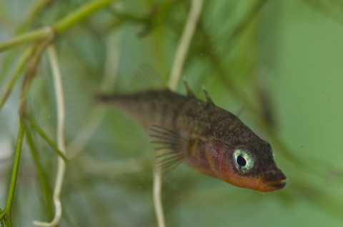

# Week 3 {#week-3}

## Overview

**Duration:** 90-120 minutes  

**Learning objectives:**  

- Apply Poisson GLM workflow to novel count data
- Make and justify model selection decisions
- Produce reproducible analysis with clear documentation
- Communicate findings professionally

---

# Dataset: Parasite co-infection in three-spined sticklebacks

## Background

Parasites rarely infect hosts in isolation. In natural populations, hosts are typically exposed to multiple parasite species, and prior infection by one parasite may alter susceptibility to subsequent infections.

In this study, researchers investigated whether infection with the tapeworm *Schistocephalus solidus* affects susceptibility to a second parasite, the trematode *Diplostomum pseudospathaceum*, in three-spined stickleback fish (*Gasterosteus aculeatus*).

**Experimental design:**

- Fish were either **exposed** to *S. solidus* tapeworm larvae or kept as **uninfected controls**

- After allowing time for tapeworm establishment, all fish (both groups) were exposed to *D. pseudospathaceum* trematode cercariae

- After a fixed exposure period, fish were dissected and trematode parasites were counted

**Research question:**

Does prior tapeworm infection affect the number of trematodes that successfully establish in stickleback hosts?

**Biological hypotheses:**

1. **Immune priming**: Tapeworm infection might activate the immune system, reducing trematode establishment (fewer trematodes in infected fish)

2. **Immune suppression**: Tapeworms might suppress host immunity to evade defences, inadvertently facilitating trematode infection (more trematodes in infected fish)

3. **Resource competition**: Tapeworms might deplete host resources, making the host less suitable for trematodes (fewer trematodes in infected fish)

4. **No effect**: The two parasite species might not interact (similar trematode counts regardless of tapeworm status)

## The Data


**File:** `parasite_coinfection.csv`

**Variables:**

- `fish_id`: Unique identifier for each fish (character)

- `treatment`: Experimental treatment (character)
  - `"Control"`: Not exposed to tapeworm
  - `"Infected"`: Exposed to tapeworm
  
- `tapeworm_present`: Whether tapeworm successfully established (logical: TRUE/FALSE)
  - Note: Not all "Infected" fish actually became infected
  
- `fish_length_mm`: Standard length of fish in millimetres (numeric)

- `trematode_count`: Number of *D. pseudospathaceum* trematodes counted in each fish (integer)

**Sample size:** 87 fish (43 Control, 44 Infected treatment)

**Data notes:**

- Some fish in the "Infected" treatment did not successfully establish tapeworm infections (`tapeworm_present == FALSE`)

- Fish length varies naturally in the population and may affect parasite susceptibility (larger fish = more surface area for infection)

- Trematode counts are discrete, non-negative integers

- Some fish have zero trematodes (unsuccessful infection or early-stage infection)


```{r, echo=FALSE, eval = T, fig.width = 10, fig.height = 5}

```

# Your Task

Complete an independent analysis following the workflow from the workshop. You will produce:

1. **Two R scripts:**
   - `01_data_cleaning.R`: Load and prepare data
   - `02_analysis.R`: Fit models and generate outputs

2. **A README file** (`README.md`): Document your analysis

3. **A Quarto document** (`analysis_report.qmd`): Professional write-up with figure

---

# Part 1: Data Preparation {.tabset}

**Time allocation:** 20 minutes

## Tasks

### Script: `01_data_cleaning.R`

**Tasks:**

1. Load required packages (at minimum: `tidyverse`, `here`, `janitor`, `performance`, `emmeans`, `broom`)

2. Read in the data (`parasite_coinfection.csv`)

3. Examine the data structure:
   - Check variable types
   - Identify any missing values
   - Calculate summary statistics by treatment group

4. Create a binary infection variable:
   - Since not all "Infected" treatment fish actually got tapeworms, create a new variable `infection_status` with two levels:
     - `"Uninfected"`: Control fish OR Infected treatment fish where `tapeworm_present == FALSE`
     - `"Tapeworm"`: Infected treatment fish where `tapeworm_present == TRUE`
   
5. Check for any data quality issues:
   - Are there any impossible values (e.g., negative counts)?
   - Are fish lengths in reasonable range for sticklebacks (typically 30-60 mm)?

6. Create an initial exploratory plot:
   - Trematode count vs fish length, coloured by infection status

7. Save cleaned data as `clean_parasite_coinfection.csv` (or keep in environment for script 02)

## Code Structure
```r
# 01_data_cleaning.R
# Author: [Your name]
# Date: [Date]
# Purpose: Clean and prepare parasite co-infection data for analysis

# Load packages ----
library(tidyverse)
library(janitor)

# Read data ----
parasites_raw <- read_csv("parasite_coinfection.csv")

# Examine structure ----
# [Your code here]

# Create infection status variable ----
# [Your code here]
# Hint: Use case_when() or if_else()

# Check data quality ----
# [Your code here]

# Exploratory plot ----
# [Your code here]

# Save cleaned data ----
# [Your code here]
```

## Expected Outputs

- Clean dataset with `infection_status` variable
- Summary table showing sample sizes by infection status
- Initial plot showing relationship between fish length and trematode count

---

# Part 2: Statistical Analysis {.tabset}

**Time allocation:** 40 minutes

## Tasks

### Script: `02_analysis.R`

Follow the workshop workflow:

1. **Start simple**: Fit a linear model
   - Model: `trematode_count ~ fish_length_mm + infection_status + fish_length_mm:infection_status`
   - Examine diagnostics—what problems do you see?

2. **Fit Poisson GLM** (additive model first)
   - Model: `trematode_count ~ fish_length_mm + infection_status`
   - Check dispersion—is there overdispersion?
   - Examine diagnostic plots

3. **Test for interaction**
   - Fit model with `fish_length_mm:infection_status` interaction
   - Does dispersion change?
   - Is the interaction significant?
   - Make a justified decision about whether to include it

4. **Address overdispersion** (if present)
   - Fit quasi-Poisson model
   - Compare inference to Poisson
   - Check diagnostic plots—does quasi-Poisson capture variance appropriately?

5. **Consider alternatives** (if needed)
   - If overdispersion is severe (φ̂ > 4), try negative binomial
   - Compare diagnostics
   - Justify your final model choice

6. **Extract key results**
   - Coefficient estimates with CIs (on response scale)
   - Predictions at meaningful fish lengths (e.g., 35mm, 45mm, 55mm)
   - Test statistics for key effects

## Code Structure
```r
# 02_analysis.R
# Author: [Your name]
# Date: [Date]
# Purpose: Analyse effect of tapeworm infection on trematode counts

# Load packages ----
library(tidyverse)
library(performance)
library(emmeans)
library(broom)
library(MASS)

# Load cleaned data ----
# [source("scripts/01_data_cleaning.R)]
# read_csv("data/clean_parasite_coinfection.csv")

# 1. Linear model (demonstration of failure) ----
# [Your code here]

# 2. Poisson GLM - additive model ----
# [Your code here]

# Check overdispersion
# [Your code here]

# 3. Test interaction ----
# [Your code here]

# Compare models
# [Your code here]

# 4. Address overdispersion ----
# [Your code here]

# 5. Final model selection ----
# [Your code here - with justification in comments]

# 6. Extract results ----
# [Your code here]

# Generate predictions for plotting
# [Your code here]
```

## Key Decisions

You must make and justify:

- Should you include the interaction term?
- Which model best handles overdispersion (if present)?
- What is your final model and why?

---

# Part 3: README Documentation

**Time allocation:** 15 minutes

## File: `README.md`

Create a README that documents your analysis. Use this template:
```markdown
# Parasite Co-infection Analysis

## Project Overview

Brief description of the research question and dataset.

## Data

- **Source**: [Where data came from - you can state "provided for course"]
- **Sample size**: [N fish, breakdown by treatment]
- **Response variable**: Trematode count (integer, range: X-Y)
- **Predictors**: 
  - Infection status (Uninfected vs Tapeworm)
  - Fish length (mm, range: X-Y)

## Files

- `parasite_coinfection.csv`: Raw data
- `01_data_cleaning.R`: Data preparation
- `02_analysis.R`: Statistical modelling
- `analysis_report.qmd`: Results write-up and figure
- `README.md`: This file

## Analysis Workflow

1. **Data cleaning**: [Brief description of what you did]
2. **Model selection**: [Brief description of models tested]
3. **Final model**: [State your final model choice]
4. **Key finding**: [One sentence summary]

## Software

- R version: [Your R version]
- Key packages:
  - tidyverse v[version]
  - performance v[version]
  - emmeans v[version]
  - [others]

## Results

[1-2 sentences on main finding]

See `analysis_report.qmd` for full write-up and figure.

## Key Decisions

Include the key model decisions you made

## Author

[Your name]  
[Date]
```

## Guidance

- Keep it concise but informative
- Someone should be able to understand your project without opening any code files
- Update the placeholders (X-Y ranges, versions, etc.) with actual values


# Part 4: Results Report [Optional]

**Time allocation:** 45 minutes

## File Structure

### File: `analysis_report.qmd`

Create a Quarto document with the following YAML header:
```yaml
---
title: "Effect of Tapeworm Infection on Trematode Susceptibility in Sticklebacks"
author: "Your Name"
date: today
format: 
  html:
    toc: true
    code-fold: true
    theme: cosmo
execute:
  warning: false
  message: false
---
```

## Required Sections

### Methods

**Statistical analysis** (following workshop examples):

Write a short paragraph containing: 

- Model family and link function
- Model structure (terms tested)
- How you assessed and addressed overdispersion
- How you tested for interaction
- Justification of final model


### Results

Write a short paragraph containing: 

**Write-up requirements:**

1. Lead with biological patterns, not statistics
2. Report effect sizes on response scale (rate ratios, fold-changes)
3. Provide predictions at meaningful fish lengths
4. Include confidence intervals for key estimates
5. Report test statistics to support claims
6. Acknowledge model uncertainty if relevant
7. Mention overdispersion and how it was handled

**Figure requirements:**

Create ONE high-quality figure that shows:

- Raw data points (with appropriate transparency)
- Model predictions (lines)
- Uncertainty (confidence ribbons)
- Clear axis labels with units
- Informative legend
- Appropriate colours (colourblind-friendly)

**Figure caption requirements:**

- What is shown (variables)
- Sample sizes
- What visual elements represent (points, lines, ribbons)
- Model used
- Key finding (optional)

---

# Assessment Criteria

Your analysis will be evaluated on:

## Code Quality (40%)

- **Organisation**: Clear script structure with meaningful section headers
- **Readability**: Informative variable names, appropriate spacing
- **Comments**: Key decisions and steps explained
- **Reproducibility**: Code runs without errors, paths are relative
- **Efficiency**: Follows tidyverse principles where appropriate

## Statistical Approach (40%)

- **Workflow**: Follows logical progression (simple → complex)
- **Diagnostics**: Properly checks assumptions and model fit
- **Model selection**: Justified choices about interaction and overdispersion
- **Interpretation**: Correct understanding of coefficients and predictions
- **Honesty**: Acknowledges uncertainty and limitations

## Communication (20%)

- **README**: Clear, concise, informative
- **Methods**: Complete, replicable, justified
- **Results**: Effect-focused, interpretable, well-supported
- **Figure**: Professional quality, self-explanatory
- **Caption**: Comprehensive, enables understanding without main text
- **Writing**: Clear, precise, appropriate for scientific audience

## Documentation (10%)

- **File naming**: Sensible, consistent
- **Project structure**: Logical organisation
- **Reproducibility**: Another analyst could recreate your work

---

# Hints and Tips 

:::{.panel-tabset}

## Data Cleaning

- Check how many fish are in each group after creating `infection_status`
- The numbers should make biological sense (not all exposed fish get infected)
- Look for the proportion of zeros—this will matter for model choice

## Model Selection

- Start simple (Poisson, no interaction) before adding complexity
- If dispersion changes substantially when you add interaction, that's informative
- Check whether negative binomial is actually better than quasi-Poisson using diagnostic plots, not just AIC

## Common Pitfalls

- **Don't** report log-scale coefficients—exponentiate them
- **Don't** claim "no effect" if P > 0.05—report the effect size and CI
- **Don't** ignore overdispersion—it will make your CIs too narrow
- **Don't** include interaction if it's not supported—simpler is better
- **Don't** forget to check if your model under-predicts zeros

## Writing Results

- State findings in biological terms first: "Tapeworm infection reduced trematode counts by X%"
- Then provide statistical support: "(rate ratio: Y [95% CI: a-b], z = Z, P = p)"
- Report predictions at 2-3 meaningful fish lengths to make effect concrete
- If results are borderline, discuss effect size not just P-value

## Figure Design

- Use `geom_ribbon()` for uncertainty (behind lines)
- Use `geom_point()` with `alpha = 0.5-0.7` for raw data
- Consider `position = position_jitter(width = 0, height = 0.1)` for discrete counts
- Put legend in whitespace, not over data
- Check your figure renders clearly at different sizes

:::

# Submission Checklist

Before submitting, ensure you have:

- [ ] `01_data_cleaning.R` with clear comments
- [ ] `02_analysis.R` with justified model choices
- [ ] `README.md` with complete information
- [ ] `analysis_report.qmd` rendered to HTML
- [ ] `analysis_report.html` (knitted output)
- [ ] All code runs without errors
- [ ] Relative file paths (not absolute paths like `C:/Users/...`)
- [ ] One high-quality figure in the report
- [ ] Professional write-up following workshop principles
- [ ] Honest acknowledgment of limitations


