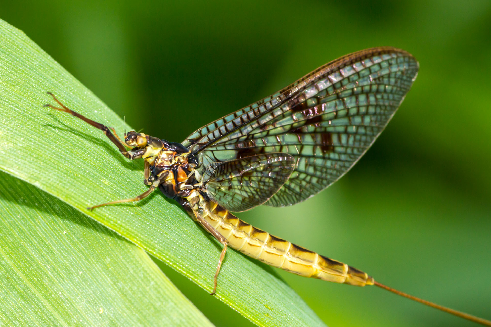

# Week 4 {#week-4}

## Overview

**Duration:** 90-120 minutes  

**Learning objectives:**  

- Apply binomial GLM workflow to proportion/presence-absence data
- Understand proper specification of response variables for binomial models
- Diagnose and address overdispersion in binomial models
- Distinguish between logit scale and probability scale interpretation
- Communicate findings with appropriate effect sizes (odds ratios, probability changes)

---

## Dataset: Mayfly presence in metal-contaminated streams

### Background

Aquatic macroinvertebrates, particularly mayflies (Ephemeroptera), are sensitive bioindicators of water quality. Their presence or absence in freshwater systems can reflect pollution levels, including heavy metal contamination from mining, industry, or agricultural runoff.

Mayflies are particularly vulnerable to heavy metals because:

- They have permeable exoskeletons allowing metal uptake
- Their immature stages (nymphs) spend months to years in contaminated sediments
- They require high dissolved oxygen, which metals can affect indirectly
- Many species cannot tolerate even moderate contamination

In this study, researchers conducted ecological surveys across multiple freshwater streams with varying levels of heavy metal contamination. At each site, they collected invertebrate samples and measured copper (Cu) concentrations in the water, which served as an indicator of overall heavy metal pollution.

**Sampling design:**

- 120 sites sampled across a pollution gradient
- Multiple kick-net samples taken at each site (standardised effort)
- All mayfly individuals identified and counted
- Water samples analysed for dissolved copper concentration (μg/L)
- Additional environmental variables recorded (dissolved oxygen)

**Research question:**

How does heavy metal contamination (copper concentration) affect mayfly presence and abundance in freshwater streams?

**Biological hypotheses:**

1. **Threshold effect**: Mayflies are present below a critical copper concentration, absent above it
2. **Gradual decline**: Mayfly occurrence probability decreases continuously with increasing copper


## The Data

**File:** `mayfly_contamination.csv`

`r hide("Dataset Description")`

**Variables:**

- `site_id`: Unique identifier for each sampling site (character)
- `latitude`: Site latitude (numeric, decimal degrees)
- `longitude`: Site longitude (numeric, decimal degrees)
- `samples_collected`: Number of kick-net samples at this site (integer, range: 3-8)
- `samples_with_mayfly`: Number of samples containing at least one mayfly (integer, 0 to `samples_collected`)
- `copper_ugl`: Dissolved copper concentration (μg/L, numeric, range: 3.2-156.8)
- `do_mgl`: Dissolved oxygen (mg/L, numeric, range: 5.1-11.2)


**Sample size:** 120 sites

**Data notes:**

- **Response variable structure**: `samples_with_mayfly` and `samples_collected` form a **binomial response** (proportion data: "X successes out of N trials")
- Sample size (`samples_collected`) varies by site → must be incorporated in model
- Some sites have 0% mayflies, some 100%, most intermediate


`r unhide()`

```{r, echo=FALSE, eval = T, fig.width = 10, fig.height = 5}

```


## Your Task

Complete an independent analysis following binomial GLM principles. You will produce:

1. **Two R scripts:**
   - `01_data_preparation.R`: Load, explore, and prepare data
   - `02_binomial_analysis.R`: Fit models and generate outputs

2. **A README file** (`README.md`): Document your analysis

3. **[Optional] A Quarto document**  (`analysis_report.qmd`): Professional write-up with figure(s)


## Part 1: Data Preparation {.tabset}

**Time allocation:** 25 minutes

## Script: `01_data_preparation.R`

**Critical tasks:**

1. Load required packages (`tidyverse`, `here`, `janitor`, `performance`, `emmeans`, `broom`)

2. Read in the data (`mayfly_contamination.csv`)

3. **Examine response variable carefully:**
   - What is the total proportion of samples with mayflies in them?
   - Check the range of `samples_collected` (sample size varies by site)
   - Identify sites where mayflies were never found 
   
> Add clear comments to your code chunks
   
`r hide ("Proportion")`

```{r, eval = FALSE}

mayfly_raw |>
  summarise(
    total_mayfly = sum(samples_with_mayfly),
    total_samples = sum(samples_collected),
    prop_mayfly = total_mayfly/total_samples
  )


```

`r unhide()`

`r hide("Range of Samples")`

```{r, eval = FALSE}


mayfly_raw |> 
  summarise(max = max(`samples_collected`),
            min = min(`samples_collected`),
            mean = mean(`samples_collected`),
            n_sites = n(),
            n_samples = sum(`samples_collected))


```

` r unhide()`

`r hide("Find sites without mayfly")`

```{r, eval = FALSE}


mayfly_raw |> 
  filter(`samples_with_mayfly` < 1)


```   

`r unhide()`

4. **Create analysis variables:**

   - `mayfly_proportion`: `samples_with_mayfly / samples_collected`

`r hide("Solution")`

```{r, eval = FALSE}
mayfly <- mayfly_raw |>
  mutate(
    samples_without_mayfly = samples_collected - samples_with_mayfly,
    prop_mayfly = samples_with_mayfly/samples_collected
  )

```

`r unhide()`
   
5. **Data quality checks:**
   - Are there any sites where `samples_with_mayfly > samples_collected`? (impossible)
   - Are copper values plausible for freshwater? (typically 0-200 μg/L)
   - Are temperature, DO, pH in reasonable ranges?
   - Check for missing values
   
`r hide("Possible solutions")`

```{r,eval = FALSE}

# Check for impossible values
mayfly |>
    filter( samples_collected < 0 | samples_with_mayfly < 0 |
            do_mgl < 0 | copper_ugl < 0)
    
mayfly |> 
   filter(samples_with mayfly > samples_collected)

mayfly |> 
  mayfly |> 
  summarise(across(where(is.numeric), 
                   list(max = ~max(.x, na.rm = TRUE), 
                        min = ~min(.x, na.rm = TRUE))))

mayfly |> 
  filter(do_mgl < 3.2 | do_mgl > 156.8)


skimr::skim(mayfly)
  

```

`r unhide()`

6. **Exploratory visualisation:**
   - Plot proportion of mayflies vs copper concentration
   - Consider adding point size to show sample size per site
   - Explore relationships with temperature and dissolved oxygen
   
`r hide("Possible solution")`

```{r, eval = FALSE}

mayfly |> 
  ggplot(aes(x = log_copper_ugl,
             y = prop_mayfly))+
  geom_point(aes(size = samples_collected))

```

`r unhide()`
   
7. **Correlation check:**
   - Are copper and dissolved oxygen correlated?
   - This matters for model interpretation
   
```{r, eval = FALSE}
mayfly |> 
GGally::ggpairs(columns = c(6,7,9))

```

### Code Structure

:::{.callout-important}

Do not just copy/paste all code below. Choose which code chunks YOU need and include comments about what you are doing and what the data shows

:::


```r
# 01_data_preparation.R
# Author: [Your name]
# Date: [Date]
# Purpose: Prepare mayfly occurrence data for binomial GLM analysis ----

# Load packages ----
library(tidyverse)
library(janitor)
library(here)

# Read data ----
mayfly_raw <- read_csv(here("data", "mayfly_contamination.csv"))

# Examine structure ----
glimpse(mayfly_raw)
summary(mayfly_raw)

# Calculate key variables ----
# set up win/loss columns


# Data quality checks ----


# Check ranges


# Exploratory plots ----
# Proportion vs copper
# [Your code here]

# Distribution of copper
# [Your code here]

# Explore confounders
# Look at correlation between copper and oxygen levels
# [Your code here - e.g., copper vs DO relationship]

# Save cleaned data ----
# write_csv(mayfly, here("data", "mayfly_clean.csv"))
```

### Expected Observations

After running your data preparation, you should note:

- **Sample size variation**: Do some sites have more samples than others? (Important for weighting)
- **Correlations**: Are copper and dissolved oxygen related? (Potential confounding)
- **Visual pattern**: Does mayfly proportion decline with copper? Linear or non-linear?


## Part 2: Binomial GLM Analysis

**Time allocation:** 45 minutes

### Script: `02_binomial_analysis.R`

**Critical concepts for binomial models:**

- Response must be specified as **cbind(successes, failures)** or **proportion with weights**
- Link function is **logit** (log odds) by default
- Coefficients are on **log-odds scale** — must exponentiate to get odds ratios
- Predictions are **probabilities** (0-1 scale)
- Overdispersion common when data are clustered or samples are not independent

**Analysis workflow:**

1. **Fit binomial GLM with proper response specification**
   - Use cbind for successes and failures (recommended)
   - Check for overdispersion (residual deviance vs df)
   - Examine diagnostic plots

2. **Consider additional predictors**
   - Does dissolved oxygen improve model?
   - Be cautious of collinearity with copper
   
3. **Address overdispersion if present**
   - Calculate dispersion parameter: φ̂ = residual deviance / residual df
   - If φ̂ > 1.5: fit quasibinomial model
   - Compare standard errors between binomial and quasibinomial
   
4. **Model comparison**
   - Compare nested models (if not using quasibinomial)
   - Use drop1() with test = "Chisq" for binomial
   - Use drop1() with test = "F" for quasibinomial

5. **Extract results for reporting**
   - Coefficients on log-odds scale AND odds ratios (exponentiated)
   - Predicted probabilities at low, medium, high copper concentrations
   - Concentration at which probability = 0.5 (LC₅₀ analogue)

### Code Structure
```r
# 02_binomial_analysis.R
# Author: [Your name]
# Date: [Date]
# Purpose: Binomial GLM analysis of copper effects on mayfly occurrence ----

# Load packages ----
library(tidyverse)
library(performance)
library(emmeans)
library(here)
library(broom)
library(MASS)

# Load cleaned data ----
# source(here("scripts", "01_data_preparation.R"))
# OR
# mayfly <- read_csv(here("data", "mayfly_clean.csv"))

# 1. Fit initial binomial GLM ----
# Using cbind specification (recommended)
# [Your code here]


# Check overdispersion
# [Your code here]

# Diagnostic plots
# [Your code here]


# 2. Add potential confounders ----
# Does dissolved oxygen explain additional variation?
# [Your code here]

# 3. Address overdispersion ----
# If dispersion > 1.5, use quasibinomial
# [Your code here]

# Check diagnostics
# [Your code here]

# Compare inference: binomial vs quasibinomial
# [Your code here]

# 4. Justify final model choice ----
# [Your justification in comments]

# 5. Extract key results ----
# Coefficients as odds ratios
# [Your code here]

# Predicted probabilities across copper gradient
# [Your code here]

# Find LC₅₀ (copper concentration at 50% probability)
# [Your code here]

# Predictions at key concentrations
# [Your code here]

# 6. Generate data for publication figure ----
# [Your code here]
```

### Key Decisions

You must make and justify:

1. **Response specification**: Did you use cbind() correctly? This is critical for binomial models.

2. **Additional predictors**: 
   - Should dissolved oxygen be included?
   - If so does it require an interaction term?
   - Does it improve fit?
   - Is it collinear with copper?

3. **Overdispersion**: Is it present? If yes:
   - What is the dispersion parameter?
   - How much do standard errors change with quasibinomial?
   - What might cause overdispersion?

4. **Final model**: State clearly and justify

---

## Part 3: README Documentation

**Time allocation:** 15 minutes

### Template
```markdown
# Mayfly Occurrence and Heavy Metal Contamination Analysis

## Project Overview

Analysis of mayfly presence in freshwater streams across a copper contamination gradient.

## Data

- **Source**: [Provided for course / ecological survey]
- **Sample size**: 120 sites with [median] kick-net samples per site
- **Response variable**: 
  - Proportion of samples containing mayflies (0-1)
  - Binomial: successes/trials structure
- **Primary predictor**: Dissolved copper concentration (3.2-156.8 μg/L)
- **Covariates**: dissolved oxygen (mg/L)

## Files

- `mayfly_contamination.csv`: Raw data
- `01_data_preparation.R`: Data cleaning and exploration
- `02_binomial_analysis.R`: GLM fitting and model selection
- `analysis_report.qmd`: Results write-up and figure
- `README.md`: This file

## Analysis Workflow

1. **Data preparation**: 
   - Created proportion and binary presence variables
   - Checked for data quality issues
   - Explored predictor correlations
   
2. **Model selection**: 
   - Tested for confounding by dissolved oxygen
   - [State other comparisons]
   
3. **Final model**: 
   - [State model: e.g., "Quasibinomial GLM with log(copper)"]
   - Dispersion parameter: φ̂ = [value]
   - Justification: [Brief reason]

4. **Key finding**: 
   - [One sentence summary]

## Software

- R version: [version]
- Key packages:
  - tidyverse v[version]
  - performance v[version]
  - emmeans v[version]

## Results

[2-3 sentences summarising main finding and effect size]

See `analysis_report.qmd` for full write-up and figure.

## Key Decisions

[List critical modelling decisions made]

## Author

[Your name]  
[Date]
```


## Part 4: Results Report [Optional]

**Time allocation:** 45 minutes

## YAML Header
```yaml
---
title: "Heavy Metal Contamination and Mayfly Occurrence in Freshwater Streams"
author: "Your Name"
date: today
format: 
  html:
    toc: true
    code-fold: true
    theme: cosmo
execute:
  warning: false
  message: false
---
```

### Required Content

#### Methods

**Statistical analysis**:

Write a short paragraph containing:

- Model family (binomial/quasibinomial) and link function (logit)
- Response variable specification (very important!)
  - "Modelled as proportion of samples with mayflies, weighted by number of samples per site"
  - OR "Modelled using binomial response (successes/failures)"
- Model structure (terms tested)
- How copper was scaled/transformed (if applicable)
- How overdispersion was assessed and addressed
- Model comparison approach
- Justification of final model

#### Results

Write a short paragraph containing:

**Write-up requirements:**

1. Lead with biological patterns, not statistics
2. Report effect sizes on interpretable scales:
   - Probabilities at meaningful copper concentrations
   - Odds ratios for copper effect
   - LC₅₀ (concentration at 50% probability)
3. Include confidence intervals for key estimates
4. Report test statistics to support claims
5. Acknowledge overdispersion and how handled
6. Reference figure

**Figure requirements:**

Create ONE high-quality figure that shows:

- Raw data points (proportion per site, sized by sample effort)
- Model predictions (line)
- Uncertainty (confidence ribbon)
- Clear axis labels with units
- Informative legend
- Appropriate colours (colourblind-friendly)

**Figure caption requirements:**

- What is shown (variables)
- Sample sizes
- What visual elements represent (points, lines, ribbons)
- Model used
- Key finding (optional)


## Assessment Criteria

Your analysis will be evaluated on:

### Code Quality (40%)

- **Organisation**: Clear script structure with meaningful section headers
- **Readability**: Informative variable names, appropriate spacing
- **Comments**: Key decisions and steps explained
- **Reproducibility**: Code runs without errors, paths are relative
- **Efficiency**: Follows tidyverse principles where appropriate

### Statistical Approach (40%)

- **Correct methods**: Proper binomial response specification with sample sizes
- **Model selection**: Test transformations, additional predictors, justified choices
- **Diagnostics**: Properly checks overdispersion and model fit
- **Overdispersion handling**: Calculate and report dispersion, use quasibinomial if needed
- **Interpretation**: Correct understanding of log-odds → odds ratios → probabilities
- **Honesty**: Acknowledges uncertainty and limitations

### Communication (20%)

- **README**: Clear, concise, informative
- **Methods**: Response specification clear, overdispersion handling explained
- **Results**: Probability-focused, interpretable, well-supported
- **Figure**: Professional quality, sized points showing sample effort
- **Caption**: Comprehensive, enables understanding without main text
- **Writing**: Clear, precise, appropriate for scientific audience


## Hints and Tips 

:::{.panel-tabset}


## Model Selection

- Start with simple copper model before adding complexity
- Test log(copper) vs linear copper—both may be defensible
- If adding DO, check whether it's significant after accounting for copper
- Don't include both copper and log(copper) in same model!

## Common Pitfalls

- ❌ **CRITICAL ERROR**: Using `glm(mayfly_proportion ~ copper, family = binomial)` without weights
  - This ignores sample size variation between sites
- ✅ **CORRECT**: `glm(cbind(samples_with_mayfly, samples_collected - samples_with_mayfly) ~ copper, family = binomial)`
- **Don't** report log-odds coefficients without interpretation
- **Don't** claim "no effect" based solely on P > 0.05
- **Don't** ignore overdispersion—check φ̂ and use quasibinomial if needed
- **Don't** forget that coefficients are multiplicative after exponentiating

## Writing Results

**Poor example:**
"Copper coefficient was -0.075 (P < 0.001)."

**Good example:**
"Mayfly occurrence probability declined sharply with copper concentration (quasibinomial GLM: F₁,₁₁₈ = 87.3, P < 0.001). At low contamination (10 μg/L), presence probability was 0.89 [95% CI: 0.84-0.93], declining to 0.50 at 45 μg/L [95% CI: 42-48 μg/L] and to 0.11 [0.07-0.16] at 100 μg/L."

## Figure Design

- Use `geom_point(aes(size = samples_collected))` to show sample effort
- Use `geom_ribbon()` for uncertainty (behind line, alpha = 0.2)
- Set `scale_y_continuous(limits = c(0, 1))` to show full probability range
- Consider log scale for x-axis if using log(copper): `scale_x_log10()`
- Add horizontal line at P = 0.5 to show LC₅₀ if desired

## Understanding Binomial Models

**Key insight**: Binomial models answer "What's the probability of success?"

- Success = sample contains mayfly
- Trials = samples collected at site
- Probability = varies with copper (and DO)

The logit link ensures probabilities stay between 0-1:

$$\text{logit}(p) = \log\left(\frac{p}{1-p}\right) = \beta_0 + \beta_1 \times \text{copper}$$

To interpret:

- Exponentiate coefficients → odds ratios (multiplicative effects)
- Use `emmeans(..., type = "response")` → probabilities (0-1 scale)

:::

## Submission Checklist

Before submitting, ensure you have:

- [ ] `01_data_preparation.R` with clear comments
- [ ] `02_binomial_analysis.R` with justified model choices
- [ ] Used `cbind()` for response specification
- [ ] Checked and addressed overdispersion
- [ ] `README.md` with complete information
- [ ] All code runs without errors
- [ ] Relative file paths (not absolute paths like `C:/Users/...`)
- [ ] One high-quality figure showing sample sizes
- [ ] Results report probabilities and LC₅₀, not just log-odds
- [ ] Honest acknowledgment of overdispersion and limitations


::: {.callout-important}
## Critical Reminder

**Correct binomial response specification is essential.**

If you write:
```r
glm(mayfly_proportion ~ copper, family = binomial, data = mayfly)
```

You are **ignoring sample size variation** between sites. A site with 1/2 mayflies gets the same weight as 4/8, even though the latter is more reliable.

**Always use:**
```r
glm(cbind(samples_with_mayfly, samples_collected - samples_with_mayfly) ~ copper,
    family = binomial, data = mayfly)
```

This is the most common error in binomial GLMs. Don't make it!
:::

**Good luck! Remember: understanding variance-mean relationships and proper model specification matters more than finding "the right answer."**
